
 <h1>由于《深入理解Android 卷一》和《深入理解Android卷二》不再出版，而知识的传播不应该因为纸质媒介的问题而中断，所以我将在CSDN博客中全文转发这两本书的全部内容</h1> <h1>第8章  深入理解ContentService和AccountManagerService</h1><h2>本章主要内容：</h2>
·  介绍ContentService

·  介绍AccountManagerService
<h2>本章所涉及的源代码文件名及位置：</h2>
·  SystemServer.java

frameworks/base/services/java/com/android/server/SystemServer.java

·  ContentService.java

frameworks/base/core/java/android/content/ContentService.java

·  ContentResolver.java

frameworks/base/core/java/android/content/ContentResolver.java

·  UsbSettings.java

packages/apps/Settings/src/com/android/settings/deviceinfo/UsbSettings.java

·  DevelopmentSettings.java

packages/apps/Settings/src/com/android/settings/DevelopmentSettings.java

·  UsbDeviceManager.java

frameworks/base/services/java/com/android/server/usb/UsbDeviceManager.java

·  AccountManagerService.java

frameworks/base/core/java/android/accounts/AccountManagerService.java

·  AccountAuthenticatorCache.java

frameworks/base/core/java/android/accounts/AccountAuthenticatorCache.java

·  RegisteredServicesCache.java

frameworks/base/core/java/android/content/pm/RegisteredServicesCache.java

·  AccountManager.java

frameworks/base/core/java/android/accounts/AccountManager.java

·  EasAuthenticatorService

packages/apps/Email/src/com/android/email/service/EasAuthenticatorService.java

·  SyncManager.java

frameworks/base/core/java/android/content/SyncManager.java

·  SyncStorageEngine.java

frameworks/base/core/java/android/content/SyncStorageEngine.java

·  SyncAdapterCache.java

frameworks/base/core/java/android/content/SyncAdapterCache.java

·  SyncQueue.java

frameworks/base/core/java/android/content/SyncQueue.java

·  EmailSyncAdapterService.java

packages/apps/Exchange/src/com/android/exchange/EmailSyncAdapterService.java

·  AbstractThreadedSyncAdapter.java

frameworks/base/core/java/android/content/AbstractThreadedSyncAdapter.java
<h2>8.1  概述</h2>
本章将分析ContentService和AccountManagerService，其中，ContentService包含以下两个主要功能：

·  它是Android平台中数据更新通知的执行者。数据更新通知与第7章分析Cursorquery函数实现时提到的ContentObserver有关。这部分内容将在8.2节中分析。

·  它是Android平台中数据同步服务的管理中枢。当用户通过Android手机中的Contacts应用将联系人信息同步到远端服务器时，就需要和ContentService交互。这部分内容是本章的难点，将在8.4节中进行分析

本章要分析的第二个Service是AccountManagerService，它负责管理Android手机中用户的账户，这些账户是用户的online账户，例如用户在Google、Facebook上注册的账户。

本章将先分析ContentService中数据通知机制的实现，然后分析AccountManagerService，最后再介绍ContentService中的数据同步服务。

<strong>提示</strong>这两个Service的难度都不大，它们在设计结构上有较大的相似性，在内容上也有一定的关联。另外，作为本书最后一章，笔者照例会留一些难度适中的问题或知识点供读者自行分析研究。

<h2>8.2  数据更新通知机制分析</h2>
何为数据更新通知？先来看日常生活中的一个例子。

笔者所在公司采用BugZilla来管理Bug。在日常工作中，笔者和同事们的一部分工作就是登录BugZilla查询各自名下的Bug并修改它们。如何跟踪自己的Bug呢？其实，以上描述中已经提到了一种方法，即登录BugZilla并查询。除此之外，BugZilla还支持另一种方法，即为每个Bug设置一个关系人列表，一旦该Bug的状态发生变化，BugZilla就会给该Bug关系人列表中的人发送邮件。

上例中提到的第二种方法就是本节要分析的数据更新通知机制。一般说来，领导和项目经理（PM）使用第一种方法居多，因为他们需要不定时地查询和统计全局Bug的情况。而程序员使用第二种方法较多（也许是没办法的事情吧，谁会情愿主动查询自己的Bug呢？）。

类似的通知机制在日常生活中的其他地方还有使用。在操作系统中，这种通知机制同样也广泛存在。例如，在OS中，设计人员一般会安排外部设备以中断的方式通知CPU并让其开展后续处理，而不会让CPU去轮询外设的状态。

现在回到Android平台，如果程序需要监控某数据项的变化，可以采用一个类似while循环的语句不断查询它以判断其值是否发生了变化。显而易见，这种方式的效率很低。有了通知机制以后，程序只需注册一个ContentObserver实例即可。一旦该项数据发生变化，系统就会通过ContentObserver的onChange函数来通知我们。与前面所述的轮询相比，此处的通知方式明显更高效。

通过上面的描述可以知道，通知机制的实施包括两个步骤：第一步，注册观察者；第二步，通知观察者。在Android平台中，这两步都离不开ContentService，下面来认识一下它。

<strong>提示</strong>在设计模式中，通知机制对应的模式是Observer模式，即观察者模式。

<h3>8.2.1  初识ContentService</h3>
SystemServer创建ContentService的代码非常简单，如下所示：

[--&gt;SystemServer::ServerThread.run]

public void run() {

   ......

  ContentService.main(context,

                   factoryTest == SystemServer.FACTORY_TEST_LOW_LEVEL);

   ......

}

以上代码中直接调用了ContentService的main函数。在一般情况下，该函数第二个参数为false。此main函数的代码如下：

·  [--&gt;ContentService.java::main]

public static IContentService main(Contextcontext, boolean factoryTest) {

   //构造ContentService实例

  ContentService service = new ContentService(context, factoryTest);

   //将ContentService注册到ServiceManager中，其注册名叫“content”

  ServiceManager.addService(ContentResolver.CONTENT_SERVICE_NAME,

                                 service);

   returnservice;

}

ContentService的构造函数的代码如下：

[--&gt;ContentService.java::ContentService]

ContentService(Context context, booleanfactoryTest) {

    mContext = context;

   mFactoryTest = factoryTest;

    getSyncManager(); //获取同步服务管理对象，接下来看它的代码

}

[--&gt;ContentService.java::getSyncManager]

private SyncManager getSyncManager() {

   synchronized(mSyncManagerLock) {

     try {

          //创建一个SyncManager实例，它是ContentService中负责数据同步服务的

          //主力成员。留待8.4节再详细分析它

           if (mSyncManager == null) mSyncManager = new

                                        SyncManager(mContext,mFactoryTest);

       }......

           return mSyncManager;

     }

}

看完以上代码读者可能会觉得ContentService比较简单。其实，ContentService中最难的功能是数据同步服务，不过该功能的实现都封装在SyncManager及相关类中了，所以在分析通知机制时不会和数据同步服务有太多瓜葛。

下面来分析通知机制实施的第一步，注册ContentObserver。该步骤由ContentResovler提供的registerContentObserver函数来实现。
<h3>8.2.2  ContentResovler的registerContentObserver分析</h3>
[--&gt;ContentResolver.java::registerContentObserver]

public final void registerContentObserver(Uri uri,

            booleannotifyForDescendents,ContentObserver observer){

  /*

   注意registerContentObserver传递的参数，其中：

   uri是客户端设置的它所需要监听的数据项的地址，用Uri来表示

   notifyForDescendents：如果该值为true，则所有地址包含此uri的数据项发生变化时

   都会触发通知。否则只有完全符合该uri地址的数据项发生变化时才会触发通知。以文件夹和

   其中的文件为例，若uri指向某文件夹，则需设置notifyForDescendents为true。即该文件

   夹下的任何文件发生变化，都需要通知监听者。

   observer是客户端设置的监听对象。当数据项发生变化时，该对象的onChange函数将被调用

  */

  try {   

           /*

            调用ContentService的registerContentObserver函数，其第三个参数是

             observer.getContentObserver的返回值，它是什么呢？

           */

           getContentService().registerContentObserver(uri,

                                   notifyForDescendents,

                                   observer.getContentObserver());

        } ......

 }

registerContentObserver最终将调用ContentService的registerContentObserver函数，其中第三个参数是ContentObservergetContentObserver的返回值。这个返回值是什么呢？需请出ContentObserver家族成员。
<h4>1.  ContentObserver介绍</h4>
ContentObserver家族成员如图8-1所示。

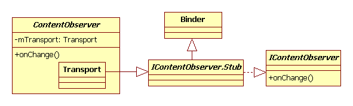 

图8-1  ContentObserver家族类图

图8-1中的ContentObserver类和第7章中介绍的ContentProvider类非常类似，内部都定义了一个Transport类参与Binder通信。由图8-1可知，Transport类从IContentObserver.stub派生。从Binder通信角度来看，客户端进程中的Transport将是Bn端。如此，通过registerContentObserver传递到ContentService所在进程的就是Bp端。IContentObserverBp端对象的真实类型是IContentObserver.Stub.Proxy。

<strong>注意</strong>IContentObserver.java由aidl处理IContentObserver.aidl生成，其位置在out/targer/common/obj/JAVA_LIBRARIES/framework_intermediates/src/core/java/android/database/IContentObserver.java中。

<h4>2.  registerContentObserver函数分析</h4>
下面来看ContentService的registerContentObserver函数的代码。

[--&gt;ContentService.java::registerContentObserver]

public void registerContentObserver(Uri uri,boolean notifyForDescendents,

               IContentObserver observer) {

     ......

   synchronized (mRootNode) {

    //ContentService要做的事情其实很简单，就是保存uri和observer的对应关系到

     //其内部变量mRootNode中

    mRootNode.addObserverLocked(uri, observer, notifyForDescendents,

                    mRootNode, Binder.getCallingUid(),

                   Binder.getCallingPid());

 }

mRootNode是ContentService的成员变量，其类型为ObserverNode。ObserverNode的组织形式是数据结构中的树，其叶子节点的类型为ObserverEntry，它保存了uri和对应的IContentObserver对象。本节不关注它们的内部实现，读者若有兴趣，不妨自行研究。

至此，客户端已经为某数据项设置了ContentObserver。再来看通知机制实施的第二步，即通知观察者。
<h3>8.2.3  ContentResolver的 notifyChange分析</h3>
数据更新的通知由ContentResolver的notifyChange函数触发。看MediaProvider的update函数的代码如下：

[--&gt;MediaProvider.java::update]

public int update(Uri uri, ContentValuesinitialValues, String userWhere,

                     String[] whereArgs) {

   int count;

   int match= URI_MATCHER.match(uri);

  DatabaseHelper database = getDatabaseForUri(uri);

   //找到对应的数据库对象

  SQLiteDatabase db = database.getWritableDatabase();

   ......

   synchronized (sGetTableAndWhereParam) {

    getTableAndWhere(uri, match, userWhere, sGetTableAndWhereParam);

     switch(match) {

         ......

        case VIDEO_MEDIA:

        case VIDEO_MEDIA_ID:{

          ContentValues values = newContentValues(initialValues);

          values.remove(ImageColumns.BUCKET_ID);

          values.remove(ImageColumns.BUCKET_DISPLAY_NAME);

          ......//调用SQLiteDatabase的update函数更新数据库

          count =db.update(sGetTableAndWhereParam.table, values,

                               sGetTableAndWhereParam.where, whereArgs);

         .......

         }......//其他处理

     }......//synchronized处理结束

    if (count &gt; 0 &amp;&amp;!db.inTransaction()) //调用notifyChange触发通知

        getContext().getContentResolver().notifyChange(uri,null);

   returncount;

}

由以上代码可知，MediaProvider update函数更新完数据库后，将通过notfiyChange函数来通知观察者。notfiyChange函数的代码如下：

[--&gt;ContentResolver.java::notifyChange]

public void notifyChange(Uri uri, ContentObserverobserver) {

     //在一般情况下，observer参数为null。调用另一个notifyChange函数，直接来看它

    notifyChange(uri, observer, true);

 }

public void notifyChange(Uri uri, ContentObserverobserver,

                               boolean syncToNetwork) {

  //第三个参数syncToNetwork用于控制是否需要发起一次数据同步请求

  try {

       //调用ContentService的notifyChange函数

       getContentService().notifyChange(

             uri, observer == null ? null : observer.getContentObserver(),

             observer != null &amp;&amp; observer.deliverSelfNotifications(),

             syncToNetwork);

        } ......

}

由以上代码可知，ContentService的notifyChange函数将被调用，其代码如下：

[--&gt;ContentSerivce::notifyChange]

public void notifyChange(Uri uri, IContentObserverobserver,

     boolean observerWantsSelfNotifications, boolean syncToNetwork) {

  longidentityToken = clearCallingIdentity();

  try {

         ArrayList&lt;ObserverCall&gt; calls = newArrayList&lt;ObserverCall&gt;();

          //从根节点开始搜索需要通知的观察者，结果保存在calls数组中

         synchronized (mRootNode) {

               mRootNode.collectObserversLocked(uri, 0, observer,

                               observerWantsSelfNotifications,calls);

          }

        final int numCalls = calls.size();

         for(int i=0; i&lt;numCalls; i++) {

              ObserverCall oc = calls.get(i);

              try {

                   /*

                     调用客户端IContentObserver Bn端，即ContentObserver

                     内部类Transport的onChange函数。最后再由Transport调用

                     客户端提供的ContentObserver子类的onChange函数

                  */

                   oc.mObserver.onChange(oc.mSelfNotify);

               } ......//异常处理

           }

           if (syncToNetwork) {

               SyncManager syncManager = getSyncManager();

               if (syncManager != null) {

                   //发起一次同步请求，相关内容留待8.4节再分析

                   syncManager.scheduleLocalSync(null,

                                           uri.getAuthority());

               }

           }

        }finally {

           restoreCallingIdentity(identityToken);

        }

    }

<h3>8.2.4  数据更新通知机制总结和深入探讨</h3>
总结上面所描述的数据更新通知机制的流程如图8-2所示。

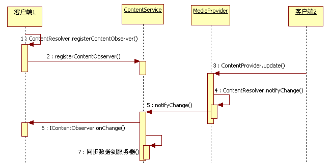 

图8-2  数据更新通知的流程图

从前面的代码介绍和图8-2所示的流程来看，Android平台中的数据更新通知机制还较为简单。不过此处尚有几个问题想和读者一起探讨。

<strong>问题一</strong>：由图8-2可知，客户端2调用ContentProvider的update函数将间接触发客户端1的ContentObserver的onChange函数被调用。如果客户端1在onChange函数中耗时过长，会不会导致客户端2阻塞在update函数中呢？

想到这个问题的读者应该是非常细致和认真的了。确实，从前面所示的代码和流程图来看，这个情况几乎是必然会发生的，但是实际上该问题并不存在，原因在于下面这一段代码：

[--&gt;IContentObserver.java::Proxy:onChange]

private static class Proxy implementsandroid.database.IContentObserver {

     privateandroid.os.IBinder mRemote;

     ......

     publicvoid onChange(boolean selfUpdate)

                      throws android.os.RemoteException {

        android.os.Parcel_data = android.os.Parcel.obtain();

        try{

           _data.writeInterfaceToken(DESCRIPTOR);

           _data.writeInt(((selfUpdate)? (1) : (0)));

          //调用客户端1的ContentObserver Bn端的onChange函数

           mRemote.transact(Stub.TRANSACTION_onChange,_data, null,

                                        <strong>android.os.IBinder.FLAG_ONEWAY</strong>);

        } finally {

            _data.recycle();

        }

     }

     ......

}

以上代码告诉我们，ContentService在调用客户端注册的IContentObserver 的onChange函数时，使用了FLAG_ONEWAY标志。根据第2章对该标志的介绍（参见2.2.1节），使用该标志的Binder调用只需将请求发给binder驱动即可，无需等待客户端onChange函数的返回。因此，即使客户端1在onChange中恶意浪费时间，也不会阻塞客户端2的update函数了。

<strong>问题二</strong>：这是一个开放性问题，最终需要读者给出合适的答案。

假设服务端有一项功能，需要客户端通过某种方式来控制它的开闭（即禁止或使用该功能），考虑一下有几种方式来实现这个控制机制。

Android平台上至少有三种方法可以实现这个控制机制。

第一种：服务端实现一个API函数，客户端直接调用这个函数来控制。

第二种客户端发送指定的广播，而服务端注册该广播的接收者，然后在这个广播接收者的onReceive函数中去处理。

第三种：服务端输出一个ContentProvider，并为这个功能输出一个uri地址，然后注册一个ContentObserver。客户端可通过更新数据的方式来触发服务端ContentObserver的onChange函数，服务端在该函数中做对应处理即可。

在Android代码中，这三种方法都有地方使用。下面将以Settings应用中和USB相关的功能设置为例来观察第一种和第三种方法的使用情况。

第一个实例和Android 4.0中新支持的USB MTP/PTP功能有关，相关代码如下：

[--&gt;UsbSettings.java::onPreferenceTreeClick]

public booleanonPreferenceTreeClick(PreferenceScreen preferenceScreen,

                             Preference preference) {

 

   ......

   if(preference == mMtp) {

        <strong>mUsbManager.setCurrentFunction</strong>(UsbManager.USB_FUNCTION_MTP,true);

       updateToggles(UsbManager.USB_FUNCTION_MTP);

   } else if(preference == mPtp) {

        mUsbManager.setCurrentFunction(UsbManager.USB_FUNCTION_PTP, true);

         updateToggles(UsbManager.USB_FUNCTION_PTP);

   }

   returntrue;

 }

由以上代码可知，如果用户从Settings界面中选择了使能MTP，将直接调用UsbManager的setCurrentFunction来使能MTP功能。这个函数的Bn端实现在UsbService中。

不过，同样是USB相关的功能控制，ADB的开关控制却采用了第三种方法，相关代码为：

[--&gt;DevelopmentSettings.java::onClick]

public void onClick(DialogInterface dialog, intwhich) {

  if (which == DialogInterface.BUTTON_POSITIVE){

       mOkClicked = true;

       //设置Settings数据库ADB对应的数据项值为1

       Settings.Secure.putInt(getActivity().getContentResolver(),

                   Settings.Secure.ADB_ENABLED, 1);

   } else

       mEnableAdb.setChecked(false);//界面更新

 }

上面的数据项更新操作将导致UsbDeviceManager做对应处理，其相关代码如下：

[--&gt;UsbDeviceManager.java::onChange]

private class AdbSettingsObserver extendsContentObserver {

   ......

   publicvoid onChange(boolean selfChange) {

        //从数据库中取出对应项的值

        boolean enable =(Settings.Secure.getInt(mContentResolver,

                            Settings.Secure.ADB_ENABLED, 0) &gt; 0);

          //发送MSG_ENABLE_ADB消息，UsbDeviceManager将处理此消息

           mHandler.sendMessage(MSG_ENABLE_ADB, enable);

     }

}

同样是USB相关的功能，Settings应用却采用了两种截然不同的方法来处理它们。这种做法为笔者目前所从事的项目中USB扩展功能的实现带来了极大困扰，因为我们想采用统一的方法来处理USB相关功能。到底应采用哪种方法比较合适呢？第一种方法和第三种方法各自的适用场景是什么？读者不妨仔细思考并将结论告诉笔者。

<strong>问题三</strong>：我们在第7章中分析Cursorquery时曾看到过ContentObserver的身影，但是并没有对其进行详细分它。如果现在回过头去分析query流程中和ContentObserver相关的部分，所涉及的流程可能比本节内容还要多。
<h2>8.3  AccountManagerService分析</h2>
本节将分析AccountManagerService。如前所述，AccountManagerService负责管理手机中用户的online账户，主要工作涉及账户的添加和删除、AuthToken（全称为authentication token。有了它，客户端就无须每次操作都向服务器发送密码了）的获取和更新等。关于AccountManagerSerivce更详细的功能，可阅读SDK文档中AccountManager的说明。

下面看AccountManagerService创建时的代码：
<h3>8.3.1  初识AccountManagerService</h3>
[--&gt;SystemServer.java::ServerThread.run]

  ......

  //注册AccountManagerService到ServiceManager，服务名为“account”

  ServiceManager.addService(Context.ACCOUNT_SERVICE,

                                    newAccountManagerService(context));

其构造函数的代码如下：

[--&gt;AccountManagerService.java::AccountManagerService]

public AccountManagerService(Context context) {

   //调用另外一个构造函数，其第三个参数将构造一个AccountAuthenticatorCache对象，它是

   //什么呢？见下文分析

   this(context,context.getPackageManager(),

            new  AccountAuthenticatorCache(context));

}

在AccountManagerService构造函数中创建了一个AccountAuthenticatorCache对象，它是什么？来看下文。
<h4>1.  AccountAuthenticatorCache分析</h4>
AccountAuthenticatorCache是Android平台中账户验证服务（Account AuthenticatorService，AAS）的管理中心。而AAS则由应用程序通过在AndroidManifest.xml中输出符合指定要求的Service信息而来。稍后读者将看到这些要求的具体格式。

先来看AccountAuthenticatorCache的派生关系，如图8-3所示。

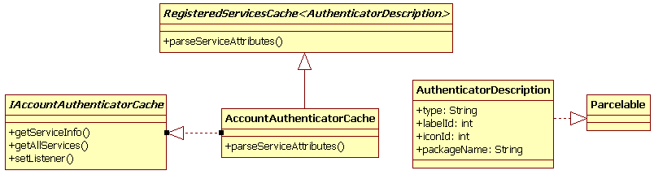 

图8-3  AccountAuthenticatorCache类图

由图8-3可知：

·  AccountAuthenticatorCache从RegisteredServicesCache&lt;AuthenticatorDescription&gt;派生。RegisteredServicesCache是一个模板类，专门用于管理系统中指定Service的信息收集和更新，而具体是哪些Service由RegisteredServicesCache构造时的参数指定。AccountAuthenticatorCache对外输出由RegisteredServicesCache模板参数指定的类的实例。在图8-3中应该就是AuthenticatorDescription。

·  AuthenticatorDescription继承了Parcelable接口，这代表它可以跨Binder传递。该类描述了AAS相关的信息。

·  AccountAuthenticatorCache实现了IAccountAuthenticatorCache接口。这个接口供外部调用者使用以获取AAS的信息。

下面看AccountAuthenticatorCache的创建，其相关代码如下：

[--&gt;AccountAuthenticatorCache.java::AccountAuthenticatorCache]

public AccountAuthenticatorCache(Context context){

  /*

  ACTION_AUTHENTICATOR_INTENT值为"android.accounts.AccountAuthenticator"

  AUTHENTICATOR_META_DATA_NAME值为"android.accounts.AccountAuthenticator"

  AUTHENTICATOR_ATTRIBUTES_NAME值为"account-authenticator"

  */

  super(context,

           AccountManager.ACTION_AUTHENTICATOR_INTENT,

          AccountManager.AUTHENTICATOR_META_DATA_NAME,

          AccountManager.AUTHENTICATOR_ATTRIBUTES_NAME, sSerializer);

 }

AccountAuthenticatorCache调用在其基类RegisteredServicesCache的构造函数时，传递了3个字符串参数，这3个参数用于控制RegisteredServicesCache从PackageManagerService获取哪些Service的信息。
<h5>（1） RegisteredServicesCache分析</h5>
[--&gt;RegisteredServicesCache.java::RegisteredServicesCache]

public RegisteredServicesCache(Context context,String interfaceName,

                                     StringmetaDataName, String attributeName,

                            XmlSerializerAndParser&lt;V&gt;serializerAndParser) {

    mContext= context;

    //保存传递进来的参数

   mInterfaceName = interfaceName;

   mMetaDataName = metaDataName;

   mAttributesName = attributeName;

   mSerializerAndParser = serializerAndParser;

 

    FiledataDir = Environment.getDataDirectory();

    FilesystemDir = new File(dataDir, "system");

   //syncDir指向/data/system/registered_service目录

    FilesyncDir = new File(systemDir, "registered_services");

    //下面这个文件指向syncDir目录下的android.accounts.AccountAuthenticator.xml

   mPersistentServicesFile = new AtomicFile(new File(syncDir,

                                          interfaceName+ ".xml"));

    //生成服务信息

   generateServicesMap();

 

    finalBroadcastReceiver receiver = new BroadcastReceiver() {

      public void onReceive(Context context1, Intent intent) {

         generateServicesMap();

         }

    };

    //注册Package安装、卸载和更新等广播监听者

   mReceiver = new AtomicReference&lt;BroadcastReceiver&gt;(receiver);

    IntentFilter intentFilter = newIntentFilter();

   intentFilter.addAction(Intent.ACTION_PACKAGE_ADDED);

   intentFilter.addAction(Intent.ACTION_PACKAGE_CHANGED);

   intentFilter.addAction(Intent.ACTION_PACKAGE_REMOVED);

   intentFilter.addDataScheme("package");

   mContext.registerReceiver(receiver, intentFilter);

    IntentFilter sdFilter = new IntentFilter();

   sdFilter.addAction(Intent.ACTION_EXTERNAL_APPLICATIONS_AVAILABLE);

   sdFilter.addAction(Intent.ACTION_EXTERNAL_APPLICATIONS_UNAVAILABLE);

   mContext.registerReceiver(receiver, sdFilter);

}

由以上代码可知：

·  成员变量mPersistentServicesFile指向/data/system/registered_service/目录下的一个文件，该文件保存了以前获取的对应Service的信息。就AccountAuthenticator而言，mPersistentServicesFile指向该目录的android.accounts.AccountAuthenticator.xml文件。

·  由于RegisteredServicesCache管理的是系统中指定Service的信息，当系统中有Package安装、卸载或更新时，RegisteredServicesCache也需要对应更新自己的信息，因为有些Service可能会随着APK被删除而不复存在。

generateServiceMap函数将获取指定的Service信息，其代码如下：

[--&gt;RegisteredServicesCache.java::generateServicesMap]

void generateServicesMap() {

   //获取PackageManager接口，用来和PackageManagerService交互

  PackageManager pm = mContext.getPackageManager();

  ArrayList&lt;ServiceInfo&lt;V&gt;&gt; serviceInfos = newArrayList&lt;ServiceInfo&lt;V&gt;&gt;();

   /*

   在本例中，查询PKMS中满足Intent Action为"android.accounts.AccountAuthenticator"

   的服务信息。由以下代码可知，这些信息指的是Service中声明的MetaData信息

   */

  List&lt;ResolveInfo&gt; resolveInfos = pm.queryIntentServices(

               new Intent(mInterfaceName),PackageManager.GET_META_DATA);

 

   for(ResolveInfo resolveInfo : resolveInfos) {

      try {

          /*

            调用parserServiceInfo函数解析从PKMS中获得的MetaData信息，该函数

            返回的是一个模板类对象。就本例而言，这个函数返回一个

            ServiceInfo&lt;AccountAuthenticator&gt;类型的对象

          */

          ServiceInfo&lt;V&gt; info = parseServiceInfo(resolveInfo);

          serviceInfos.add(info);

         }

      }

 

   synchronized (mServicesLock) {

       if(mPersistentServices == null)

           readPersistentServicesLocked();

      mServices = Maps.newHashMap();

      StringBuilder changes = new StringBuilder();

       ......//检查mPersistentServices保存的服务信息和当前从PKMS中取出来的PKMS

      //信息，判断是否有变化，如果有变化，需要通知监听者。读者可自行阅读这段代码，

     //注意其中uid的作用

       mPersistentServicesFileDidNotExist = false;

     }

 }

接下来解析Service的parseServiceInfo函数。
<h5>（2） parseServiceInfo函数分析</h5>
[--&gt;RegisteredServicesCache.java::parseServiceInfo]

private ServiceInfo&lt;V&gt;parseServiceInfo(ResolveInfo service)

                     throws XmlPullParserException, IOException {

  android.content.pm.ServiceInfo si = service.serviceInfo;

  ComponentName componentName = new ComponentName(si.packageName, si.name);

 

  PackageManager pm = mContext.getPackageManager();

 

  XmlResourceParser parser = null;

   try {

        //解析MetaData信息

       parser = si.loadXmlMetaData(pm, mMetaDataName);

       AttributeSet attrs = Xml.asAttributeSet(parser);

 

        inttype;

       ......

 

      StringnodeName = parser.getName();

      //调用子类实现的parseServiceAttributes得到一个真实的对象，在本例中它是

      //AuthenticatorDescription。注意，传递给parseServiceAttributes的第一个

      //参数代表MetaData中的resource信息。详细内容见下文的图例

     V v=parseServiceAttributes(

                     pm.getResourcesForApplication(si.applicationInfo),

                    si.packageName, attrs);

 

    finalandroid.content.pm.ServiceInfo serviceInfo = service.serviceInfo;

    finalApplicationInfo applicationInfo = serviceInfo.applicationInfo;

    finalint uid = applicationInfo.uid;

    returnnew ServiceInfo&lt;V&gt;(v, componentName, uid);

   } ...... finally {

           if (parser != null) parser.close();

    }

 }

parseServiceInfo将解析Service中的MetaData信息，然后调用子类实现的parseServiceAttributes函数，以获取特定类型Service的信息。

下面通过实例向读者展示最终的解析结果。
<h5>（3） AccountAuthenticatorCache分析总结</h5>
在Email应用的AndroidManifest.xml中定义了一个AAS，如图8-4所示。

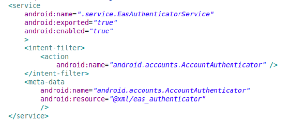 

图8-4  Email AAS定义

由图8-4可知，在Email中这个Service对应为EasAuthenticatorService，其Intent匹配的Action为“android.accounts.AccountAuthenticator”，其MetaData的name为“android.accounts.AccountAuthenticator”，而MetaData的具体信息保存在resource资源中，在本例中，它指向另外一个xml文件，即eas_authenticator.xml，此文件的内容如图8-5所示。

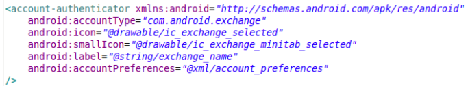 

图8-5  eas_authenticator.xml的内容

图8-5为Email中eas_authenticator.xml的内容。这个xml中的内容是有严格要求的，其中：

·  accountType标签用于指定账户类型（账户类型和具体应用有关，Android并未规定账户的类型）。

·  icon、smallIcon、label和accountPreferences等用于界面显示。例如，当需要用户输入账户信息时，系统会弹出一个Activity，上述几个标签就用于界面显示。详细情况可阅读SDK文档AbstractAccountAuthenticator的说明。

而android.accounts.AccountAuthenticator.xml的内容如图8-6所示。

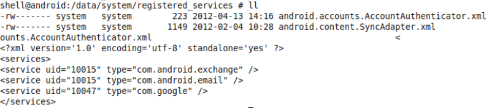 

图8-6  android.accounts.AccountAuthenticator.xml的内容

由图8-6可知，笔者的测试机器上有3个AAS服务，其中同一个uid有两个服务（即uid为10015对应的两个Service）。

<strong>提示</strong>uid是在为PackageManagerService解析APK文件时赋予APK的。读者不妨自行阅读frameworks/base/services/java/com/android/server/pm/Settings.java中的newUserIdLPw函数。

下面来看AccountManagerService的构造函数。
<h4>2. AccountManagerService构造函数分析</h4>
[--&gt;AccountManagerService.java::AccountManagerService]

public AccountManagerService(Context context,PackageManager packageManager,

           IAccountAuthenticatorCache authenticatorCache) {

 

    mContext= context;

   mPackageManager = packageManager;

 

  synchronized (mCacheLock) {

      //此数据库文件对应为/data/system/accounts.db

     mOpenHelper = new DatabaseHelper(mContext);

   }

 

  mMessageThread = new HandlerThread("AccountManagerService");

  mMessageThread.start();

  mMessageHandler = new MessageHandler(mMessageThread.getLooper());

 

  mAuthenticatorCache = authenticatorCache;

   //为AccountAuthenticatorCache设置一个监听者，一旦AAS服务发生变化，

  //AccountManagerService需要做对应处理

  mAuthenticatorCache.setListener(this, null /* Handler */);

 

  sThis.set(this);

   //监听ACTION_PACKAGE_REMOVED广播

  IntentFilter intentFilter = new IntentFilter();

  intentFilter.addAction(Intent.ACTION_PACKAGE_REMOVED);

  intentFilter.addDataScheme("package");

  mContext.registerReceiver(new BroadcastReceiver() {

   publicvoid onReceive(Context context1, Intent intent) {

       purgeOldGrants();

     }

   },intentFilter);

   /*

    accounts.db数据库中有一个grants表，用于存储授权信息，该信息用于保存哪些Package

    有权限获取账户信息。下面的函数将根据grants表中的数据查询PKMS，以判断这些

    Package是否还存在。如果系统中已经不存在这些Package，则grants表需要更新

  */

   purgeOldGrants();

   /*

  accounts.db中有一个accounts表，该表中存储了账户类型和账户名。其中，账户类型

   就是AuthenticatorDescription中的accountType，它和具体应用有关。下面这个

   函数将比较accounts表中的内容与AccountAuthenticatorCache中服务的信息，如果

   AccountAuthenticatorCache已经不存在对应账户类型的服务，则需要删除accounts表

   中的对应项

  */

  validateAccountsAndPopulateCache();

 }

AccountManagerService的构造函数较简单，有兴趣的读者可自行研究以上代码中未详细分析的函数。下面将通过一个具体的例子来分析AccountManagerService的工作流程。
<h3>8.3.2  AccountManageraddAccount分析</h3>
这一节将分析AccountManagerService中的一个重要的函数，即addAccount，其功能是为某项账户添加一个用户。下面以前面提及的Email为例来认识AAS的处理流程。

AccountManagerService是一个运行在SystemServer中的服务，客户端进程必须借助AccountManager提供的API来使用AccountManagerService服务，所以，本例需从AccountManager的addAccount函数讲起。
<h4>1.  AccountManager的addAccount发起请求</h4>
AccountManager 的addAccount函数的参数和返回值较复杂，先看其函数原型：

public AccountManagerFuture&lt;Bundle&gt;addAccount(

   finalString accountType,

   finalString authTokenType,

   finalString[] requiredFeatures,

   finalBundle addAccountOptions,

   finalActivity activity,

   AccountManagerCallback&lt;Bundle&gt;callback,

   Handlerhandler)

在以上代码中：

·  addAccount的返回值类型是AccountManagerFuture&lt;Bundle&gt;。其中，AccountManagerFuture是一个模板Interface，其真实类型只有在分析addAccount的实现时才能知道。现在可以告诉读者的是，它和Java并发库（concurrent库）中的FutureTask有关，是对异步函数调用的一种封装<a>[①]</a>。调用者在后期只要调用它的getResult函数即可取得addAccount的调用结果。由于addAccount可能涉及网络操作（例如，AAS需要把账户添加到网络服务器上），所以这里采用了异步调用的方法以避免长时间的阻塞。这也是AccountManagerFuture的getResult不能在主线程中调用的原因。

·  addAccount的第一个参数accountType代表账户类型。该参数不能为空。就本例而言，它的值为“com.android.email”。

·  authTokenType、requiredFeatures和addAccountOptions与具体的AAS服务有关。如果想添加指定账户类型的Account，则须对其背后的AAS有所了解。

·  activity：此参数和界面有关。例如有些AAS需要用户输入用户名和密码，故需启动一Activity。在这种情况下，AAS会返回一个Intent，客户端将通过这个activity启动Intent所标示的Activity。读者将通过下文的分析了解这一点。

·  callback和handler：这两个参数与如何获取addAccount返回结果有关。如这两个参数为空，客户端则须单独启动一个线程去调用AccountManagerFuture的getResult函数。

addAccount的代码如下：

[--&gt;AccountManager.java::addAccount]

public AccountManagerFuture&lt;Bundle&gt;addAccount(final String accountType,

     finalString authTokenType, final String[] requiredFeatures,

     finalBundle addAccountOptions, final Activity activity,

    AccountManagerCallback&lt;Bundle&gt; callback, Handler handler) {

    if(accountType == null) //accountType不能为null

            thrownew IllegalArgumentException("accountType is null");

   finalBundle optionsIn = new Bundle();

   if(addAccountOptions != null)//保存客户端传入的addAccountOptions

      optionsIn.putAll(addAccountOptions);

 

  optionsIn.putString(KEY_ANDROID_PACKAGE_NAME,

                        mContext.getPackageName());

    //构造一个匿名类对象，该类继承自AmsTask，并实现了doWork函数。addAccount返回前

    //将调用该对象的start函数

    returnnew AmsTask(activity, handler, callback) {

      publicvoid doWork() throws RemoteException {

           //mService用于和AccountManagerService通信

           mService.addAcount(mResponse, accountType, authTokenType,

                     requiredFeatures, activity!= null, optionsIn);

         }

      }.<strong>start</strong>();

 }

在以上代码中，AccountManager的 addAccount函数将返回一个匿名类对象，该匿名类继承自AmsTask类。那么，AmsTask又是什么呢？
<h5>（1） AmsTask介绍</h5>
先来看AmsTask的继承关系，如图8-7所示。

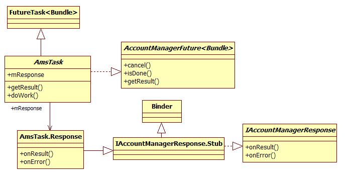 

图8-7  AmsTask继承关系

由图8-7可知：

·  AmsTask继承自FutureTask，并实现了AccountManagerFuture接口。FutureTask是Java concurrent库中一个常用的类。AmsTask定义了一个doWork虚函数，该函数必须由子类来实现。

·  一个AmsTask对象中有一个mResponse成员，该成员的类型是AmsTask中的内部类Response。从Response的派生关系可知，Response将参与Binder通信，并且它是Binder通信的Bn端。而AccountManagerService的addAccount将得到它的Bp端对象。当添加完账户后，AccountManagerService会通过这个Bp端对象的onResult或onError函数向Response通知处理结果。
<h5>（2） AmsTask匿名类处理分析</h5>
AccountManager的addAccount最终返回给客户端的是一个AmsTask的子类，首先来了解它的构造函数，其代码如下：

[--&gt;AccountManager.java::AmsTask]

public AmsTask(Activity activity, Handler handler,

                       AccountManagerCallback&lt;Bundle&gt; callback){

   ......//调用基类构造函数

   //保存客户端传递的参数

    mHandler= handler;

   mCallback = callback;

   mActivity = activity;

   mResponse = new Response();//构造一个Response对象，并保存到mResponse中

}

下一步调用的是这个匿名类的start函数，代码如下：

[--&gt;AccountManager.java::AmsTask.start]

public final AccountManagerFuture&lt;Bundle&gt;start() {

   try {

          doWork(); //调用匿名类实现的doWork函数

     }......

    returnthis;

 }

匿名类实现的doWork函数即下面这个函数：

[--&gt;AccountManager.java::addAccount返回的匿名类]

public void doWork() throws RemoteException {

   //调用AccountManagerService的addAccount函数，其第一个参数是mResponse

   mService.addAcount(mResponse, accountType, authTokenType,

           requiredFeatures, activity != null, optionsIn);

  }

AccountManager的addAccount函数的实现比较新奇，它内部使用了Java的concurrent类。不熟悉Java并发编程的读者有必要了解相关知识。

下面转到AccountManagerService中去分析addAccount的实现。
<h4>2. AccountManagerService addAccount转发请求</h4>
AccountManagerServiceaddAccount的代码如下所示：

[--&gt;AccountManagerService.java::addAccount]

public void addAcount(finalIAccountManagerResponse response,

        finalString accountType, final String authTokenType,

       final String[] requiredFeatures, final boolean expectActivityLaunch,

       final Bundle optionsIn) {

   ......

   //检查客户端进程是否有“android.permission.MANAGE_ACCOUNTS”的权限

   checkManageAccountsPermission();

 

   final intpid = Binder.getCallingPid();

   final intuid = Binder.getCallingUid();

   //构造一个Bundle类型的options变量，并保存传入的optionsIn

   finalBundle options = (optionsIn == null) ? new Bundle() : optionsIn;

  options.putInt(AccountManager.KEY_CALLER_UID, uid);

  options.putInt(AccountManager.KEY_CALLER_PID, pid);

 

    longidentityToken = clearCallingIdentity();

    try {

          //创建一个匿名类对象，该匿名类派生自Session类。最后调用该匿名类的bind函数

          new Session(response, accountType, expectActivityLaunch,true){

             public void run() throws RemoteException {

                mAuthenticator.addAccount(this, mAccountType,

                           authTokenType,requiredFeatures, options);

               }

               protected String toDebugString(longnow) {

                   ......//实现toDebugString函数

               }

           }.<strong>bind</strong>();

        }finally {

           restoreCallingIdentity(identityToken);

        }

    }

由以上代码可知，AccountManagerService的addAccount函数最后也创建了一个匿名类对象，该匿名类派生自Session。addAccount最后还调用了这个对象的bind函数。其中最重要的内容就是Session。那么，Session又是什么呢？
<h5>（1） Session介绍</h5>
Session家族成员如图8-8所示。

 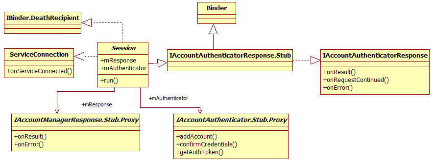

图8-8  Session家族示意图

由图8-8可知：

·  Session从IAccountAuthenticatorResponse.Stub派生，这表明它将参与Binder通信，并且它是Bn端。那么这个Binder通信的目标是谁呢？，它正是具体的AAS服务。AccountManagerService会将自己传递给AAS，这样，AAS就得到IAccountAuthenticatorResponse的Bp端对象。当AAS完成了具体的账户添加工作后，会通过IAccountAuthenticatorResponse的Bp端对象向Seession返回处理结果。

·  Session通过mResponse成员变量指向来自客户端的IAccountManagerResponse接口，当Session收到AAS的返回结果后，又通过IAccountManagerResponse 的Bp端对象向客户端返回处理结果。

·  Session mAuthenticator变量的类型是IAccountAuthenticator，它用于和远端的AAS通信。客户端发起的请求将通过Session经由mAuthenticator调用对应AAS中的函数。

由图8-7和图8-8可知，AccountManagerService在addAccount流程中所起的是桥梁作用，具体如下：

·  客户端将请求发送给AccountManagerService，然后AccountManagerService再转发给对应的AAS。

·  AAS处理完的结果先返回给AccountManagerService，再由AccountManagerService返回给客户端。

由于图8-7和图8-8中定义的类名较相似，因此读者阅读时应仔细一些。

下面来看Session匿名类的处理。
<h5>（2） Session匿名类处理分析</h5>
首先调用Session的构造函数，代码为：

[--&gt;AccountManagerService.java::Session]

public Session(IAccountManagerResponse response,String accountType,

      boolean expectActivityLaunch, boolean stripAuthTokenFromResult) {

      super();

       ......

      /*

       注意其中的参数，expectActivityLaunch由客户端传来，如果用户调用

       AccountManager addAccount时传入了activity参数，则该值为true，

       stripAuthTokenFromResult的默认值为true

      */

      mStripAuthTokenFromResult = stripAuthTokenFromResult;

       mResponse = response;

      mAccountType = accountType;

      mExpectActivityLaunch = expectActivityLaunch;

      mCreationTime = SystemClock.elapsedRealtime();

       synchronized(mSessions) {

          //将这个匿名类对象保存到AccountManagerService中的mSessions成员中

          mSessions.put(toString(), this);

        }

        try{  //监听客户端死亡消息

               response.asBinder().linkToDeath(this, 0);

          } ......

 }

获得匿名类对象后，addAccount将调用其bind函数，该函数由AmsTask实现，代码如下：

[--&gt;AccountManagerService.java::Session:bind]

void bind() {

   //绑定到mAccountType指定的AAS。在本例中，AAS的类型是“com.android.email”

   if(!bindToAuthenticator(mAccountType)) {

      onError(AccountManager.ERROR_CODE_REMOTE_EXCEPTION, "bindfailure");

     }

}

bindToAuthenticator的代码为：

[--&gt;AccountManagerService.java::Session:bindToAuthenticator]

private boolean bindToAuthenticator(StringauthenticatorType) {

    //从mAuthenticatorCache中查询满足指定类型的服务信息

   AccountAuthenticatorCache.ServiceInfo&lt;AuthenticatorDescription&gt;

            authenticatorInfo =

             mAuthenticatorCache.getServiceInfo(

                           AuthenticatorDescription.newKey(authenticatorType));

   ......

 

    Intentintent = new Intent();

   intent.setAction(AccountManager.ACTION_AUTHENTICATOR_INTENT);

    //设置目标服务的ComponentName

   intent.setComponent(authenticatorInfo.componentName);

     //通过bindService启动指定的服务，成功与否将通过第二个参数传递的

    //ServiceConnection接口返回

    if(!mContext.bindService(intent, this, Context.BIND_AUTO_CREATE)) {

          ......

      }

     returntrue;

 }

由以上代码可知，Session的bind函数将启动指定类型的Service，这是通过bindService函数完成的。如果服务启动成功，Session的onServiceConnected函数将被调用，这部分代码如下：

[--&gt;AccountManagerService.java::Session:onServiceConnected]

public void onServiceConnected(ComponentName name,IBinder service) {

   //得到远端AAS返回的IAccountAuthenticator接口，这个接口用于

  //AccountManagerService和该远端AAS交互

   mAuthenticator = IAccountAuthenticator.Stub.asInterface(service);

    try {

           run();//调用匿名类实现的run函数

     } ......

 }

匿名类实现的run函数非常简单，代码如下：

[--&gt;AccountManagerService.java::addAccount返回的匿名类]

new Session(response, accountType,expectActivityLaunch,true) {

     publicvoid run() throws RemoteException {

          //调用远端AAS实现的addAccount函数

         mAuthenticator.addAccount(this, mAccountType,

                            authTokenType, requiredFeatures,options);

}

由以上代码可知，AccountManagerService在addAccount最终将调用AAS实现的addAccount函数。

下面来看本例中满足“com.android.email”类型的服务是如何处理addAccount的请求的。该服务就是Email应用中的EasAuthenticatorService，下面来分析它。
<h4>3.  EasAuthenticatorService处理请求</h4>
EasAuthenticatorService的创建是AccountManagerService调用了bindService导致的，该函数会触发EasAuthenticatorService的onBind函数被调用，这部分代码如下：

[--&gt;EasAuthenticatorService.java::onBind]

public IBinder onBind(Intent intent) {

  if(AccountManager.ACTION_AUTHENTICATOR_INTENT.equals(

                                intent.getAction())){

       //创建一个EasAuthenticator类型的对象，并调用其getIBinder函数

      return new EasAuthenticator(this).getIBinder();

   }else  return null;

 }

下面来分析EasAuthenticator。
<h5>（1） EasAuthenticator介绍</h5>
EasAuthenticator是EasAuthenticatorService定义的内部类，其家族关系如图8-9所示。

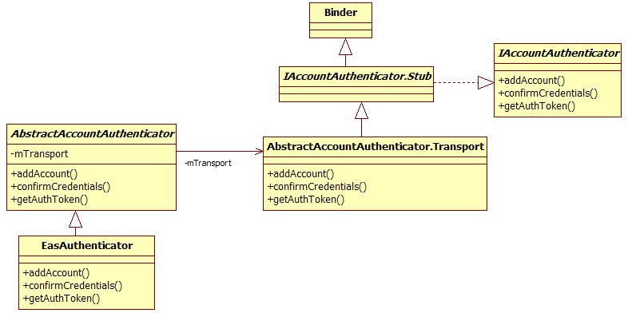 

图8-9  EasAuthenticator家族类图

由图8-9可知：

·  EasAuthenticator从AbstractAccountAuthenticator类派生。AbstractAccountAuthenticator内部有一个mTransport的成员变量，其类型是AbstractAccountAuthenticator的内部类Transport。在前面的onBind函数中，EasAuthenticator的getIBinder函数返回的就是这个变量。

·  Transport类继承自Binder，故它将参与Binder通信，并且是IAccountAuthenticator的Bn端。Session匿名类通过onServiceConnected函数将得到一个IAccountAuthenticator的Bp端对象。

当由AccoutManagerService的addAccount创建的那个Session匿名类调用IAccountAuthenticator Bp端对象的addAccount时，将触发位于Emai进程中的IAccountAuthenticatorBn端的addAccount。下面来分析Bn端的addAccount函数。
<h5>（2） EasAuthenticator的 addAccount函数分析</h5>
根据上文的描述可知，Emai 进程中首先被触发的是IAccountAuthenticatorBn端的addAccount函数，其代码如下：

[--&gt;AbstractAccountAuthenticator.java::Transport:addAccount]

private class Transport extendsIAccountAuthenticator.Stub {

   publicvoid addAccount(IAccountAuthenticatorResponse response,

               String accountType, String authTokenType,

               String[] features, Bundle options)

               throws RemoteException {

     //检查权限

    checkBinderPermission();

     try {

           //调用AbstractAccountAuthenticator子类实现的addAccount函数

           final Bundle result =

                AbstractAccountAuthenticator.this.addAccount(

                   new AccountAuthenticatorResponse(response),

                        accountType,authTokenType, features, options);

               //如果返回的result不为空，则调用response的onResult返回结果。

              //这个response是IAccountAuthenticatorResponse类型，它的onResult

              //将触发位于Session匿名类中mResponse变量的onResult函数被调用

              if (result != null)

                   response.onResult(result);

       }......

 }

本例中AbstractAccountAuthenticator子类（即EasAuthenticator）实现的addAccount函数，代码如下：

[--&gt;EasAuthenticatorService.java::EasAuthenticator.addAccount]

public BundleaddAccount(AccountAuthenticatorResponse response,

               String accountType, StringauthTokenType,

               String[] requiredFeatures, Bundle options)

               throws NetworkErrorException {

    //EasAuthenticatoraddAccount的处理逻辑和Email应用有关。只做简单了解即可

    //如果用户传递的账户信息保护了密码和用户名，则走if分支。注意，其中有一些参数名是

    //通用的，例如OPTIONS_PASSWORD，OPTIONS_USERNAME等

    if(options != null &amp;&amp; options.containsKey(OPTIONS_PASSWORD)

                   &amp;&amp; options.containsKey(OPTIONS_USERNAME)) {

     //创建一个Account对象，该对象仅包括两个成员，一个是name，用于表示账户名；

    //另一个是type，用于表示账户类型

     finalAccount account = new

                           Account(options.getString(OPTIONS_USERNAME),

                       AccountManagerTypes.TYPE_EXCHANGE);

    //调用AccountManager的addAccountExplicitly将account对象和password传递

    //给AccountManagerService处理。读者可自行研究这个函数，在其内部将这些信息写入

   //accounts.db的account表中

     AccountManager.get(EasAuthenticatorService.this).

                     addAccountExplicitly(account,

                        options.getString(OPTIONS_PASSWORD), null);

 

    //根据Email应用的规则，下面将判断和该账户相关的数据是否需要设置自动数据同步

    //首先判断是否需要处理联系人自动数据同步

     booleansyncContacts = false;

      if(options.containsKey(OPTIONS_CONTACTS_SYNC_ENABLED) &amp;&amp;

            options.getBoolean(OPTIONS_CONTACTS_SYNC_ENABLED))

                   syncContacts = true;

     ContentResolver.setIsSyncable(account,

                       ContactsContract.AUTHORITY,1);

    ContentResolver.setSyncAutomatically(account,

                           ContactsContract.AUTHORITY,syncContacts);

     booleansyncCalendar = false;

     ......//判断是否需要设置Calendar自动数据同步

     booleansyncEmail = false;

    //如果选项中包含Email同步相关的功能，则需要设置Email数据同步的相关参数

    if(options.containsKey(OPTIONS_EMAIL_SYNC_ENABLED) &amp;&amp;

          options.getBoolean(OPTIONS_EMAIL_SYNC_ENABLED))

          syncEmail = true;

    /*

     下面这两个函数将和ContentService中的SyncManager交互。注意这

     两个函数：第一个函数setIsSyncable将设置Email对应的同步服务功能标志，

     第二个函数setSyncAutomatically将设置是否自动同步Email。

     数据同步的内容留待8.4节再详细分析

   */

     <strong>ContentResolver.setIsSyncable</strong>(account,EmailContent.AUTHORITY, 1);

     <strong>ContentResolver.setSyncAutomatically</strong>(account,EmailContent.AUTHORITY,

                                                    syncEmail);

     //构造返回结果，注意，下面这些参数名是Android统一定义的，如KEY_ACCOUNT_NAME等

     Bundleb = new Bundle();

     b.putString(AccountManager.KEY_ACCOUNT_NAME,

                              options.getString(OPTIONS_USERNAME));

   b.putString(AccountManager.KEY_ACCOUNT_TYPE,

                                AccountManagerTypes.TYPE_EXCHANGE);

    returnb;

   } else {

        //如果没有传递password，则需要启动一个Activity，该Activity对应的Intent

        //由actionSetupExchangeIntent返回。注意下面几个通用的参数,如

        // KEY_ACCOUNT_AUTHENTICATOR_RESPONSE和KEY_INTENT

       Bundle b = new Bundle();

       Intent intent =AccountSetupBasics.actionSetupExchangeIntent(

                                         EasAuthenticatorService.this);

        intent.putExtra(

                AccountManager.KEY_ACCOUNT_AUTHENTICATOR_RESPONSE, response);

        b.putParcelable(AccountManager.KEY_INTENT,intent);

       return b;

   }

 }

不同的AAS有自己特定的处理逻辑，以上代码向读者展示了EasAuthenticatorService的工作流程。虽然每个AAS的处理方式各有不同，但Android还是定义了一些通用的参数，例如OPTIONS_USERNAME用于表示用户名，OPTIONS_PASSWORD用于表示密码等。关于这方面内容，读者可查阅SDK中AccountManager的文档说明。
<h4>4.  返回值的处理流程</h4>
在EasAuthenticator的addAccount返回处理结果后，AbstractAuthenticator将通过IAccountAuthenticatorResponse的onResult将其返回给由AccountManagerService创建的Session匿名类对象。来看Session的onResult函数，其代码如下：

[--&gt;AccountManagerService.java::Session:onResult]

public void onResult(Bundle result) {

   mNumResults++;

    //从返回的result中取出相关信息，关于下面这个if分支处理和状态栏中相关的逻辑，

   //读者可自行研究    if (result != null&amp;&amp;!TextUtils.isEmpty(

               result.getString(AccountManager.KEY_AUTHTOKEN))) {

       String accountName = result.getString(AccountManager.KEY_ACCOUNT_NAME);

       String accountType =

              result.getString(AccountManager.KEY_ACCOUNT_TYPE);

         if(!TextUtils.isEmpty(accountName) &amp;&amp;

                         !TextUtils.isEmpty(accountType)){

           Account account = new Account(accountName, accountType);

            cancelNotification(

                     getSigninRequiredNotificationId(account));

         }

     }

   IAccountManagerResponse response;

   //如果客户端传递了activity参数，则mExpectActivityLaunch为true。如果

  //AAS返回的结果中包含KEY_INTENT，则表明需要弹出Activity以输入账户和密码

   if(mExpectActivityLaunch &amp;&amp; result != null

                   &amp;&amp; result.containsKey(AccountManager.KEY_INTENT)) {

        response = mResponse;

    } else {

        /*

         getResponseAndClose返回的也是mResponse，不过它会调用unBindService

         断开和AAS服务的连接。就整个流程而言，此时addAccount已经完成AAS和

       AccountManagerService的工作，故无需再保留和AAS服务的连接。而由于上面的if

        分支还需要输入用户密码，因此以AAS和AccountManagerService之间的工作

        还没有真正完成

       */

       response = getResponseAndClose();

    }

    if(response != null) {

         try{

               ......

               if (mStripAuthTokenFromResult)

                     result.remove(AccountManager.KEY_AUTHTOKEN);

               //调用位于客户端的IAccountManagerResponse的onResult函数

               response.onResult(result);

          } ......

    }

 }

客户端的IAccountManagerResponse接口由AmsTask内部类Response实现，其代码为：

[--&gt;AccountManager.java::AmsTask::Response.onResult]

public void onResult(Bundle bundle) {

    Intentintent = bundle.getParcelable(KEY_INTENT);

    //如果需要弹出Activity，则要利用客户端传入的那个activity去启动AAS指定的

   //Activity。这个Activity由AAS返回的Intent来表示

    if(intent != null &amp;&amp; mActivity != null) {

         mActivity.startActivity(intent);

     } elseif (bundle.getBoolean("retry")) {

          //如果需要重试，则再次调用doWork

           try {

                  doWork();

           }......

       }else{

         //将返回结果保存起来，当客户端调用getResult时，就会得到相关结果

          set(bundle);

      }

}

<h4>5.  AccountManager的addAccount分析总结</h4>
AccountManager的addAccount流程分析起来给人一种行云流水般的感觉。该流程涉及3个模块，分别是客户端、AccountManagerService和AAS。整体难度虽不算大，但架构却比较巧妙。

总结起来addAccount相关流程如图8-10所示。

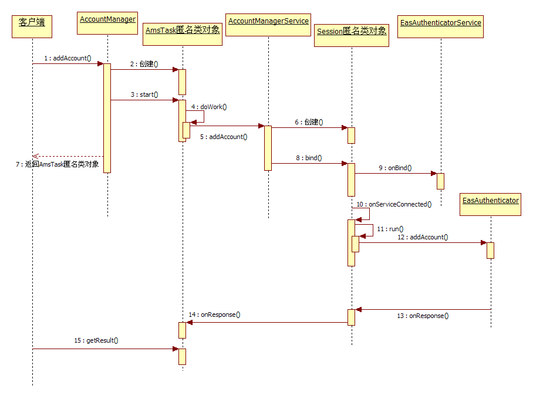 

图8-10  AccountManager的addAccount处理流程

为了让读者看得更清楚，图8-10中略去了一些细枝末节的内容。另外，图8-10中第10步的onServiceConnected函数应由位于SystemServer中的ActivityThread对象调用，为方便阅读起见，这里没有画出ActivityThread的对象。

 
<h3>8.3.3  AccountManagerService的分析总结</h3>
本节对AccountManagerService进行分析，从技术上说，本节涉及和Java concurrent类相关的知识。另外，对并发编程来说，架构设计是最重要的，因此读者务必阅读脚注中提到的参考书籍《Pattern.Oriented.Software.Architecture.Volume.2》。

就整体而言，AccountManagerService及相关类的设计非常巧妙，读者不妨重温RegisteredServicesCache的结构及addAccount的处理流程并认真体会。
<h2>8.4  数据同步管理SyncManager分析</h2>
本节将分析ContentService中负责数据同步管理的SyncManager。SynManager和AccountManagerService之间的关系比较紧密。同时，由于数据同步涉及手机中重要数据（例如联系人信息、Email、日历等）的传输，因此它的控制逻辑非常严谨，知识点也比较多，难度相对比AccountManagerService大。

先来认识数据同步管理的核心类SyncManager。
<h3>8.4.1  初识SyncManager</h3>
SyncManager的构造函数的代码较长，可分段来看。下面先来介绍第一段的代码。
<h4>1.  SyncManager介绍</h4>
[--&gt;SyncManager.java::SyncManager]

public SyncManager(Context context, booleanfactoryTest) {

   mContext= context;

  //SyncManager中的几位重要成员登场。见下文的解释

  SyncStorageEngine.init(context);

   <strong>mSyncStorageEngine</strong> =SyncStorageEngine.getSingleton();

   <strong>mSyncAdapters</strong> = newSyncAdaptersCache(mContext);

   <strong>mSyncQueue</strong> = newSyncQueue(mSyncStorageEngine, mSyncAdapters);

 

   HandlerThread syncThread = newHandlerThread("SyncHandlerThread",

                          Process.THREAD_PRIORITY_BACKGROUND);

  syncThread.start();

  mSyncHandler = new SyncHandler(syncThread.getLooper());

  mMainHandler = new Handler(mContext.getMainLooper());

 

   /*

    mSyncAdapters类似AccountManagerService中的AccountAuthenticatorCache，

    它用于管理系统中和SyncService相关的服务信息。下边的函数为mSyncAdapters增加一个

    监听对象，一旦系统中的SyncService发生变化（例如安装了一个提供同步服务的APK包），则

    SyncManager需要针对该服务发起一次同步请求。同步请求由scheduleSync函数发送，

    后文再分析此函数

   */

  mSyncAdapters.setListener(new

             RegisteredServicesCacheListener&lt;SyncAdapterType&gt;() {

           public void onServiceChanged(SyncAdapterType type,

                                              boolean removed) {

               if (!removed) {

                   scheduleSync(null, type.authority, null, 0,false);

               }

           }

        },mSyncHandler);

在以上代码中，首先见到的是SyncManager的几位重要成员，它们之间的关系如图8-11所示。

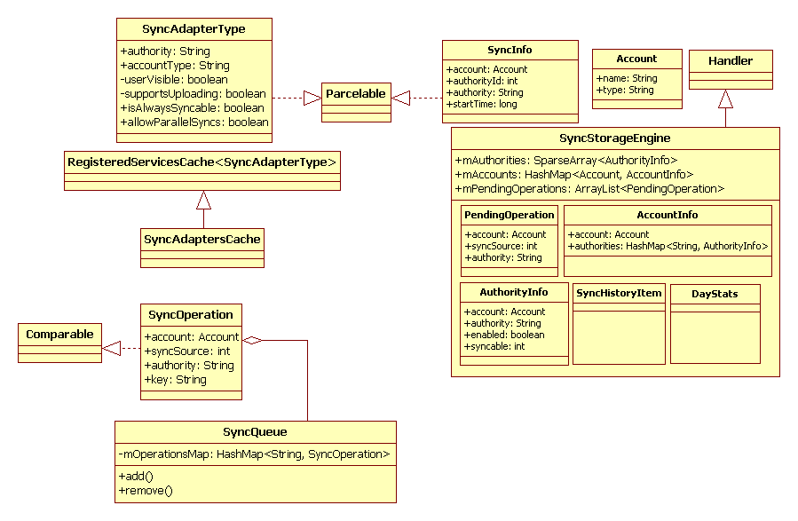 

图8-11  SyncManager成员类图

由图8-11可知， SyncManager的这几位成员的功能大体可分为3部分：

·  左上角是SyncAdaptersCache类，从功能和派生关系上看，它和AccountManagerService中的AccountAuthenticatorCaches类似。SyncAdaptersCache用于管理系统中SyncService服务的信息。在SyncManager中，SyncService的信息用SyncAdapterType类来表示。

·  左下角是SyncQueue和SyncOperation类，SyncOperation代表一次正在执行或等待执行的同步操作，而SyncQueue通过mOperationsMap保存系统中存在的SyncOperation。

·  右半部分是SyncStorageEngine，由于同步操作涉及,重要数据的传输，加之可能耗时较长，所以SyncStorageEngine提供了一些内部类来保存同步操作中的一些信息。例如PendingOperation代表保存在从本地文件中的那些还没有执行完的同步操作的信息。另外，SyncStrorageEngine还需要对同步操作进行一些统计，例如耗电量统计等。SyncStorageEngine包含的内容较多，读者学习完本章后可自行研究相关内容。

SyncManager家族成员的责任分工比较细，后续分析时再具体讨论它们的作用。先接着看SyncManager的构造函数：

[--&gt;SyncManager.java::SyncManager]

   ......

    //创建一个用于广播发送的PendingIntent，该PendingIntent用于和

    //AlarmManagerService交互

    mSyncAlarmIntent= PendingIntent.getBroadcast(

                          mContext, 0, new Intent(ACTION_SYNC_ALARM),0);

   //注册CONNECTIVITY_ACTION广播监听对象，用于同步操作需要使用网络，所以

   //此处需要监听和网络相关的广播

  IntentFilter intentFilter =

             new IntentFilter(ConnectivityManager.CONNECTIVITY_ACTION);

       context.registerReceiver(mConnectivityIntentReceiver, intentFilter);

 

   if(!factoryTest) {

         //监听BOOT_COMPLETED广播

        intentFilter = new IntentFilter(Intent.ACTION_BOOT_COMPLETED);

        context.registerReceiver(mBootCompletedReceiver, intentFilter);

   }

   //监听BACKGROUND_DATA_SETTING_CHANGED广播。该广播与是否允许后台传输数据有关，

   //用户可在Settings应用程序中设置对应选项

  intentFilter =

               new IntentFilter(ConnectivityManager.

                          ACTION_BACKGROUND_DATA_SETTING_CHANGED);

  context.registerReceiver(mBackgroundDataSettingChanged, intentFilter);

 

   //监视设备存储空间状态广播。由于SyncStorageEngine会保存同步时的一些信息到存储

   //设备中，所以此处需要监视存储设备的状态

  intentFilter = new IntentFilter(Intent.ACTION_DEVICE_STORAGE_LOW);

  intentFilter.addAction(Intent.ACTION_DEVICE_STORAGE_OK);

  context.registerReceiver(mStorageIntentReceiver, intentFilter);

 

   //监听SHUTDOWN广播。此处设置优先级为100，即优先接收此广播

  intentFilter = new IntentFilter(Intent.ACTION_SHUTDOWN);

  intentFilter.setPriority(100);

  context.registerReceiver(mShutdownIntentReceiver, intentFilter);

 

   if(!factoryTest) {//和通知服务交互，用于在状态栏上提示用户

      mNotificationMgr = (NotificationManager)

               context.getSystemService(Context.NOTIFICATION_SERVICE);

      //注意，以下函数注册的广播将针对前面创建的mSyncAlarmIntent

      context.registerReceiver(new SyncAlarmIntentReceiver(),

                          newIntentFilter(ACTION_SYNC_ALARM));

   }......

 

  mPowerManager = (PowerManager)

               context.getSystemService(Context.POWER_SERVICE);

  //创建WakeLock，防止同步过程中掉电

  mHandleAlarmWakeLock =

              mPowerManager.newWakeLock(PowerManager.PARTIAL_WAKE_LOCK,

                                             HANDLE_SYNC_ALARM_WAKE_LOCK);

  mHandleAlarmWakeLock.setReferenceCounted(false);

 

  mSyncManagerWakeLock =

              mPowerManager.newWakeLock(PowerManager.PARTIAL_WAKE_LOCK,

                                            SYNC_LOOP_WAKE_LOCK);

  mSyncManagerWakeLock.setReferenceCounted(false);

 

   //<strong>知识点一</strong>：监听SyncStorageEngine的状态变化，如下文解释

  mSyncStorageEngine.addStatusChangeListener(

               ContentResolver.SYNC_OBSERVER_TYPE_SETTINGS,

                     newISyncStatusObserver.Stub() {

           public void onStatusChanged(int which) {

               sendCheckAlarmsMessage();

           }

        });

 

    //<strong>知识点二</strong>：监视账户的变化。如果用户添加或删除了某个账户，则需要做相应处理。

    //如下文解释

    if(!factoryTest) {

           AccountManager.get(mContext).addOnAccountsUpdatedListener(

                 SyncManager.this,

               mSyncHandler, false);

           onAccountsUpdated(AccountManager.get(mContext).getAccounts());

        }

    }

在以上代码中，有两个重要知识点。

<strong>第一</strong>， SyncManager为SyncStorageEngine设置了一个状态监听对象。根据前文的描述，在SyncManager家族中，SyncStorageEngine专门负责管理和保存同步服务中绝大部分的信息，所以当外界修改了这些信息时，SyncStorageEngine需要通知状态监听对象。我们可以通过一个例子了解其中的工作流程。下面的setSyncAutomatically函数的作用是设置是否自动同步某个账户的某项数据，代码如下：

[--&gt;ContentService.java::setSyncAutomatically]

public void setSyncAutomatically(Account account,String providerName,

                                       booleansync) {

    ......//检查WRITE_SYNC_SETTINGS权限

   longidentityToken = clearCallingIdentity();

   try {

     SyncManager syncManager = getSyncManager();

       if(syncManager != null) {

           /*

            通过SyncManager找到SyncStorageEngine，并调用它的

             setSyncAutomatically函数。在其内部会修改对应账户的同步服务信息，然后通知

             监听者，而这个监听者就是SyncManager设置的那个状态监听对象

          */

           syncManager.getSyncStorageEngine().setSyncAutomatically(

                       account, providerName,sync);

          }

     }finally {

         restoreCallingIdentity(identityToken);

     }

}

在以上代码中，最终调用的是SyncStorageEngine的函数，但SyncManager也会因状态监听对象被触发而做出相应动作。实际上，ContentService中大部分设置同步服务参数的API，其内部实现就是先直接调用SyncStorageEngine的函数，然后再由SyncStorageEngine通知监听对象。读者在阅读代码时，仔细一些就可明白这一关系。

<strong>第二</strong>，SyncManager将为AccountManager设置一个账户更新监听对象（注意，此处是AccountManager，而不是AccountManagerService。AccountManager这部分功能的代码不是很简单，读者有必要反复研究）。在Android平台上，数据同步和账户的关系非常紧密，并且同一个账户可以对应不同的数据项。例如在EasAuthenticator的addAccount实现中，读者会发现一个Exchange账户可以对应Contacts、Calendar和Email三种不同的数据项。在添加Exchange账户时，还可以选择是否同步其中的某项数据（通过判断实现addAccount时传递的options是否含有对应的同步选项，例如同步邮件数据时需要设置的OPTIONS_EMAIL_SYNC_ENABLED选项）。由于SyncManager和账户之间的这种紧密关系的存在，SyncManager就必须监听手机中账户的变化情况。

<strong>提示</strong>上述两个知识点涉及的内容都是一些非常细节的问题，本章拟将它们作为小任务，读者可自行研究它们。

下面来认识一下SyncManager家族中的几位主要成员，首先是SyncStorageEngine。
<h4>2.  SyncStorageEngine介绍</h4>
SyncStorageEngine负责整个同步系统中信息管理方面的工作。先看其init函数代码：

[--&gt;SyncStorageEngine.java::init]

public static void init(Context context) {

  if(sSyncStorageEngine != null) return;

   /*

    得到系统中加密文件系统的路径，如果手机中没有加密的文件系统（根据系统属性

    “persist.security.efs.enabled”的值来判断），则返回的路径为/data，

    目前的Android手机大部分都没有加密文件系统，故dataDir为/data

   */

   FiledataDir = Environment.getSecureDataDirectory();

   //创建SyncStorageEngine对象

  sSyncStorageEngine = new SyncStorageEngine(context, dataDir);

 }

而SyncStorageEngine的构造函数代码为：

[--&gt;SyncStorageEngine.java::SyncStorageEngine]

private SyncStorageEngine(Context context, FiledataDir) {

   mContext= context;

  sSyncStorageEngine = this;

 

   mCal =Calendar.getInstance(TimeZone.getTimeZone("GMT+0"));

 

   FilesystemDir = new File(dataDir, "system");

   FilesyncDir = new File(systemDir, "sync");

  syncDir.mkdirs();

   //mAccountInfoFile指向/data/system/sync/accounts.xml

  mAccountInfoFile = new AtomicFile(new File(syncDir,"accounts.xml"));

 

   //mStatusFile指向/data/system/sync/status.bin，该文件记录

  //一些和同步服务相关的状态信息

  mStatusFile = new AtomicFile(new File(syncDir, "status.bin"));

 

   //mStatusFile指向/data/system/sync/pending.bin，该文件记录了当前处于pending

   //状态的同步请求

  mPendingFile = new AtomicFile(new File(syncDir,"pending.bin"));

 

   //mStatusFile指向/data/system/sync/stats.bin，该文件记录同步服务管理运行过程

   //中的一些统计信息

  mStatisticsFile = new AtomicFile(new File(syncDir,"stats.bin"));

 

  /*

   解析上述四个文件，从下面的代码看，似乎是先读（readXXX）后写（writeXXX），这是怎么

   回事？答案在于AtomicFile，它内部实际包含两个文件，其中一个用于备份，防止数据丢失。

   感兴趣的读者可以研究AtomicFile类，其实现非常简单

  */

   readAccountInfoLocked();

  readStatusLocked();

  readPendingOperationsLocked();

  readStatisticsLocked();

  readAndDeleteLegacyAccountInfoLocked();

  

  writeAccountInfoLocked();

  writeStatusLocked();

  writePendingOperationsLocked();

  writeStatisticsLocked();

 }

上述init和SyncStorage的构造函数都比较简单，故不再详述。下面将讨论一些有关accounts.xml的故事。以下是一个真实机器上的accounts.xml文件，如图8-12所示。

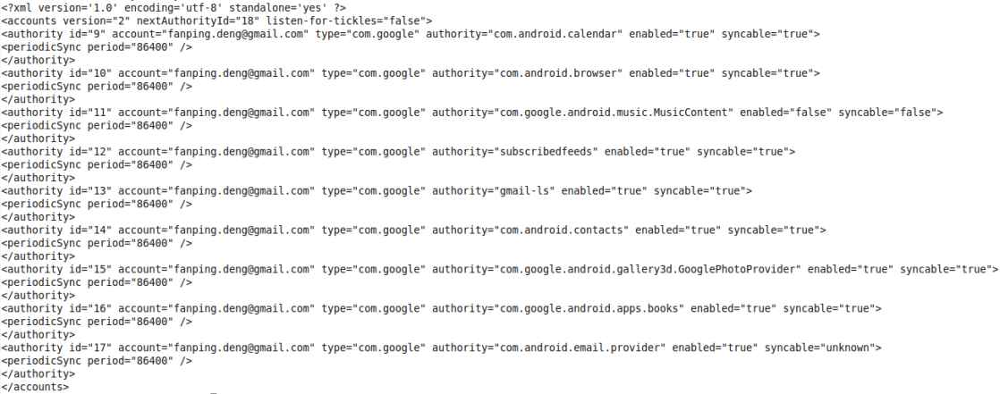 

图8-12  accounts.xml内容展示

图8-12所示为笔者KindleFire（CM9的ROM）机器中accounts.xml文件的内容，其中两个黑框中内容的作用如下：

·  第一个框中的listen-for-tickles，该标签和Android平台中的Master Sync有关。Master Sync用于控制手机中是否所有账户对应的所有数据项都自动同步。用户可通过ContentResolver setMasterSyncAutomatically进行设置。

·  第二个框代表一个AuthorityInfo。AuthorityInfo记录了账户和SyncService相关的一些信息。此框中的account为笔者的邮箱，type为“com.google”。另外，从图8-12中还可发现，一个账户（包含account和type两个属性）可以对应多种类型的数据项，例如此框中对应的数据项是“com.android.email.provider”，而此框前面一个AuthorityInfo对应的数据项是“com.google.android.apps.books”。AuthorityInfo中的periodicSync用于控制周期同步的时间，单位是秒，默认是86400秒，也就是1天。另外，AuthorityInfo中还有一个重要属性syncable，它的可选值为true、false或unknown（在代码中，这3个值分别对应整型值1、0和-1）。

syncable的unknown状态是个较难理解的概念，它和参数SYNC_EXTRAS_INITIALIZE有关，官方的解释如下：

/**

 Set by theSyncManager to request that the SyncAdapter initialize itself for

 the givenaccount/authority pair. One required initialization step is to

 ensure thatsetIsSyncable()has been called with a &gt;= 0 value.

  When thisflag is set the SyncAdapter does not need to do a full sync,

 though itis allowed to do so.

*/

 publicstatic final String SYNC_EXTRAS_INITIALIZE = "initialize";

由以上解释可知，如果某个SyncService的状态为unknown，那么在启动它时必须传递一个SYNC_EXTRAS_INITIALIZE选项，SyncService解析该选项后即可知自己尚未被初始化。当它完成初始化后，需要调用setIsSyncable函数设置syncable的状态为1。另外，SyncService初始化完成后，是否可接着执行同步请求呢？目前的设计是，它们并不会立即执行同步，需要用户再次发起请求。读者在后续小节中会看到与此相关的处理。

此处先来看setIsSyncable的使用示例，前面分析的EasAuthenticator addAccount中有如下的函数调用：

  //添加完账户后，将设置对应的同步服务状态为1

  <strong>ContentResolver.setIsSyncable</strong>(account,EmailContent.AUTHORITY, 1);

  <strong>ContentResolver.setSyncAutomatically</strong>(account,EmailContent.AUTHORITY,

                                                    syncEmail);

在EasAuthenticator中，一旦添加了账户，就会设置对应SyncService的syncable状态为1。SyncManager将根据这个状态做一些处理，例如立即发起一次同步操作。

<strong>注意</strong>是否设置syncable状态和具体应用有关，图8-12第二个框中的gmail邮件同步服务就没有因为笔者添加了账户而设置syncable为1。

 
<h4>3.  SyncAdaptersCache介绍</h4>
再看SyncAdaptersCache，其构造函数代码如下：

[--&gt;SyncAdaptersCache.java::SyncAdaptersCache]

SyncAdaptersCache(Context context) {

   /*

   调用基类RegisteredServicesCache的构造函数，其中SERVICE_INTERFACE和

   和SERVICE_META_DATA的值为“android.content.SyncAdapter”，

   ATTRIBUTES_NAME为字符串"sync-adapter"

   */

 super(context, SERVICE_INTERFACE, SERVICE_META_DATA,

              ATTRIBUTES_NAME, sSerializer);

 }

SyncAdaptersCache的基类是RegisteredServicesCache。8.3.1节已经分析过RegisteredServicesCache了，此处不再赘述。下面展示一个实际的例子，如图8-13所示。

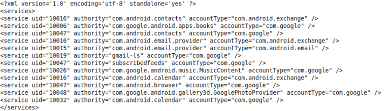 

图8-13  android.content.SyncAdapter.xml

图8-13列出了笔者KindleFire上安装的同步服务，其中黑框列出的是“om.android.exchange”，该项服务和Android中Exchange应用有关。Exchange的AndroidManifest.xml文件的信息如图8-14所示。

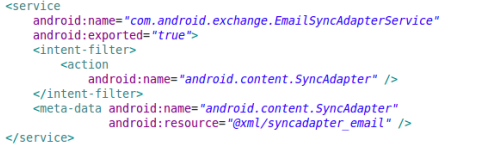 

图8-14  Exchange AndroidManifest.xml示意

图8-14列出了Exchange应用所支持的针对邮件提供的同步服务，即EmailSyncAdapterService。该服务会通过meta-data中的resource来描述自己，这部分内容如图8-15所示。

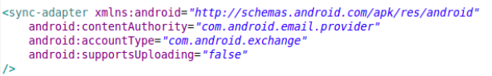 

图8-15  syncadapter_email.xml内容展示

图8-15告诉我们，EmailSyncAdapterService对应的账户类型是“com.android.exchange”，需要同步的邮件数据地址由contentAuthority表示，即本例中的“com.android.email.provider”。注意，EmailSyncAdapterService只支持从网络服务端同步数据到本机，故supportsUploading为false。

再看SyncManager家族中最后一位成员SyncQueue。
<h4>4.  SyncQueue介绍</h4>
SyncQueue用于管理同步操作对象SyncOperation。SyncQueue的构造函数代码为：

[--&gt;SyncQueue.java::SyncQueue]

public SyncQueue(SyncStorageEnginesyncStorageEngine,

                         finalSyncAdaptersCache syncAdapters) {

  mSyncStorageEngine = syncStorageEngine;

   //从SyncStorageEngine中取出上次没有完成的同步操作信息，这类信息由

  //PendingOperations表示

  ArrayList&lt;SyncStorageEngine.PendingOperation&gt; ops

                           = mSyncStorageEngine.getPendingOperations();

   final intN = ops.size();

   for (inti=0; i&lt;N; i++) {

    SyncStorageEngine.PendingOperation op = ops.get(i);

     //从SyncStorageEngine中取出该同步操作的backoff信息

     finalPair&lt;Long, Long&gt; backoff =

                      syncStorageEngine.getBackoff(op.account,op.authority);

     //从SyncAdaptersCache中取出该同步操作对应的同步服务信息，如果同步服务已经不存在，

     //则无须执行后面的流程

    finalRegisteredServicesCache.ServiceInfo&lt;SyncAdapterType&gt;

           syncAdapterInfo= syncAdapters.getServiceInfo(

                           SyncAdapterType.newKey(op.authority,

                             op.account.type));

    if (syncAdapterInfo == null)  continue;

    //构造一个SyncOperation对象

    SyncOperation syncOperation = newSyncOperation(

            op.account, op.syncSource, op.authority, op.extras, 0,

            backoff != null ? backoff.first : 0,

            syncStorageEngine.getDelayUntilTime(op.account, op.authority),

            syncAdapterInfo.type.allowParallelSyncs());

    syncOperation.expedited = op.expedited;

    syncOperation.pendingOperation = op;

     //将SyncOperation对象保存到mOperationsMap变量中

    add(syncOperation, op);

   }

}

SyncQueue比较简单，其中一个比较难理解的概念是backoff，后文再对此作解释。

至此，SyncManager及相关家族成员已介绍完毕。下面将通过实例分析同步服务的工作流程。在本例中，将同步Email数据，目标同步服务为EmailSyncAdapterService。
<h3>8.4.2 ContentResolver 的requestSync分析</h3>
ContentResolver提供了一个requestSync函数，用于发起一次数据同步请求。在本例中，该函数的调用方法如下：

Account emailSyncAccount = newAccount("fanping.deng@gmail",

                                               "com.google");

String emailAuthority ="com.android.email.provider";

Bundle emailBundle = new Bundle();

......//为emailBundle添加相关的参数。这些内容和具体的同步服务有关

//发起Email同步请求

ContentResolver.requesetSync(emailSyncAccount,emailAuthority,emailBundle);

<h4>1.  客户端发起请求</h4>
ContentResolver requestSync的代码如下：

[--&gt;ContentResolver.java::requestSync]

public static void requestSync(Account account,String authority,

                     Bundle extras) {

   //检查extras携带的参数的数据类型，目前只支持float、int和String等几种类型

  validateSyncExtrasBundle(extras);

   try {

         //调用ContentService的requestSync函数

        getContentService().requestSync(account, authority, extras);

    }......

}

与添加账户（addAccount）相比，客户端发起一次同步请求所要做的工作就太简单了。

下面转战ContentService去看它的requestSync函数。
<h4>2.  ContentService 的requestSync函数分析</h4>
[--&gt;ContentService.java::requestSync]

public void requestSync(Account account, Stringauthority, Bundle extras) {

   ContentResolver.validateSyncExtrasBundle(extras);

    longidentityToken = clearCallingIdentity();

     try {

        SyncManager syncManager = getSyncManager();

         if(syncManager != null) {

               //调用syncManager的scheduleSync

               syncManager.scheduleSync(account, authority, extras,

                          0,false);

           }

        }finally {

           restoreCallingIdentity(identityToken);

        }

}

ContentService将工作转交给SyncManager来完成，其调用的函数是scheduleSync。
<h5>（1） SyncManager的scheduleSync函数分析</h5>
先行介绍的scheduleSync函数非常重要。

/*

  scheduleSync一共5个参数，其作用分别如下。

  requestedAccount表明要进行同步操作的账户。如果为空，SyncManager将同步所有账户。

 requestedAuthority表明要同步的数据项。如果为空，SyncManager将同步所有数据项。

  extras指定同步操作中的一些参数信息。这部分内容后续分析时再来介绍。

  delay指定本次同步请求是否延迟执行。单位为毫秒。

  onlyThoseWithUnkownSyncableState是否只同步那些处于unknown状态的同步服务。该参数

  在代码中没有注释。结合前面对syncable为unknown的分析，如果该参数为true，则

  本次同步请求的主要作用就是通知同步服务进行初始化操作

*/

public void scheduleSync(Account requestedAccount,String requestedAuthority,

        Bundleextras, long delay,boolean onlyThoseWithUnkownSyncableState)

关于scheduleSync的代码将分段分析，其相关代码如下：

[--&gt;SyncManager.java::scheduleSync]

boopublic void scheduleSync(AccountrequestedAccount,

            StringrequestedAuthority, Bundle extras,

           long delay, boolean onlyThoseWithUnkownSyncableState)

  //判断是否允许后台数据传输

  finalboolean backgroundDataUsageAllowed = !mBootCompleted ||

               getConnectivityManager().getBackgroundDataSetting();

 

  if (extras== null) extras = new Bundle();

   //下面将解析同步服务中特有的一些参数信息，下面将逐条解释

   //SYNC_EXTRAS_EXPEDITED参数表示是否立即执行。如果设置了该选项，则delay参数不起作用

   //delay参数用于设置延迟执行时间，单位为毫秒

   Booleanexpedited = extras.getBoolean(

                     ContentResolver.SYNC_EXTRAS_EXPEDITED,false);

   if (expedited)

       delay = -1;

 

   Account[]accounts;

   if (requestedAccount != null) {

      accounts = new Account[];

    } ......

 

   //SYNC_EXTRAS_UPLOAD参数设置本次同步是否对应为上传。从本地同步到服务端为Upload，

   //反之为download

   finalboolean uploadOnly = extras.getBoolean(

                   ContentResolver.SYNC_EXTRAS_UPLOAD, false);

 

   //SYNC_EXTRAS_MANUAL等同于SYNC_EXTRAS_IGNORE_BACKOFF加

   //SYNC_EXTRAS_IGNORE_SETTINGS

   final boolean manualSync = extras.getBoolean(

                   ContentResolver.SYNC_EXTRAS_MANUAL, false);    //如果是手动同步，则忽略backoff和settings参数的影响

   if(manualSync) {

       //<strong>知识点一</strong>：SYNC_EXTRAS_IGNORE_BACKOFF：该参数和backoff有关，见下文的解释

      extras.putBoolean(

                  ContentResolver.SYNC_EXTRAS_IGNORE_BACKOFF, true);

       //SYNC_EXTRAS_IGNORE_SETTINGS：忽略设置

      extras.putBoolean(

                  ContentResolver.SYNC_EXTRAS_IGNORE_SETTINGS, true);

    }

   finalboolean ignoreSettings = extras.getBoolean(

                  ContentResolver.SYNC_EXTRAS_IGNORE_SETTINGS,false);

   //定义本次同步操作的触发源，见下文解释

   int source;

   if(uploadOnly) {

      source = SyncStorageEngine.SOURCE_LOCAL;

   } else if(manualSync) {

      source = SyncStorageEngine.SOURCE_USER;

   } else if(requestedAuthority == null) {

       source = SyncStorageEngine.SOURCE_POLL;

   } else {

       source = SyncStorageEngine.SOURCE_SERVER;

   }

在以上代码中，有两个知识点需要说明。

<strong>知识点一</strong>和backoff有关：这个词不太好翻译。和其相关的应用场景是，如果本次同步操作执行失败，则尝试休息一会再执行，而backoff在这个场景中的作用就是控制休息时间。由以上代码可知，当用户设置了手动（Manual）参数后，就无须对这次同步操作使用backoff模式。

另外，在后续的代码中，我们会发现和backoff有关的数据被定义成一个Paire&lt;Long,Long&gt;，即backoff对应两个参数。这两个参数到底有什么用呢？笔者在SyncManager代码中找到了一个函数，其参数的命名很容易理解。该函数是setBackoff，原型如下：

[--&gt;SyncManager.java::setBackoff]

public void setBackoff(Account account, StringproviderName,

                           long nextSyncTime, long nextDelay)

在调用这个函数时，Pair&lt;Long,Long&gt;中的两个参数分别对应nextSyncTime和nextDelay，所以，Pair中的第一个参数对应nextSyncTime，第二个参数对应nextDelay。backoff的计算中实际上存在着一种算法。它是什么呢？读者不妨先研究setBackoff，然后再和我们一起分享。

<strong>知识点二</strong>和SyncStorageEngine定义的触发源有关。说白了，触发源就是描述该次同步操作是因何而起的。SyncStorageEngine一共定义了4种类型的源，这里笔者直接展示其原文解释：

/* Enumvalue for a local-initiated sync. */

 public static final int SOURCE_LOCAL = 1;

/**  Enum value for a poll-based sync (e.g., upon connectionto network)*/

 public static final int SOURCE_POLL = 2;

/* Enumvalue for a user-initiated sync. */

  public static final int SOURCE_USER = 3;

/* Enumvalue for a periodic sync. */

publicstatic final int SOURCE_PERIODIC = 4;

触发源的作用主要是为了SyncStorageEngine的统计工作。本节不打算深究这部分内容，感兴趣的读者可在学习完本节后自行研究。

关于scheduleSync下一阶段的工作，代码如下：

[--&gt;SyncManager.java::scheduleSync]

   //从SyncAdaptersCache中取出所有SyncService信息

   final HashSet&lt;String&gt;syncableAuthorities = new HashSet&lt;String&gt;();

   for(RegisteredServicesCache.ServiceInfo&lt;SyncAdapterType&gt;

               syncAdapter :mSyncAdapters.getAllServices()) {

           syncableAuthorities.add(syncAdapter.type.authority);

   }

   //如果指定了本次同步的authority，则从上述同步服务信息中找到满足要求的SyncService

   if(requestedAuthority != null) {

        final boolean hasSyncAdapter =

                      syncableAuthorities.contains(requestedAuthority);

           syncableAuthorities.clear();

         if(hasSyncAdapter) syncableAuthorities.add(requestedAuthority);

   }

 

   finalboolean masterSyncAutomatically =

                           mSyncStorageEngine.getMasterSyncAutomatically();

 

   for(String authority : syncableAuthorities) {

       for(Account account : accounts) {

         //取出AuthorityInfo中的syncable状态，如果为1，则syncable为true，

        //如果为-1，则状态为unknown

        intisSyncable = mSyncStorageEngine.getIsSyncable(

                                     account,authority);

        if(isSyncable == 0) continue;//syncable为false，则不能进行同步操作

 

       final RegisteredServicesCache.ServiceInfo&lt;SyncAdapterType&gt;

                  syncAdapterInfo =

                    mSyncAdapters.getServiceInfo(

                             SyncAdapterType.newKey(authority, account.type));

       ......

        //有些同步服务支持多路并发同步操作

       final boolean allowParallelSyncs =

                          syncAdapterInfo.type.allowParallelSyncs();

       finalboolean isAlwaysSyncable = syncAdapterInfo.type.

                                              isAlwaysSyncable();

      //如果该同步服务此时的状态为unknown，而它又是永远可同步的（AlwaysSyncable），

      //那么通过setIsSyncable设置该服务的状态为1

       if(isSyncable &lt; 0 &amp;&amp; isAlwaysSyncable) {

            mSyncStorageEngine.setIsSyncable(account, authority, 1);

            isSyncable = 1;

       }

      //如果只操作unknow状态的同步服务，并且该服务的状态不是unknown，则不允许后续操作

      if(onlyThoseWithUnkownSyncableState &amp;&amp; isSyncable &gt;= 0)

         continue;

      //如果此同步服务不支持上传，而本次同步又需要上传，则不允许后续操作

       if(!syncAdapterInfo.type.supportsUploading() &amp;&amp; uploadOnly)

            continue;

      //判断是否允许执行本次同步操作。如果同步服务状态为unknown，则总是允许发起同步请求，

     //因为这时的同步请求只是为了初始化SyncService

      boolean syncAllowed = (isSyncable &lt; 0) ||ignoreSettings

                 || (backgroundDataUsageAllowed &amp;&amp; masterSyncAutomatically

                 &amp;&amp; mSyncStorageEngine.getSyncAutomatically(

                              account,authority));

        ......

      //取出对应的backoff参数

     Pair&lt;Long, Long&gt; backoff = mSyncStorageEngine.getBackoff(

                                  account,authority);

      //获取延迟执行时间

      longdelayUntil = mSyncStorageEngine.getDelayUntilTime(

                                  account,authority);

      finallong backoffTime = backoff != null ? backoff.first : 0;

      if(isSyncable &lt; 0) {

           Bundle newExtras = new Bundle();

           //如果syncable状态为unknown，则需要设置一个特殊的参数，即

           //SYNC_EXTRAS_INITIALIZE，它将通知SyncService进行初始化操作

           newExtras.putBoolean(ContentResolver.SYNC_EXTRAS_INITIALIZE, true);

           scheduleSyncOperation(

                new SyncOperation(account, source, authority, newExtras, 0,

                         backoffTime,delayUntil,allowParallelSyncs));

        }

        if(!onlyThoseWithUnkownSyncableState)

            scheduleSyncOperation(

                   new SyncOperation(account,source, authority, extras, delay,

                         backoffTime, delayUntil,allowParallelSyncs));

         }//for循环结束

      }

 }

scheduleSync函数较复杂，难点在于其策略控制。建议读者反复阅读这部分内容。

scheduleSync最后将构造一个SyncOperation对象，并调用scheduleSyncOperation处理它。scheduleSyncOperation内部会将这个SyncOperation对象保存到mSyncQueue中，然后发送MESSAGE_CHECK_ALARMS消息让mSyncHandler去处理。由于scheduleSyncOperation函数比较简单，因此下面将直接去mSyncHandler的handleMessage函数中分析MESSAGE_CHECK_ALARMS的处理过程。
<h5>（2） 处理MESSAGE_CHECK_ALARMS消息</h5>
SyncHandler的handleMessage代码如下：

[--&gt;SyncManager.java::SyncHandler:handleMessage]

public void handleMessage(Message msg) {

   longearliestFuturePollTime = Long.MAX_VALUE;

   longnextPendingSyncTime = Long.MAX_VALUE;

 

   try {

          waitUntilReadyToRun();

          mDataConnectionIsConnected = readDataConnectionState();

          //获得WakeLock，防止在同步过程中掉电

          mSyncManagerWakeLock.acquire();

          //处理周期同步的操作

           earliestFuturePollTime= scheduleReadyPeriodicSyncs();

          switch (msg.what) {

             ......

             case SyncHandler.MESSAGE_CHECK_ALARMS:

                //调用maybeStartNextSyncLocked函数，返回一个时间。见下文解释

                nextPendingSyncTime = maybeStartNextSyncLocked();

               break;

             ......

              }//switch结束

     } finally{

         manageSyncNotificationLocked();

          /*

          将上边函数调用的返回值传递给manageSyncAlarmLocked，该函数内部与

          AlarmManagerService交互，其实就是定义一个定时提醒。在Alarm超时后，就会广播

          在SyncManager构造函数中定义的那个PendingIntent mSyncAlarmIntent，

          而SyncManager收到该广播后又会做对应处理。相关内容读者可自行阅读

         */

         manageSyncAlarmLocked(earliestFuturePollTime,nextPendingSyncTime);

         mSyncTimeTracker.update();

         mSyncManagerWakeLock.release();

       }

}

如以上代码所述，MESSAGE_CHECK_ALARMS消息的处理就是调用maybeStartNextSyncLocked函数。这个函数内容较繁琐，它主要做了以下几项工作。

·  检查SyncQueue中保存的同步操作对象SyncOperation，判断它们对应的同步服务的状态是否为false，如果为false，则不允许执行该同步操作。

·  查询ConnectivityManagerService以判断目标同步服务是否使用了网络。如果该服务当前没有使用网络，则不允许执行该同步操作。

·  判断同步操作对象的执行时间是否已到，如果未到，则不允许执行该操作。

·  将通过上述判断的同步操作对象SyncOperation与当前系统中正在执行的同步操作上下文对象进行比较。系统当前正在执行的同步操作上下文对象对应的数据类是ActiveSyncContext，它是在同步操作对象之上的一个封装，包含了能和同步服务交互的接口。由于并非所有同步服务都支持多路并发同步操作，因此这里需做一些处理，以避免不必要的同步操作。另外，如一个仅对应初始化同步服务的同步操作执行时间过长（由系统属性“sync.max_time_per_sync”控制，默认是5分钟），系统也需做一些处理。

<strong>提示</strong>maybeStartNextSyncLocked是笔者在本节留给读者自行分析的函数中最难的一个。读者务必阅读完下面的分析后，尝试去研究此函数。

通过上述层层考验后，manageSyncAlarmLocked最后将调用dispatchSyncOperation真正去派发一个同步操作。下面来看dispatchSyncOperation的代码。

[--&gt;SyncManager.java::dispatchSyncOperation]

private booleandispatchSyncOperation(SyncOperation op) {

  SyncAdapterType syncAdapterType = SyncAdapterType.

                            newKey(op.authority,op.account.type);

  RegisteredServicesCache.ServiceInfo&lt;SyncAdapterType&gt;

          syncAdapterInfo=

                   mSyncAdapters.getServiceInfo(syncAdapterType);

   ......

   //构造一个ActiveSyncContext对象，它就是前面提到的同步操作上下文对象

   ActiveSyncContextactiveSyncContext =

          new ActiveSyncContext(op,

                 insertStartSyncEvent(op), syncAdapterInfo.uid);

   activeSyncContext.mSyncInfo =

               mSyncStorageEngine.addActiveSync(activeSyncContext);

    // mActiveSyncContexts保存了当前系统中所有的ActiveSyncContext对象

   mActiveSyncContexts.add(activeSyncContext);

    //为该对象绑定到具体的同步服务上

    if(!activeSyncContext.bindToSyncAdapter(syncAdapterInfo)) {

         closeActiveSyncContext(activeSyncContext);

         return false;

    }

     returntrue;

 }

ActiveSyncContext是SyncManager和同步服务交互的关键类，其家族图谱如图8-16所示。

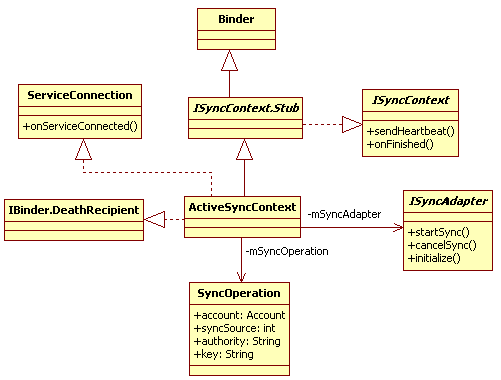 

图8-16  ActiveSyncContext的 UML类图

图8-16中的ActiveSyncContext和图8-8中的Session非常像。ActiveSyncContext的主要工作包括下面两部分。

·  它将首先通过bindService方式启动SyncService，并在onServiceConnected函数中得到用于和SyncService交互的接口对象，即参与Binder通信的ISyncAdapterBp端。

·  ActiveSyncContext是ISyncContext接口的Binder通信的Bn端，它在调用ISyncAdapter的startSync时，会把自己传递给同步服务。同步服务得到的当然是ISyncContext的Bp端对象。当同步服务完成此次同步操作后就会调用ISyncContext 的Bp端对象的onFinished函数以通知ActiveSyncContext同步操作的执行结果。

下面再看第一部分的工作。
<h5>（3） ActiveSyncContext派发请求</h5>
[--&gt;SyncManager.java::ActiveSyncContext.bindToSyncAdapter]

booleanbindToSyncAdapter(RegisteredServicesCache.ServiceInfo info) {

    Intentintent = new Intent();

   intent.setAction("android.content.SyncAdapter");

    //设置目标同步服务的ComponentName

   intent.setComponent(info.componentName);

    intent.putExtra(Intent.EXTRA_CLIENT_LABEL,

                   com.android.internal.R.string.sync_binding_label);

   intent.putExtra(Intent.EXTRA_CLIENT_INTENT,

                 PendingIntent.getActivity(

                   mContext, 0,

                   new Intent(Settings.ACTION_SYNC_SETTINGS),0));

      mBound= true;

      //调用bindService启动指定的同步服务

      finalboolean bindResult = mContext.bindService(intent, this,

                   Context.BIND_AUTO_CREATE | Context.BIND_NOT_FOREGROUND

                   | Context.BIND_ALLOW_OOM_MANAGEMENT);

       if(!bindResult)

           mBound = false;

      returnbindResult;

   }

当目标SyncService从其onBind函数返回后，ActiveSyncContext的onServiceConnected将被调用，该函数的内部处理流程如下：

[--&gt;SyncManager.java::ActiveSyncContext.onServiceConnected]

public void onServiceConnected(ComponentName name,IBinder service) {

    Messagemsg = mSyncHandler.obtainMessage();

    msg.what= SyncHandler.MESSAGE_SERVICE_CONNECTED;

    //构造一个ServiceConnectionData对象，并发送MESSAGE_SERVICE_CONNECTED消息

    //给mSyncHandler。第二个参数就是SyncService在onBind函数中返回的ISyncAdapter的

    //Binder通信对象。不过在ActiveSyncContext中，它是Bp端

    msg.obj= new ServiceConnectionData(this,

                          ISyncAdapter.Stub.asInterface(service));

   mSyncHandler.sendMessage(msg);

}

[--&gt;SyncManager.java::SyncHandler.handleMessage]

case SyncHandler.MESSAGE_SERVICE_CONNECTED: {

    ServiceConnectionData msgData = (ServiceConnectionData)msg.obj;

     if(isSyncStillActive(msgData.activeSyncContext))

          //调用runBoundToSyncAdapter函数处理

         runBoundToSyncAdapter(msgData.activeSyncContext,

                             msgData.syncAdapter);

    break;

  }

[--&gt;SyncManager.java::runBoundToSyncAdapter]

private void runBoundToSyncAdapter(final ActiveSyncContextactiveSyncContext,

      ISyncAdapter syncAdapter) {

   activeSyncContext.mSyncAdapter = syncAdapter;

    finalSyncOperation syncOperation = activeSyncContext.mSyncOperation;

    try {

        activeSyncContext.mIsLinkedToDeath = true;

        syncAdapter.asBinder().linkToDeath(activeSyncContext, 0);

        //调用目标同步服务的startSync函数

        syncAdapter.startSync(activeSyncContext, syncOperation.authority,

                   syncOperation.account, syncOperation.extras);

       } ......

 }

对SynManager工作的分析到此为止，下面将分析目标同步服务。
<h4>3. EmailSyncAdapterService处理请求</h4>
在本例中，目标同步服务位于EmailSyncAdapterService中，先看它通过onBind函数返回给ActiveSyncContext的是什么。
<h5>（1） onBind分析</h5>
[--&gt;EmailSyncAdapterService.java::onBind]

public IBinder onBind(Intent intent) {

     //sSyncAdapter是EmailSyncAdapterService的内部类对象，见下文解释

      returnsSyncAdapter.getSyncAdapterBinder();

 }

在以上代码中，sSyncAdapter的类型是EmailSyncAdapterService中的内部类SyncAdapterImpl。它的派生关系如图8-17所示。

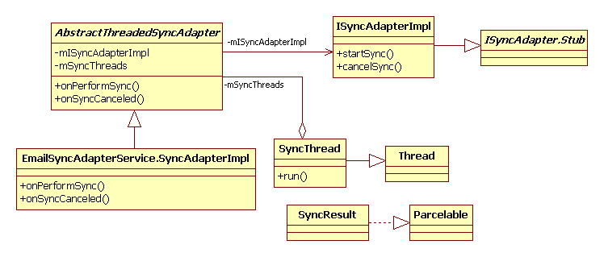 

图8-17  SyncAdapterImpl派生关系图

有图8-17可知：

·  AbstractThreadSyncAdapter是核心类，其内部有一个成员变量mISyncAdapterIml，该变量用于和ActiveSyncContext交互，是ISyncAdapter Binder通信的Bn端。该对象也是以上代码中onBind函数的返回值。

·  SyncThread从Thread派生。从这一点可看出，同步服务将创建工作线程来执行具体的同步操作。AbstractThreadSyncAdapter中的mSyncThreads保存该同步服务中所有的SyncThread对象。

·  同步操作的结果将通过SyncResult返给SyncManager。

再看SyncManager runBoundToSyncAdapter函数最后调用的startSync函数。
<h5>（2） startSync分析</h5>
在SyncService中，首先被调用的函数是ISyncAdapterImpl的startSync函数，其代码为：

[--&gt;AbstractThreadedSyncAdapter.java::ISyncAdapterImpl.startSync]

public void startSync(ISyncContext syncContext,String authority,

              Account account,Bundle extras) {

     //构造一个SyncContext对象，用于保存上下文信息

     finalSyncContext syncContextClient = new SyncContext(syncContext);

     booleanalreadyInProgress;

     finalAccount threadsKey = toSyncKey(account);

    synchronized (mSyncThreadLock) {

        //判断是否存在已经在执行的SyncThread

        if(!mSyncThreads.containsKey(threadsKey)) {

            if (mAutoInitialize

                &amp;&amp; extras != null&amp;&amp; extras.getBoolean(

                 ContentResolver.SYNC_EXTRAS_INITIALIZE, false)) {

              //一般而言，mAutoInitialize都为true，表示同步服务支持自动初始化

             //如果该服务对应的syncable状态为unknown，则重新设置syncable为1

              if (ContentResolver.getIsSyncable(account, authority) &lt; 0)

                      <strong> ContentResolver.setIsSyncable(account,authority, 1)</strong>;

                //直接返回，不再做后续的处理，实际上后续的流程是可以继续进行的

                syncContextClient.onFinished(new SyncResult());

               return;

            }

                //创建一个新的SyncThread对象

               SyncThread syncThread = new SyncThread(

                           "SyncAdapterThread-" +

                                      mNumSyncStarts.incrementAndGet(),

                        syncContextClient,authority, account, extras);

                mSyncThreads.put(threadsKey, syncThread);

                syncThread.start();//启动工作线程

                alreadyInProgress = false;

           }else {

                alreadyInProgress = true;

            }

        }

   if(alreadyInProgress)

        syncContextClient.onFinished(SyncResult.ALREADY_IN_PROGRESS);

  }

假如尚未匹配的工作线程（根据account生成一个key作为标示来查找是否已经存在对应的工作线程），SyncService将创建一个SyncThread，其run函数代码是：

[--&gt;AbstractThreadedSyncAdapter.java::ISyncAdapterImpl.run]

public void run() {

    Process.setThreadPriority(Process.THREAD_PRIORITY_BACKGROUND);

 

    SyncResult syncResult = new SyncResult();

    ContentProviderClient provider = null;

    try {

          if(isCanceled()) return;

          //获得同步操作指定的ContentProvider，provider是ContentProviderClient

         //类型，用于和目标ContentProvider交互

         provider = mContext.getContentResolver().

                       acquireContentProviderClient(mAuthority);

          if (provider != null) {

             //调用AbstractThreadedSyncAdapter子类的onPerformSync函数

             AbstractThreadedSyncAdapter.this.onPerformSync(mAccount,

                               mExtras,mAuthority,provider, syncResult);

              } else

                  syncResult.databaseError = true;

      }finally {

          if (provider != null)

                   provider.release();

          if (!isCanceled()) //通知结果

              <strong>mSyncContext.onFinished</strong>(syncResult);

        //工作完成，将该线程从mSyncThreads中移除

       synchronized (mSyncThreadLock) {

            mSyncThreads.remove(mThreadsKey);

        }

  }

}

来看AbstractThreadedSyncAdapter子类实现的onPeroformSync函数，在本例中，子类是SyncAdapterImpl，代码如下：

[--&gt;EmailSyncAdapterService.java::SyncAdapterImpl.onPerformSync]

public void onPerformSync(Account account, Bundleextras, String authority,

         ContentProviderClient provider,SyncResult syncResult) {

  try {

        //调用EmailSyncAdapterService performSync完成真正的同步，这部分代码和

       //Email业务逻辑相关，此处不再深入研究

       EmailSyncAdapterService.performSync(mContext, account, extras,

                     authority, provider,syncResult);

   }......

}

执行完onPerformSync函数后，ISyncAdapterImpl.run返回前会调用mSyncContext.onFinished函数，向位于SyncManager中的ActiveSyncContext通知同步操作的结果。读者可自行研究这部分内容。
<h4>4.  ContentResolver requestSync分析总结</h4>
总结requestSync的工作流程，如图8-18所示。

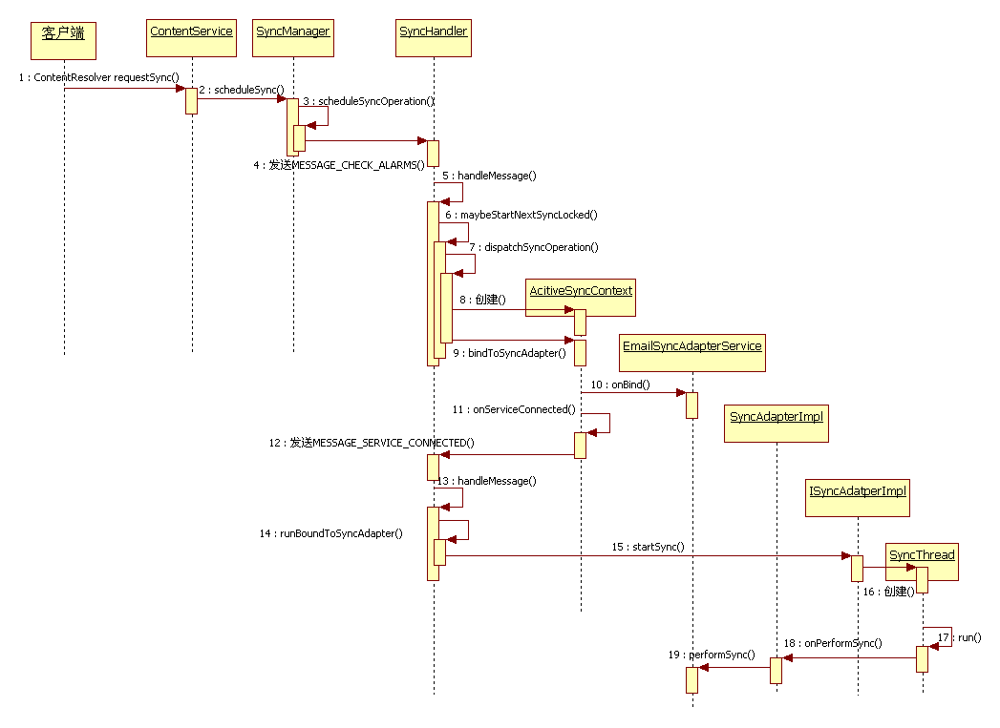 

图8-18  requestSync流程

由图8-18可知，requestSync涉及的对象及调用流程比较繁琐。但从技术上看，则没有什么需要特别注意的地方。
<h3>8.4.3  数据同步管理SyncManager分析总结</h3>
本节对ContentService中第二个主要功能即数据同步管理SyncManager进行了研究，这部分内容主要包括3个方面：

·  介绍SyncManager及其相关成员的作用。

·  通过requestSync展示了SyncManager各个模块的作用及交互过程。

·  穿插于上述两方面之中的是数据同步的一些处理策略和规则。笔者未对这部分内容展开更细致的讨论。感兴趣的读者可自行学习。
<h2>8.5  本章学习指导</h2>
本章对ContentService和AccountManagerService进行了研究，在学习过程中，需注意以下几方面。

·  ContentService包括两个不同部分，一个是数据更新通知机制，另一个是同步服务管理。在这两部分中，ContentService承担了数据更新通知机制的工作，同步服务管理的工作则委托给SyncManager来完成。基于这种分工，本章先分析了ContentService的数据更新通知机制。这部分内容非常简单，读者应能轻松掌握。不过，作为深入学习的入口，笔者有意留了几个问题，旨在让读者仔细思考。

·  由于同步服务管理和AccountManagerService关系密切，因此本章先分析了AccountManagerService。在这部分代码中，读者需要了解RegisteredServicesCache的作用。另外，感兴趣的读者也可以学习如何编写AuthenticatorService，相关文档在SDK关于AbstractAccountAuthenticator类的说明中。

·  SyncManager是本章理解难度最大的知识点。笔者觉得，其难度主要体现在同步策略上。另外，缺乏相关文档资料的参考也是导致学习SyncManager难度较大的原因之一。读者在把本节内容搞清楚的基础上，可自行研究本章没有提及的内容。另外，读者如想学习如何编写同步服务，可参考SDK文档中关于AbstractThreadSyncAdapter的说明。

除上述内容外，AccountManager的ddAccount函数实现中所使用的Java concurrent类，也是读者必须学习并掌握的基础知识。
<h2>8.6  本章小结</h2>
本章对ContentService和AccountManagerService进行了较为深入的探讨，其中：

·  8.2和8.4节分别分析了ContentService中数据更新通知机制的实现及同步服务管理方面的工作。

·  8.3节分析了AccountManagerService及addAccount的实现。

本章留出以下问题供读者自行研究，这些问题包括：

·  8.2节最后提到的开放性问题和Cursor query中ContentObserver的使用分析。

·  8.4节涉及SyncManager的同步请求处理的策略和maybeStartNextSyncLocked函数分析等。另外，读者如果有兴趣，不妨研究一下SyncStorageEngine中同步信息的统计等内容。

 

 

<a>[①]</a> 从设计模式角度来说，这属于ActiveObject模式。详细内容可阅读《Pattern.Oriented.Software.Architecture.Volume.2》的第2章“Concurrency Patterns”。

 
 
版权声明：本文为博主原创文章，未经博主允许不得转载。
 
 
