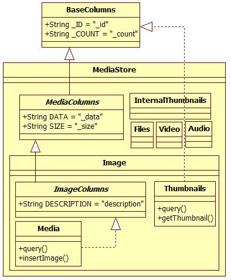
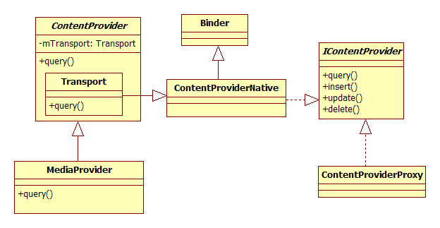
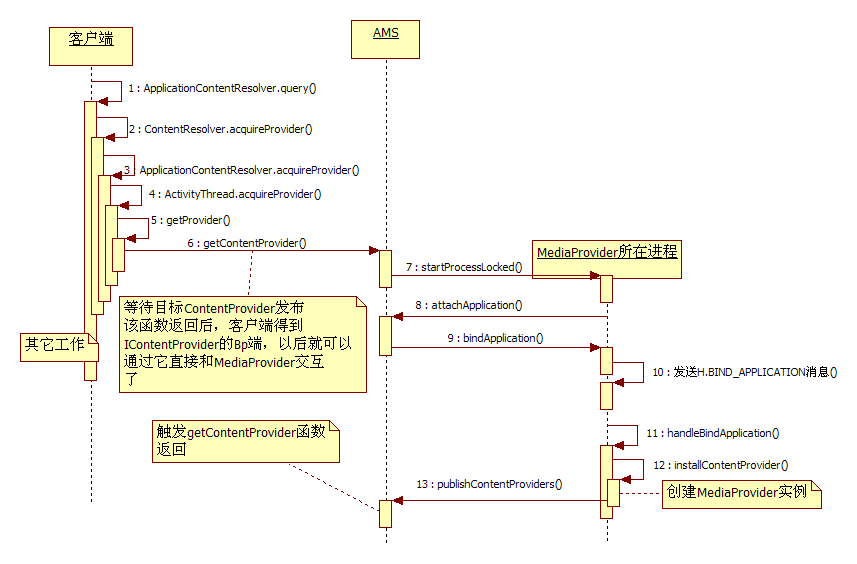
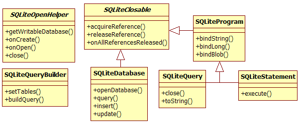
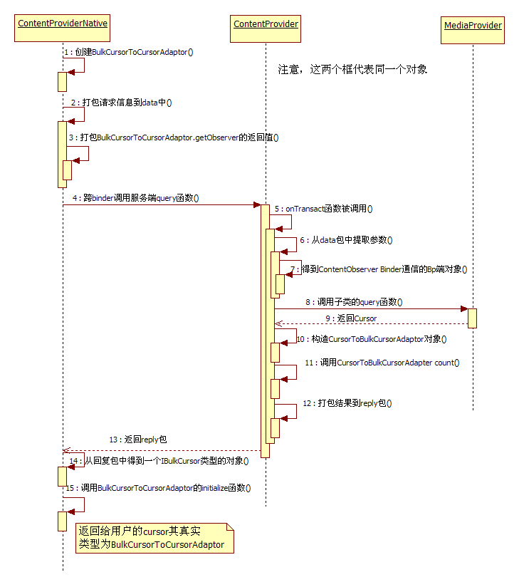

<h1>第7章  深入理解 ContentProvider</h1>
<h2>本章主要内容：</h2>

·  深入分析ContentProvider的创建和启动，以及SQLite相关的知识点

·  深入分析Cursor query和close函数的实现

·  深入分析ContentResolver openAssetFileDescriptor函数的实现

<h2>本章所涉及的源代码文件名及位置：</h2>

·  ActivityManagerService.java

frameworks/base/services/java/com/android/server/am/ActivityManagerService.java

·  ContextImpl.java

frameworks/base/core/java/android/app/ContextImpl.java

·  ActivityThread.java

frameworks/base/core/java/android/app/ActivityThread.java

·  MediaStore.java

frameworks/base/core/java/android/provider/MediaStore.java

·  ContentResolver.java

frameworks/base/core/java/android/content/ContentResolver.java

·  ContentProvider.java

frameworks/base/core/java/android/content/ContentProvider.java

·  MediaProvider.java

package/providers/MediaProvider/src/java/com/android/MediaProvider/MediaProvider.java

·  SQLiteDatabase.java

frameworks/base/core/java/android/database/sqlite/SQLiteDatabase.java

·  SQLiteCompliteSql.java

frameworks/base/core/java/android/database/sqlite/SQLiteCompliteSql.java

·  android_database_SQLiteDatabase.cpp

frameworks/base/core/jni/android_database_SQLiteDatabase.cpp

·  android_database_SQLiteCompliteSql.cpp

frameworks/base/core/jni/android_database_SQLiteCompliteSql.cpp

·  sqlite3_android.cpp

external/sqlite3/android/sqlite3_android.cpp

·  SQLiteQueryBuilder.java

frameworks/base/core/java/android/database/sqlite/SQLiteQueryBuilder.java

·  SQLiteCursorDriver.java

frameworks/base/core/java/android/database/sqlite/SQLiteCursorDriver.java

·  SQLiteQuery.java

frameworks/base/core/java/android/database/sqlite/SQLiteQuery.java

·  SQLiteCursor.java

frameworks/base/core/java/android/database/sqlite/SQLiteCursor.java

·  SQLiteProgram.java

frameworks/base/core/java/android/database/sqlite/SQLiteProgram.java

·  CursorToBulkCursorAdaptor.java

frameworks/base/core/java/android/database/CursorToBulkCursorAdaptor.java

·  BulkCursorToCursorAdaptor.java

frameworks/base/core/java/android/database/BulkCursorToCursorAdaptor.java

·  CursorWindow.java

frameworks/base/core/java/android/database/CursorWindow.java

·  android_database_CursorWindow.cpp

frameworks/base/core/jni/android_database_CursorWindow.cpp

·  CursorWindow.cpp

frameworks/base/libs/binder/CursorWindow.cpp

·  android_database_SQLiteQuery.cpp

frameworks/base/core/jni/android_database_SQLiteQuery.cpp

·  CursorWrapper.java

frameworks/base/core/java/android/database/CursorWrapper.java

·  AbstractCursor.java

frameworks/base/core/java/android/database/AbstractCursor.java

·  BulkCursorNative.java

frameworks/base/core/java/android/database/BulkCursorNative.java

·  ParcelFileDescriptor.java

frameworks/base/core/java/android/os/ParcelFileDescriptor.java

·  MediaProvider.java

packages/providers/MediaProvider/src/com/android/providers/media/MediaProvider.java

·  android_util_Binder.cpp

frameworks/base/core/jni/android_util_Binder.cpp

·  Parcel.cpp

frameworks/base/libs/binder/Parcel.cpp

·  binder.c

kernel/drivers/staging/android/binder.c

<h2>7.1  概述</h2>

本章重点分析ContentProvider、SQLite、Cursor query、close函数的实现及ContentResolver openAssetFileDescriptor函数。为了帮助读者进一步理解本章的知识点，笔者特意挑选了四条分析路线。

·  第一条：以客户端进程通过MediaStore.Images.Media类的静态函数query来查询MediaProvider中Image相关信息为入口点，分析系统如何创建和启动MediaProvider。此分析路线着重关注客户端进程、ActivityManagerService及MediaProvider所在进程间的交互。

·  第二条：沿袭第一条分析路径，但是将关注焦点转移到SQLiteDatabase如何创建数据库的分析上。另外，本条路线还将对SQLite进行相关介绍。

·  第三条：将重点研究Cursor query和close函数的实现细节。

·  第四条：将分析ContentResolver openAssetFileDescriptor函数的实现。

闲话少说，立即开始本次分析之旅。

<h2>7.2  MediaProvider的启动及创建</h2>

第一、二、三条分析路线都将以下面这段示例为参考。

[--&gt;MediaProvider客户端示例]

    
void QueryImage(Context context){

    
  //①得到ContentResolver对象

    
 ContentResolver cr = context.getContentResover();

    
  Uri uri = MediaStore.Images.Media.EXTERNAL_CONTENT_URI;

    
  //②查询数据库

    
  Cursorcursor = MediaStore.Images.Media.query(cr,uri,null);

    
 cursor.moveToFirst();//③移动游标到头部

    
  ......//从游标中取出数据集

    
  cursor.close();//④关闭游标

    
}

先介绍一下这段示例的情况：客户端（即运行本示例的进程）查询（query）的目标ContentProvider是MediaProvider，它运行于进程android.process.media中。假设目标进程此时还未启动。

本节的关注点集中在：

·  MediaProvider所在进程是如何创建的？MediaProvider又是如何创建的？

·  客户端通过什么和位于目标进程中的MediaProvider交互的？

先来看第一个关键函数getContentResolver。

<h3>7.2.1  Context的getContentResolver函数分析</h3>

根据第6章对Context的介绍，Context的getContentResolver最终会调用它所代理的ContextImpl对象的getContentResolver函数，此处直接看ContextImpl的代码。

[--&gt;ContextImpl.java::getContentResolver]

    
public ContentResolver getContentResolver() {

    
   returnmContentResolver;

    
}

该函数直接返回mContentResolver，此变量在ContextImpl初始化时创建，相关代码如下：

[--&gt;ContextImpl.java::init]

    
final void init(LoadedApk packageInfo, IBinder activityToken,

    
       ActivityThreadmainThread, Resources container,String basePackageName) {

    
   ......

    
  mMainThread = mainThread;//mainThread指向AcitivityThread对象

    
  //mContentResolver的真实类型是ApplicationContentResolver

    
  mContentResolver = new ApplicationContentResolver(this, mainThread);

    
   ......

    
 }

由以上代码可知，mContentResolver的真实类型是ApplicationContentResolver，它是ContextImpl定义的内部类并继承了ContentResolver。

getContentResolver函数比较简单，就分析到此。下面来看第二个关键点。

    
<strong>提示</strong>为了书写方便，将ContentProvider简称为CP，将ContentResolver简称为CR。

 

<h3>7.2.2  MediaStore.Image.Media的query函数分析</h3>

第二个关键点是在MediaProvider客户端示例中所调用的MediaStore.Image.Media 的query函数。MediaStore是多媒体开发中常用的类，其内部定义了专门针对Image、Audio、Video等不同多媒体信息的内部类来帮助客户端开发人员更好底和MediaProvider交互。这些类及相互之间的关系如图7-1所示。

图7-1  MediaStore类图

由图7-1可知，MediaStore定义了较多的内部类，我们重点展示作为内部类之一的Image的情况，其中：

·  MediaColumns定义了所有与媒体相关的数据库表都会用到的数据库字段，而ImageColumns定义了单独针对Image的数据库字段。

·  Image类定义了一个名为Media的内部类用于查询和Image相关的信息，同时Image类还定义了一个名为Thumbnails的内部类用于查询和Image相关的缩略图的信息（在Android平台上，缩略图的来源有两种，一种是Image，另一种是Video，故Image定义了名为Thumbnails的内部类，而Video也定义了一个名为Thumbnails的内部类）。

    
<strong>提示</strong>MediaStore类较为复杂，主要原因是它定义了一些同名类。读者阅读代码时务须仔细。

下面来看Image.Media的query函数，其代码非常简单，如下所示：

[--&gt;MediaStore.java::Image.Media.query]

    
public static final class Media implementsImageColumns {

    
   public static final Cursor query(ContentResolvercr,Uri uri,

    
                                           String[]projection) {

    
   //直接调用ContentResolver的query函数

    
   returncr.query(uri, projection, null,

    
                      null,DEFAULT_SORT_ORDER);

    
 }

Image.Media的query函数直接调用ContentResolver的query函数，虽然cr的真实类型是ApplicationContentResolver，但是此函数却由其基类ContentResolver实现。

    
<strong>提示</strong>追求运行效率的程序员也许会对上边这段代码的实现略有微词，因为Image.Media的query函数基本上没做任何有意义的工作。假如客户端直接调用cr.query函数，则此处的query就增加了一次函数调用和返回的开销（即Image.Media query调用和返回时参数的入栈/出栈）。但是，通过Image.Media的封装将使程序更清晰和易读（与直接使用ContentResolver的query相比，代码阅读者一看Image.Media就知道其query函数应该和Image有关，否则需要通过解析uri参数才能确定查询的信息是什么）。代码清晰易读和运行效率高，往往是软件开发中的熊掌和鱼，它们之间的对立性，将在本章中体现得淋漓尽致。笔者建议读者在实际开发中结合具体情况决定取舍，万不可钻牛角尖。

<h4>1.  ContentResolver的query函数分析</h4>

[--&gt;ContentResolver.java::query]

    
public final Cursor query(Uri uri, String[]projection,

    
           String selection, String[] selectionArgs, String sortOrder) {

    
   //调用acquireProvider函数，参数为uri，函数也由ContentResolver实现

    
  IContentProvider provider = acquireProvider(uri);

    
  //<strong>注意</strong>：下面将和ContentProvider交互， 相关知识留待7.4节再分析

    
   ......

    
 }

ContentResolver的query将调用acquireProvider，该函数定义在ContentResolver类中，代码如下：

[--&gt;ContentResolver.java::query]

    
public final IContentProvider acquireProvider(Uriuri) {

    
  if(!SCHEME_CONTENT.equals(uri.getScheme())) return null;

    
  Stringauth = uri.getAuthority();

    
  if (auth!= null) {

    
     //acquireProvider是一个抽象函数，由ContentResolver的子类实现。在本例中，该函数

    
     //将由ApplicationContentResolver实现。uri.getAuthority将返回代表目标

    
     //ContentProvider的名字

    
      returnacquireProvider(mContext, uri.getAuthority());

    
  }

    
  returnnull;

    
 }

如上所述，acquireProvider由ContentResolver的子类实现，在本例中该函数由ApplicationContentResolver定义，代码如下：

[--&gt;ContextImpl.java::acquireProvider]

    
protected IContentProvider acquireProvider(Contextcontext, String name) {

    
   //mMainThread指向代表应用进程主线程的ActivityThread对象，每个应用进程只有一个

    
   //ActivityThread对象

    
    return mMainThread.acquireProvider(context,name);

    
 }

如以上代码所示，最终ActivityThread的acquireProvider函数将被调用，希望它不要再被层层转包了。

<h4>2.  AcitvityThread的acquireProvider函数分析</h4>

ActivityThread的 acquireProvider函数的代码如下：

[--&gt;ActivityThread.java::acquireProvider]

    
public final IContentProvideracquireProvider(Context c, String name) {

    
  //①调用getProvider函数，它很重要。见下文分析

    
  IContentProvider provider = getProvider(c,name);

    
  ......

    
  IBinderjBinder = provider.asBinder();

    
  synchronized(mProviderMap) {

    
     //客户端进程将本进程使用的ContentProvider信息保存到mProviderRefCountMap中，

    
     //其主要功能与引用计数和资源释放有关，读者暂可不理会它

    
     ProviderRefCount prc = mProviderRefCountMap.get(jBinder);

    
      if(prc== null) 

    
          mProviderRefCountMap.put(jBinder, newProviderRefCount(1));

    
     else   prc.count++;

    
   }

    
 returnprovider;

    
}

在acquireProvider内部调用getProvider得到一个IContentProvider类型的对象，该函数非常重要，其代码为：

[--&gt;ActivityThread.java::getProvider]

    
private IContentProvider getProvider(Contextcontext, String name) {

    
  /*

    
   查询该应用进程是否已经保存了用于和远端ContentProvider通信的对象existing。

    
   此处，我们知道existing的类型是IContentProvider，不过IContentProvider是一

    
   个interface，那么existing的真实类型是什么呢？稍后再揭示

    
  */

    
 IContentProvider existing = getExistingProvider(context, name);

    
  if(existing != null) return existing;//如果existing存在，则直接返回

    
  

    
 IActivityManager.ContentProviderHolder holder = null;

    
  try {

    
      //如果existing不存在，则需要向AMS查询，返回值的类型为ContentProviderHolder

    
      holder= ActivityManagerNative.getDefault().getContentProvider(

    
               getApplicationThread(), name);

    
  }......

    
   //<strong>注意</strong>：记住下面这个函数调用，此时是在客户端进程中

    
 IContentProvider prov = installProvider(context, holder.provider,

    
               holder.info, true);

    
   ......

    
  returnprov;

    
 }

以上代码中让人比较头疼的是其中新出现的几种数据类型，如IContentProvider、ContentProviderHolder。先来分析AMS的getContentProvider。

<h4>3.  AMS的getContentProvider函数分析</h4>

getContentProvider的功能主要由getContentProviderImpl函数实现，故此处可直接对它进行分析。

<h5>（1） getContentProviderImpl启动目标进程</h5>

getContentProviderImpl函数较长，可分段来看，先来分析下面一段代码。

[--&gt;ActivityManagerService.java::getContentProviderImpl]

    
 privatefinal ContentProviderHolder getContentProviderImpl(

    
                          IApplicationThread caller, String name) {

    
 ContentProviderRecord cpr;

    
 ProviderInfo cpi = null;

    
 

    
 synchronized(this) {

    
    ProcessRecord r = null;

    
     if(caller != null) {

    
          r= getRecordForAppLocked(caller);

    
          if (r == null)......//如果查询不到调用者信息，则抛出SecurityException

    
      }// if (caller != null)判断结束

    
    //name参数为调用进程指定的代表目标ContentProvider的authority

    
    cpr =mProvidersByName.get(name);

    
    //如果cpr不为空，表明该ContentProvider已经在AMS中注册

    
    booleanproviderRunning = cpr != null;

    
    if(providerRunning){

    
       ......//如果该ContentProvider已经存在，则进行对应处理, 相关内容可自行阅读

    
    }

    
   //如果目标ContentProvider对应进程还未启动

    
   if(!providerRunning) {

    
       try {

    
           //查询PKMS，得到指定的ProviderInfo信息

    
           cpi = AppGlobals.getPackageManager().resolveContentProvider(

    
                   name,STOCK_PM_FLAGS | 

    
                   PackageManager.GET_URI_PERMISSION_PATTERNS);

    
        }......

    
        String msg;

    
      //权限检查，此处不作讨论

    
      if((msg=checkContentProviderPermissionLocked(cpi, r)) != null) 

    
         throw new SecurityException(msg);

    
     /*

    
      如果system_server还没启动完毕，并且该ContentProvider不运行在system_server

    
      中，则此时不允许启动ContentProvider。读者还记得哪个ContentProvider运行在

    
     system_server进程中吗？答案是SettingsProvider

    
    */

    
     .......

    
 

    
    ComponentName comp = new ComponentName(cpi.packageName, cpi.name);

    
     cpr =mProvidersByClass.get(comp);

    
     finalboolean firstClass = cpr == null;

    
     //初次启动MediaProvider对应进程时，firstClass一定为true

    
     if (firstClass) {

    
         try {

    
             //查询PKMS，得到MediaProvider所在的Application信息

    
              ApplicationInfoai =

    
                      AppGlobals.getPackageManager().getApplicationInfo(

    
                          cpi.applicationInfo.packageName, STOCK_PM_FLAGS);

    
             if (ai == null) return null;

    
            //在AMS内部通过ContentProviderRecord来保存ContentProvider的信息，类似

    
            //ActivityRecord，BroadcastRecord等

    
             cpr = new ContentProviderRecord(cpi, ai,comp);

    
         }......

    
    }// if(firstClass)判断结束

以上代码的逻辑比较简单，主要是为目标ContentProvider（即MediaProvider）创建一个ContentProviderRecord对象。结合第6章的知识，AMS为四大组件都设计了对应的数据结构，如ActivityRecord、BroadcastRecord等。

接着看getContentProviderImpl，其下一步的工作就是启动目标进程：

[--&gt;ActivityManagerService.java::getContentProviderImpl]

    
   /*

    
   canRunHere函数用于判断目标CP能否运行在r所对应的进程（即调用者所在进程）

    
   该函数内部做如下判断：

    
   (info.multiprocess|| info.processName.equals(app.processName))

    
    &amp;&amp; (uid == Process.SYSTEM_UID || uid == app.info.uid)

    
    就本例而言，MediaProvider不能运行在客户端进程中

    
   */

    
    if (r !=null &amp;&amp; cpr.canRunHere(r))  returncpr;

    
 

    
    finalint N = mLaunchingProviders.size();

    
    ......//查找目标ContentProvider对应的进程是否正处于启动状态

    
    //如果i大于等于N，表明目标进程的信息不在mLaunchingProviders中

    
    if (i&gt;= N) {

    
       finallong origId = Binder.clearCallingIdentity();

    
       ......

    
       //调用startProcessLocked函数创建目标进程

    
      ProcessRecord proc = startProcessLocked(cpi.processName,

    
                         cpr.appInfo, false, 0,"content provider",

    
                         newComponentName(cpi.applicationInfo.packageName,

    
                          cpi.name), false);

    
       if(proc == null)return null;

    
      cpr.launchingApp = proc;

    
       //将该进程信息保存到mLaunchingProviders中

    
      mLaunchingProviders.add(cpr);

    
    }

    
 

    
     if(firstClass) mProvidersByClass.put(comp, cpr);

    
    mProvidersByName.put(name, cpr);

    
     /*

    
       下面这个函数将为客户端进程和目标CP进程建立紧密的关系，即当目标CP进程死亡后，

    
        AMS将根据该函数建立的关系找到客户端进程并杀死（kill）它们。在7.2.3节

    
        有对这个函数的相关解释

    
     */

    
     <strong>incProviderCount</strong>(r, cpr);

    
     if(cpr.launchingApp == null) return null;

    
     try {

    
          cpr.wait();//等待目前进程的启动

    
      } ......

    
   }// synchronized(this)结束

    
  returncpr;

    
}

通过对以上代码的分析发现，getContentProviderImpl将等待一个事件，想必读者也能明白，此处一定是在等待目标进程启动并创建好MediaProvider。目标进程的这部分工作用专业词语来表达就是发布目标ContentProvider（即本例的MediaProvider）。

<h5>（2） MediaProvider的创建 </h5>

根据第6章的介绍，目标进程启动后要做的第一件大事就是调用AMS的attachApplication函数，该函数的主要功能由attachApplicationLocked完成。我们回顾一下相关代码。

[--&gt;ActivityManagerService.java::attachApplicationLocked]

    
private final booleanattachApplicationLocked(IApplicationThread thread,

    
           int pid) {

    
   ......

    
   //通过PKMS查询运行在该进程中的CP信息，并保存到mProvidersByClass中

    
   Listproviders = normalMode ? 

    
               generateApplicationProvidersLocked(app) : null;

    
  //调用目标应用进程的bindApplication函数，此处将providers信息传递给目标进程

    
   thread.bindApplication(processName,appInfo, <strong>providers</strong>,

    
                             app.instrumentationClass, profileFile, 

    
                              ......);

    
   ......

    
}

再来看目标进程bindApplication的实现，其内部最终会通过handleBindApplication函数处理，我们回顾一下相关代码。

[--&gt;ActivtyThread.java::handleBindApplication]

    
private void handleBindApplication(AppBindDatadata) {

    
   ......

    
   if(!data.restrictedBackupMode){ 

    
       List&lt;ProviderInfo&gt; providers = data.providers;

    
        if(providers != null) {

    
           //调用installContentProviders安装

    
           installContentProviders(app, providers);

    
           ......

    
       } 

    
   }

    
   ......

    
}

AMS传递过来的ProviderInfo列表将由目标进程的installContentProviders处理，其相关代码如下：

[--&gt;ActivtyThread.java::installContentProviders]

    
private void installContentProviders(Contextcontext,

    
                                              List&lt;ProviderInfo&gt;providers) {

    
 

    
  finalArrayList&lt;IActivityManager.ContentProviderHolder&gt; results =

    
                newArrayList&lt;IActivityManager.ContentProviderHolder&gt;();

    
 Iterator&lt;ProviderInfo&gt; i = providers.iterator();

    
  while(i.hasNext()) {

    
     //①也调用installProvider，注意该函数传递的第二个参数为null

    
    IContentProvider cp = installProvider(context, null, cpi, false);

    
     if (cp!= null) {

    
         IActivityManager.ContentProviderHolder cph =

    
                          newIActivityManager.ContentProviderHolder(cpi);

    
         cph.provider = cp;

    
          results.add(cph);//将信息添加到results数组中

    
           ......//创建引用计数

    
         }

    
    }//while循环结束

    
 

    
    try {  //②调用AMS的publishContentProviders发布ContentProviders

    
           ActivityManagerNative.getDefault().publishContentProviders(

    
               getApplicationThread(), results);

    
        } ......

    
 }

以上代码列出了两个关键点，分别是：

·  调用installProvider得到一个IContentProvider类型的对象。

·  调用AMS的publishContentProviders发布本进程所运行的ContentProvider。该函数留到后面再作分析

在继续分析之前，笔者要特别强调installProvider，该函数既在客户端进程中被调用（还记得7.2.2节ActivityThread的acquireProvider函数中那句注释吗？），又在目标进程（即此处MediaProvider所在进程）中被调用。与客户端进程的调用相比，只在一处有明显的不同：

·  客户端进程调用installProvider函数时，该函数的第二个参数不为null。

·  目标进程调用installProvider函数时，该函数的第二个参数硬编码为null。

我们曾经在6.2.3分析过installProvider函数，结合那里的介绍可知：installProvider是一个通用函数，不论客户端使用远端的CP还是目标进程安装运行在其上的CP上，最终都会调用它，只不过参数不同罢了。

来看installProvider函数，其代码如下：

[--&gt;ActivityThread.java::installProvider]

    
private IContentProvider installProvider(Contextcontext,

    
           IContentProvider provider, ProviderInfo info, boolean noisy) {

    
  ContentProvider localProvider = null;

    
   if(provider == null) {//针对目标进程的情况

    
       Context c = null;

    
        ApplicationInfo ai = info.applicationInfo;

    
         if(context.getPackageName().equals(ai.packageName)) {

    
               c = context;

    
           }......//这部分代码已经在6.2.3节分析过了，其目的就是为了得到正确的

    
          //Context用于加载Java字节码

    
         try{

    
            final java.lang.ClassLoader cl = c.getClassLoader();

    
            //通过Java反射机制创建MediaProvider实例

    
            localProvider = (ContentProvider)cl.

    
                                     loadClass(info.name).newInstance();

    
            //注意下面这句代码

    
            provider = localProvider.getIContentProvider();

    
            }

    
     } elseif (localLOGV) {

    
           Slog.v(TAG, "Installing external provider " + info.authority +": "

    
                   + info.name);

    
    }// if(provider == null)判断结束

    
    /*

    
     由以上代码可知，对于provider不为null 的情况（即客户端调用的情况），该函数没有

    
     什么特殊的处理

    
    */

    
    ......

    
     /*

    
      引用计数及设置DeathReceipient等相关操作。在6.2.3节的第2个小标题中

    
      曾说过，目标进程为自己进程中的CP实例设置DeathReceipient没有作用，因为二者在同一个

    
      进程中，自己怎么能接收自己的讣告消息呢？不过，如果客户端进程为目标进程的CP设置

    
     DeathReceipient又有作用吗？仔细思考这个问题

    
    */

    
    returnprovider;//最终返回的对象是IContentProvider类型，它到底是什么呢？

    
 }

由以代码可知，installProvider最终返回的是一个IContentProvider类型的对象。对于目标进程而言，该对象是通过调用CP的实例对象的（本例就是MediaProvider） getIContentProvider函数得来的。而对于客户端进程而言，该对象是由installProvider第二个参数传递进来的，那么，这个IContentProvider到底是什么？

<h5>（3） IContentProvider的真面目</h5>

要说清楚IContentProvider，就先来看ContentProvider家族的类图，如图7-2所示。

图7-2  ContentProvider类图

图7-2揭示了IContentProvider的真面目，具体介绍如下：

·  每个ContentProvider实例中都有一个mTransport成员，其类型为Transport。

·  Transport类从ContentProviderNative派生。由图7-2可知，ContentProviderNative从Binder类派生，并实现了IContentProvider接口。结合前面的代码，IContentProvider将是客户端进程和目标进程交互的接口，即目标进程使用IContentProvider的Bn端Transport，而客户端使用IContentProvider的Bp端，其类型是ContentProviderProxy（定义在ContentProviderNative.java中）。

客户端如何通过IContentProvider query函数和目标CP进程交互的呢？其流程如下：

·  CP客户端得到IContentProvider的Bp端（实际类型是ContentProviderProxy），并调用其query函数，在该函数内部将参数信息打包，传递给Transport（它是IContentProvider的Bn端）。

·  Transport的onTransact函数将调用Transport的query函数，而Transport的query函数又将调用ContentProvider子类定义的query函数（即MediaProvider的query函数）。

关于目标进程这一系列的调用函数，不妨先看看Transport的query函数，其代码为：

[--&gt;ContentProvider.java::Transport.query]

    
public Cursor query(Uri uri, String[] projection,

    
               String selection, String[] selectionArgs, String sortOrder) {

    
  enforceReadPermission(uri);

    
  //Transport为ContentProvider的内部类，此处将调用ContentProvider的query函数

    
   //本例中，该query函数由MediaProvider实现，故最终会调用MediaProvider的query

    
   returnContentProvider.this.query(uri, projection, selection,

    
                   selectionArgs, sortOrder);

    
 }

务必弄清楚，此处只有一个目标ContentProvider的实例，即只有一个MediaProvider对象。Transport的 query函数内部虽然调用的是基类ContentProvider的query函数，但是根据面向对象的多态原理，该函数最终由其子类（本例中是MediaProvider）来实现。

认识了IContentProvider，即知道了客户端进程和目标进程的交互接口。

继续我们的分析。此时目标进程需要将MediaProvider的信息通过AMS发布出去。

<h5>（4）  AMS pulishContentProviders分析</h5>

要把目标进程的CP信息发布出去，需借助AMS 的pulishContentProviders函数，其代码如下：

[--&gt;ActivityManagerService.java::publishContentProviders]

    
public final voidpublishContentProviders(IApplicationThread caller,

    
         List&lt;ContentProviderHolder&gt; providers) {

    
   ......

    
  synchronized(this) {

    
     finalProcessRecord r = getRecordForAppLocked(caller);

    
     finallong origId = Binder.clearCallingIdentity();

    
 

    
     final int N = providers.size();

    
     for (int i=0; i&lt;N; i++) {

    
       ContentProviderHolder src = providers.get(i);

    
       ContentProviderRecord dst = r.pubProviders.get(src.info.name);

    
       if(dst != null) {

    
           ......//将相关信息分别保存到mProviderByClass和mProvidersByName中

    
           int NL = mLaunchingProviders.size();

    
         ...... //目标进程已经启动，将其从mLaunchingProviders移除

    
         synchronized (dst) {

    
            dst.provider = src.provider;//将信息保存在dst中

    
            dst.proc = r;

    
           //触发还等在（wait）getContentProvider中的那个客户端进程

    
            dst.notifyAll();

    
          }

    
       updateOomAdjLocked(r);//调节目标进程的oom_adj等相关参数

    
     }// if(dst != null)判断结束

    
   ......

    
   }

    
}

至此，客户端进程将从getContentProvider中返回，并调用installProvider函数。根据前面的分析，客户端进程调用installProvider时，其第二个参数不为null，即客户端进程已经从AMS中得到了能直接和目标进程交互的IContentProvider Bp端对象。此后，客户端就可直接使用该对象向目标进程发起请求。

<h3>7.2.3  MediaProvider的启动及创建总结</h3>

回顾一下整个MediaProvider的启动和创建过程，如图7-3所示。

图7-3  MediaProvider的启动和创建流程

整个流程相对比较简单。读者在分析时只要注意installProvider这个函数在目标进程和客户端进程中被调用时的区别即可。这里再次强调：

·  目标进程调用installProvider时，传递的第二个参数为null，使内部通过Java反射机制真正创建目标CP实例。

·  客户端调用installProvider时，其第二个参数已经通过查询AMS得到。该函数真正的工作只不过是引用计数控制和设置讣告接收对象罢了。

至此，客户端进程和目标进程通信的通道IContentProvider已经登场。除此之外，客户端进程和目标CP还建立了非常紧密的关系，这种关系造成的后果就是一旦目标CP进程死亡，AMS会杀死与之有关的客户端进程。不妨回顾一下与之相关的知识点：

·  该关系的建立是在AMS getContentProviderImpl函数中调用incProviderCount完成的，关系的确立以ContentProviderRecorder保存客户端进程的ProcessRecord信息为标识。

·  一旦CP进程死亡，AMS能根据该ContentProviderRecorder中保存的客户端信息找到使用该CP的所有客户端进程，然后再杀死它们。

客户端能否撤销这种紧密关系呢？答案是肯定的，但这和Cursor是否关闭有关。这里先简单描述一下流程：

·  当Cursor关闭时，ContextImpl的releaseProvider会被调用。根据前面的介绍，它最终会调用ActivityThread的releaseProvider函数。

·  ActivityThread的releaseProvider函数会导致completeRemoveProvider被调用，在其内部根据该CP的引用计数判断是否需要调用AMS的removeContentProvider。

·  通过AMS的removeContentProvider将删除对应ContentProviderRecord中此客户端进程的信息，这样一来，客户端进程和目标CP进程的紧密关系就荡然无存了。

至此，本章第一条分析路线就介绍完毕。

    
<strong>提示</strong>读者可能觉得，这条路线是对第6章的补充和延续。不过，虽然目标进程由AMS创建和启动，而且ContentProvider的发布也需和AMS交互，但是对于ContentProvider来说，我们更关注客户端和目标进程中ContentProvider实例间的交互。事实上，客户端得到IContentProvider Bp端对象后，即可直接与目标进程的CP实例交互，也就无需借助AMS了，所以笔者将这条路线放到了本章进行分析。

<h2>7.3  SQLite创建数据库分析 </h2>

作为Android多媒体系统中媒体信息的仓库，MediaProvider使用了SQLite数据库来管理系统中多媒体相关的数据信息。作为第二条分析路线，本节的目标是分析MediaProvider如何利用SQLite创建数据库，同时还将介绍和SQLite相关的一些知识点。

先来看大名鼎鼎的SQLite及Java层的SQLiteDatabase家族。

<h3>7.3.1  SQLite及SQLiteDatabase家族</h3>
<h4>1.  SQLite轻装上阵</h4>

SQLite是一个轻量级的数据库，它和笔者之前接触的SQLServer或Oracle DB比起来，犹如蚂蚁和大象的区别。它“轻”到什么程度呢？笔者总结了SQLite具有的两个特点：

·  从代码上看，SQLite所有的功能都实现在Sqlite3.c中，而头文件Sqlite3.h定义了它所支持的API。其中，Sqlite3.c文件包含12万行左右的代码，相当于一个中等偏小规模的程序。

·  从使用者角度的来说，SQLite编译完成后将生成一个libsqlite.so，大小仅为300多KB。

SQLite确实够轻，但这个“轻”还不是本节标题“轻装上阵”一词中的“轻”。为什么？此处先向读者们介绍一个直接使用SQLite API开发的Android native程序示例，该示例最终编译成的二进制可执行程序名为sqlitetest。

    
<strong>注意</strong>本书后文所说的SQLite API特指libsqlite.so提供的Native层的API。

使用SQLite API开发的Android native程序示例的代码如下：

[--&gt;SqliteTest.cpp::libsqlite示例]

    
#include &lt;unistd.h&gt;

    
#include &lt;sqlite3.h&gt; //包含sqlite API头文件，这里的3是SQLite的版本号

    
#include &lt;stdlib.h&gt;

    
 

    
#define LOG_TAG "SQLITE_TEST"  //定义该进程logcat输出的标签

    
#include &lt;utils/Log.h&gt;

    
#ifndef NULL

    
   #defineNULL (0)

    
#endif

    
//声明数据库文件的路径

    
#define DB_PATH"/mnt/sdcard/sqlite3test.db"

    
/*

    
   声明一个全局的SQLite句柄，开发者无需了解该数据结构的具体内容，只要知道它代表了使用者

    
   和数据库的一种连接关系即可。以后凡是针对特定数据库的操作，都需要传入对应的SQLite句柄

    
*/

    
static sqlite3* g_pDBHandle = NULL;

    
 

    
/*

    
   定义一个宏，用于检测SQLite API调用的返回值，如果value不等于expectValue，则打印警告，

    
   并退出程序。注意，进程退出后，系统会自动回收分配的内存资源。对如此简单的例子来说，读者大可

    
    不必苛责。其中，sqlite3_errmsg函数用于打印错误信息

    
*/

    
#define CHECK_DB_ERR(value,expectValue) \

    
do \

    
{ \

    
   if(value!= expectValue)\

    
   {\

    
    LOGE("Sqlite db fail:%s",g_pDBHandle==NULL?"db not \

    
           connected":<strong>sqlite3_errmsg</strong>(g_pDBHandle));\

    
    exit(0);\

    
   }\

    
}while(0)

    
 

    
 

    
int main(int argc, char* argv[])

    
{

    
  LOGD("Delete old DB file");

    
  unlink(DB_PATH);//先删除旧的数据库文件

    
  LOGD("Create new DB file");

    
   /*

    
    调用<strong>sqlite3_open</strong>创建一个数据库，并将和该数据库的连接环境保存在全局的SQLite句柄

    
     g_pDBHandle中，以后操作g_pDBHandle就是操作DB_PATH对应的数据库

    
    */

    
   int ret =sqlite3_open(DB_PATH,&amp;g_pDBHandle);

    
  CHECK_DB_ERR(ret,SQLITE_OK);

    
   

    
  LOGD("Create Table personal_info:");

    
   /*

    
    定义宏TABLE_PERSONAL_INFO，用于描述为本例数据库建立一个表所用的SQL语句，

    
    不熟悉SQL语句的读者可先学习相关知识。从该宏的定义可知，将建立一个名为

    
   personal_info的表，该表有4列，第一列是主键，类型是整型（SQLite中为INTEGER），

    
    每加入一行数据该值会自动递增；第二列名为"name"，数据类型是字符串（SQLite中为TEXT）；

    
     第三列名为“age”，数据类型是整型；第四列名为“sex”，数据类型是字符串

    
   */

    
   #defineTABLE_PERSONAL_INFO  \

    
          "CREATETABLE personal_info" \

    
           "(ID INTEGER primary keyautoincrement," \

    
           "nameTEXT," \

    
           "age INTEGER,"\

    
           "sex TEXT"\

    
           ")"

    
   //打印TABLE_PERSONAL_INFO所对应的SQL语句

    
  LOGD("\t%s\n",TABLE_PERSONAL_INFO);

    
  //调用<strong>sqlite3_exec</strong>执行前面那条SQL语句

    
   ret =sqlite3_exec(g_pDBHandle,TABLE_PERSONAL_INFO,NULL,NULL,NULL);

    
  CHECK_DB_ERR(ret,SQLITE_OK);

    
   

    
   /*

    
    定义插入一行数据所使用的SQL语句，注意最后一行中的问号，它表示需要在插入数据

    
   前和具体的值绑定。插入数据库对应的SQL语句是标准的INSERT命令

    
   */

    
  LOGD("Insert one personal info into personal_info table");

    
   #defineINSERT_PERSONAL_INFO  \

    
  "INSERT INTO personal_info"\

    
  "(name,age,sex)"\

    
  "VALUES"\

    
  "(?,?,?)"   //<strong>注意这一行语句中的问号</strong>

    
  LOGD("\t%s\n",INSERT_PERSONAL_INFO);

    
 

    
   //<strong>sqlite3_stmt</strong>是SQLite中很重要的一个结构体，它代表了一条SQL语句

    
   <strong>sqlite3_stmt* pstmt = NULL;</strong>

    
   /*

    
    调用<strong>sqlite3_prepare</strong>初始化pstmt，并将其和INSERT_PERSONAL_INFO绑定。

    
    也就是说，如果执行pstmt，就会执行INSERT_PERSONAL_INFO语句

    
   */

    
   ret =sqlite3_prepare(g_pDBHandle,INSERT_PERSONAL_INFO,-1,&amp;pstmt,NULL);

    
  CHECK_DB_ERR(ret,SQLITE_OK);

    
  /*

    
    调用<strong>sqlite3_bind_xxx</strong>为该pstmt中对应的问号绑定具体的值，该函数的第二个参数用于

    
    指定第几个问号

    
  */

    
   ret =sqlite3_bind_text(pstmt,1,"dengfanping",-1,SQLITE_STATIC);

    
   ret =sqlite3_bind_int(pstmt,2,30);

    
   ret =sqlite3_bind_text(pstmt,3,"male",-1,SQLITE_STATIC);

    
   //调用<strong>sqlite3_step</strong>执行对应的SQL语句，该函数如果执行成功，我们的personal_info

    
   //表中将添加一条新记录，对应值为（1，dengfanping，30，male）

    
   ret =sqlite3_step(pstmt);

    
  CHECK_DB_ERR(ret,SQLITE_DONE);

    
   //调用<strong>sqlite3_finalize</strong>销毁该SQL语句

    
   ret =sqlite3_finalize(pstmt);

    
   

    
   //下面将从表中查询name为"dengfanping"的person的age值

    
  LOGD("select dengfanping's age from personal_info table");

    
   pstmt =NULL;

    
   /*

    
    重新初始化该pstmt，并将其和SQL语句“SELECT age FROM personal_info WHERE name

    
     = ?”绑定

    
   */

    
   ret =sqlite3_prepare(g_pDBHandle,"SELECT age FROM personal_info WHERE name

    
                                              =? ",-1,&amp;pstmt,NULL);

    
  CHECK_DB_ERR(ret,SQLITE_OK);   

    
   /*

    
    绑定pstmt中第一个问号为字符串“dengfanping”，最终该SQL语句为

    
    SELECTage FROM personal_info WHERE name = 'dengfanping'

    
   */

    
   ret =sqlite3_bind_text(pstmt,1,"dengfanping",-1,SQLITE_STATIC);

    
  CHECK_DB_ERR(ret,SQLITE_OK);

    
   //执行这条查询语句

    
 while(true)//在一个循环中遍历结果集

    
 {

    
    ret =sqlite3_step(pstmt);

    
   if(ret ==SQLITE_ROW)

    
   {

    
      //从结果集中取出第一列（由于执行SELECT时只选择了age，故最终结果只有一列），

    
      //调用<strong>sqlite3_column_int</strong>返回结果集的第一列（从0开始）第一行的值

    
      intmyage = sqlite3_column_int(pstmt, 0);

    
      LOGD("Gotdengfanping's age: %d\n",myage);

    
   }

    
   else //如果ret为其他值，则退出循环

    
     break; 

    
 

    
  }

    
  

    
   else  LOGD("Find nothing\n"); //SELECT执行失败

    
   ret =sqlite3_finalize(pstmt);//销毁pstmt

    
  if(g_pDBHandle)

    
  {

    
     LOGD("CloseDB");

    
    //调用<strong>sqlite3_close</strong>关闭数据库连接并释放g_pDBHandle

    
   sqlite3_close(g_pDBHandle);

    
   g_pDBHandle = NULL;

    
   }

    
  return 0;

    
}

通过上述示例代码可发现，SQLite API的使用主要集中在以下几点上：

·  创建代表指定数据库的sqlite3实例。

·  创建代表一条SQL语句的sqlite3_stmt实例，在使用过程中首先要调用sqlite3_prepare将其和一条代表SQL语句的字符串绑定。如该字符串含有通配符“?”，后续就需要通过sqlite3_bind_xxx函数为通配符绑定特定的值以生成一条完整的SQL语句。最终调用sqlite3_step执行这条语句。

·  如果是查询（即SELECT命令）命令，则需调用sqlite3_step函数遍历结果集，并通过sqlite3_column_xx等函数取出结果集中某一行指定列的值。

·  最后需调用sqlite3_finalize和sqlite3_close来释放sqlite3_stmt实例及sqlite3实例所占据的资源。

SQLite API的使用非常简单明了。不过很可惜，这份简单明了所带来的快捷，只供那些Native层程序开发者独享。对于Java程序员，他们只能使用Android在SQLite API之上所封装的SQLiteDatabase家族提供的类和相关API。笔者心中对这个封装的评价只有一个词 “叹为观止”，综合考虑到架构及系统的稳定性和可扩展性等各种情况，Android在 SQLite API之上进行了面向对象的封装和解耦等设计，最终呈现在大家面前的是一个庞大而复杂的SQLiteDatabase家族，其成员有61个之多（参阅frameworks/base/core/java/android/database目录中的文件）。

现在读者应该理解本节标题“SQLite轻装上阵”中“轻”的真正含义了。在后续的分析过程中，我们主要和SQLiteDatabase家族打交道。随着分析的深入，读者能逐渐见认识SQLiteDatabase的“厚重"。

<h4>2.  SQLiteDatabase家族介绍</h4>

图7-4展示了SQLiteDatabase家族中的几位重要成员。

图7-4  SQLitDatabase家族部分成员

图7-4中相关类的说明如下：

·  SQLiteOpenHelper是一个帮助（Utility）类，用于方便开发者创建和管理数据库。

·  SQLiteQueryBuilder是一个帮助类，用于帮助开发者创建SQL语句。

·  SQLiteDatabase代表SQLite数据库，它内部封装了一个Native层的sqlite3实例。

·  Android提供了3个类SQLiteProgram、SQLiteQuery和SQLiteStatement用于描述和SQL语句相关的信息。从图7-4可知，SQLiteProgram是基类，它提供了一些API用于参数绑定。SQLiteQuery主要用于query查询操作，而SQLiteStatement用于query之外的一些操作（根据SDK的说明，如果SQLiteStatement用于query查询，其返回的结果集只能是1行*1列）。注意，在这3个类中，基类SQLiteProgram将保存一个指向Native层的sqlite3_stmt实例的变量，但是这个成员变量的赋值却和另外一个对开发者隐藏的类SQLiteComplieSql有关。从这个角度看，可以认为Native层sqlite3_stmt实例的封装是由SQLiteComplieSql完成的。这方面的知识在后文进行分析时即能见到。

·  SQLiteClosable用于控制SQLiteDatabase家族中一些类的实例的生命周期，例如SQLiteDatabase实例和SQLiteQuery实例。每次使用这些实例对象前都需要调用acquireReference以增加引用计数，使用完毕后都需要调用releaseReferenece以减少引用计数。

    
<strong>提示</strong>读者见识了SQLiteDatabase家族中这几位成员后有何感想？是否觉得要真正搞清楚它们还需要花费一番工夫呢？

下面来看MediaProvider是如何使用SQLiteDatabase的，重点关注SQLite数据库是如何创建的。

<h3>7.3.2  MediaProvider创建数据库分析</h3>

在MediaProvider中触发数据库的是attach函数，其代码如下：

[--&gt;MediaProvider::attach]

    
private Uri attachVolume(String volume) {

    
  Contextcontext = getContext();

    
 DatabaseHelper db;

    
  if(INTERNAL_VOLUME.equals(volume)) {

    
        ......//针对内部存储空间的数据库

    
     } elseif (EXTERNAL_VOLUME.equals(volume)) {

    
       ......

    
        String dbName = "external-" +Integer.toHexString(volumeID) + ".db";

    
        //①构造一个DatabaseHelper对象

    
       db =new DatabaseHelper(context, dbName, false,

    
                                   false, mObjectRemovedCallback);

    
       ......//省略不相关的内容

    
    }......

    
 

    
  if(!db.mInternal) {

    
     //②调用DatabaseHelper的getWritableDatabase函数，该函数返回值的类型为

    
   //SQLiteDatabase，即代表SQLite数据库的对象

    
    createDefaultFolders(db.getWritableDatabase());

    
     .......

    
  }

    
  ......

    
}

以上代码中列出了两个关键点，分别是：

·  构造一个DatabaseHelper对象。

·  调用DatabaseHelper对象的getWritableDatabase函数得到一个代表SQLite数据库的SQLiteDatabase对象。

<h4>1.  DatabaseHelper分析</h4>

DatabaseHelper是MediaProvider的内部类，它从SQLiteOpenHelper派生，其构造函数的代码如下：

<h5>（1） DatabaseHelper构造函数分析</h5>

[--&gt;MediaProvider.java::DatabaseHelper]

    
public DatabaseHelper(Context context, Stringname, boolean internal,

    
                    boolean earlyUpgrade,

    
                   SQLiteDatabase.CustomFunction objectRemovedCallback) {

    
      //重点关注其基类的构造函数

    
      <strong>super</strong>(context, name, null,DATABASE_VERSION);

    
     mContext = context;

    
      mName= name;

    
     mInternal = internal;

    
     mEarlyUpgrade = earlyUpgrade;

    
     mObjectRemovedCallback = objectRemovedCallback;

    
 }

SQLiteOpenHelper作为DatabaseHelper的基类，其构造函数的代码如下：

[--&gt;SQLiteOpenHelper.java::SQLiteOpenHelper]

    
public SQLiteOpenHelper(Context context, Stringname, CursorFactory factory,

    
                             int version) {

    
  //调用另外一个构造函数，注意它新建了一个默认的错误处理对象

    
 this(context, name, factory, version, newDefaultDatabaseErrorHandler());

    
}

    
public SQLiteOpenHelper(Context context, Stringname, CursorFactory factory,

    
            int version, DatabaseErrorHandlererrorHandler) {

    
    ......

    
    mContext= context;

    
    mName =name;

    
   //看到”factory“一词，读者要能想到设计模式中的工厂模式，在本例中该变量为null

    
    mFactory= factory; 

    
   mNewVersion = version;

    
    mErrorHandler= errorHandler;

    
 }

上面这些函数都比较简单，其中却蕴含一个较为深刻的设计理念，具体如下：

从SQLiteOpenHelper的构造函数中可知，MediaProvider对应的数据库对象（即SQLiteDatabase实例）并不在该函数中创建。那么，代表数据库的SQLiteDatabase实例是何时创建呢？

此处使用了所谓的延迟创建（lazy creation）的方法，即SQLiteDatabase实例真正创建的时机是在第一次使用它的时候，也就是本例中第二个关键点函数getWritableDatabase。

在分析getWritableDatabase函数之前，先介绍一些和延迟创建相关的知识。

延迟创建或延迟初始化（lazy intializtion）所谓的“重型”资源（如占内存较大或创建时间比较长的资源），是系统开发和设计中常用的一种策略<a>[①]</a>。在使用这种策略时，开发人员不仅在资源创建时“斤斤计较”，在资源释放的问题上也是“慎之又。资源释放的控制一般会采用引用计数技术。

结合前面对SQLiteDatabase的介绍会发现，SQLiteDatabase这个框架，在设计时不是简单地将SQLite API映射到Java层，而是有大量更为细致的考虑。例如，在这个框架中，资源创建采用了lazy creation方法，资源释放又利用SQLiteClosable来控制生命周期。

    
<strong>建议</strong>此框架虽更完善、更具扩展性，但是使用它比直接使用SQLite API要复杂得多，因此在开发过程中，应当根据实际情况综合考虑是否使用该框架。例如，笔者在开发公司的DLNA解决方案时，就直接使用了SQLiteAPI，而没使用这个框架。

<h5>（2） getWritableDatabase函数分析</h5>

现在来看getWritableDatabase的代码。

[--&gt;SQLiteDatabase.java::getWritableDatabase]

    
public synchronized SQLiteDatabasegetWritableDatabase() {

    
  if(mDatabase != null) {

    
    //第一次调用该函数时mDatabase还未创建。以后的调用将直接返回已经创建好的mDatabase

    
   }

    
 

    
   booleansuccess = false;

    
  SQLiteDatabase db = null;

    
   if (mDatabase != null) mDatabase.lock();

    
   try {

    
        mIsInitializing = true;

    
        if(mName == null) {

    
            db = SQLiteDatabase.create(null);

    
         }else {

    
            //①调用Context的openOrCreateDatabase创建数据库

    
            db = mContext.openOrCreateDatabase(mName, 0, 

    
                                                 mFactory, mErrorHandler);

    
        }

    
 

    
     intversion = db.getVersion();

    
     if(version != mNewVersion) {

    
         db.beginTransaction();

    
          try {

    
               if (version == 0) {

    
              /*

    
              如果初次创建该数据库（即对应的数据库文件不存在），则调用子类实现的

    
              onCreate函数。子类实现的onCreate函数将完成数据库建表等操作。读者不妨

    
              查看MediaProviderDatabaseHelper实现的onCreate函数

    
             */

    
                 onCreate(db); 

    
               } else {

    
                  //如果从数据库文件中读出来的版本号与MediaProvider设置的版本号不一致，

    
                  //则调用子类实现的onDowngrade或onUpgrade做相应处理

    
                  if (version &gt; mNewVersion) 

    
                    onDowngrade(db, version,mNewVersion);

    
                  else

    
                    onUpgrade(db, version,mNewVersion);

    
                }

    
              db.setVersion(mNewVersion);

    
             db.setTransactionSuccessful();

    
       }finally {

    
          db.endTransaction();

    
       }

    
   }// if (version != mNewVersion)判断结束

    
  onOpen(db);//调用子类实现的onOpen函数

    
   success =true;

    
   return db;

    
  }......

由以上代码可知，代表数据库的SQLiteDatabase对象是由context openOrCreateDatabase创建的。下面单起一节具体分析此函数。

<h4>2.  ContextImpl openOrCreateDatabase分析</h4>
<h5>（1） openOrCreateDatabase函数分析</h5>

相信读者已能准确定位openOrCreateDatabase函数的真正实现了，它就在ContextImpl.java中，其代码如下：

[--&gt;ContextImpl.java::openOrCreateDatabase]

    
public SQLiteDatabase openOrCreateDatabase(Stringname, int mode, 

    
               CursorFactory factory,DatabaseErrorHandler errorHandler) {

    
  File f =validateFilePath(name, true);

    
  //调用SQLiteDatabase的静态函数openOrCreateDatabase创建数据库

    
 SQLiteDatabase db = SQLiteDatabase.openOrCreateDatabase(f.getPath(), 

    
                                             factory, errorHandler);

    
 setFilePermissionsFromMode(f.getPath(), mode, 0);

    
  return db;

    
 }

[--&gt;SQLiteDatabase.java::openDatabase]

    
public static SQLiteDatabase openDatabase(Stringpath, CursorFactory

    
            factory, int flags,DatabaseErrorHandlererrorHandler) {

    
    //又调用openDatabase创建SQLiteDatabase实例，真的是层层转包啊

    
   SQLiteDatabase sqliteDatabase = openDatabase(path, factory,

    
                                              flags, errorHandler,(short) 0);

    
 

    
    if(sBlockSize == 0)  sBlockSize = newStatFs("/data").getBlockSize();

    
     //为该SQLiteDatabase实例设置一些参数。这些内容和SQLite本身的特性有关，本书不

    
    //拟深入讨论这方面的内容，感兴趣的读者不妨参考SQLite官网提供的资料

    
    sqliteDatabase.setPageSize(sBlockSize);

    
    sqliteDatabase.setJournalMode(path, "TRUNCATE");

    
 

    
    synchronized(mActiveDatabases) {

    
           mActiveDatabases.add(

    
                     newWeakReference&lt;SQLiteDatabase&gt;(sqliteDatabase));

    
     }

    
    returnsqliteDatabase;

    
 }

openDatabase将真正创建一个SQLiteDatabase实例，其相关代码是：

[--&gt;SqliteDatabase.java::openDatabase]

    
private static SQLiteDatabase openDatabase(Stringpath, CursorFactory factory,

    
                             int flags,DatabaseErrorHandler errorHandler, 

    
                             shortconnectionNum) {

    
   //构造一个SQLiteDatabase实例

    
  SQLiteDatabase db = new SQLiteDatabase(path, factory, flags,errorHandler,

    
                                                 connectionNum);

    
   try {

    
        db.dbopen(path, flags);//打开数据库,dbopen是一个native函数

    
        db.setLocale(Locale.getDefault());//设置Locale

    
        ......

    
         returndb;

    
    }......

    
 }

其实openDatabase主要就干了两件事情，即创建一个SQLiteDatabase实例，然后调用该实例的dbopen函数。

<h5>（2） SQLiteDatabase的构造函数及dbopen函数分析</h5>

先看SQLitedDatabase的构造函数，代码如下：

[--&gt;SQLitedDatabase.java::SQLiteDatabase]

    
private SQLiteDatabase(String path, CursorFactoryfactory, int flags,

    
           DatabaseErrorHandler errorHandler, short connectionNum) {

    
 

    
  setMaxSqlCacheSize(DEFAULT_SQL_CACHE_SIZE);

    
   mFlags =flags;

    
   mPath = path;

    
   mFactory= factory;

    
   mPrograms= new WeakHashMap&lt;SQLiteClosable,Object&gt;();

    
   // config_cursorWindowSize值为2048，所以下面得到的limit值应该为8MB

    
   int limit= Resources.getSystem().getInteger(

    
               com.android.internal.R.integer.config_cursorWindowSize) 

    
                * 1024 * 4;

    
  native_setSqliteSoftHeapLimit(limit);

    
 }

前面说过，Java层的SQLiteDatabase对象会和一个Native层sqlite3实例绑定，从以上代码中可发现，绑定的工作并未在构造函数中开展。实际上，该工作是由dbopen函数完成的，其相关代码如下：

[--&gt;android_database_SQLiteDatabase.cpp::dbopen]

    
static void dbopen(JNIEnv* env, jobject object,jstring pathString, jint flags)

    
{

    
    int err;

    
    sqlite3* handle = NULL;

    
   sqlite3_stmt * statement = NULL;

    
    charconst * path8 = env-&gt;GetStringUTFChars(pathString, NULL);

    
    intsqliteFlags;

    
   registerLoggingFunc(path8);

    
 

    
    if(flags &amp; CREATE_IF_NECESSARY) {

    
       sqliteFlags = SQLITE_OPEN_READWRITE | SQLITE_OPEN_CREATE;

    
    } ......

    
    //调用sqlite3_open_v2函数创建数据库,sqlite3_open_v2和示例中的sqlite3_open类似

    
    //handle用于存储新创建的sqlite3*类型的实例

    
    err =sqlite3_open_v2(path8, &amp;handle, sqliteFlags, NULL);

    
    ......

    
   sqlite3_soft_heap_limit(sSqliteSoftHeapLimit);

    
    err =sqlite3_busy_timeout(handle, 1000 /* ms */);

    
    ......

    
    //Android在原生SQLite之上还做了一些特殊的定制，相关内容留待本节最后分析

    
    err =register_android_functions(handle, UTF16_STORAGE);

    
    //将handle保存到Java层的SQLiteDatabase对象中，这样Java层SQLiteDatabase实例

    
    //就和一个Native层的sqlite3实例绑定到一起了

    
   env-&gt;SetIntField(object, offset_db_handle, (int) handle);

    
    handle =NULL;  // The caller owns the handle now.

    
 

    
done:

    
    if(path8 != NULL) env-&gt;ReleaseStringUTFChars(pathString, path8);

    
    if(statement != NULL) sqlite3_finalize(statement);

    
    if(handle != NULL) sqlite3_close(handle);

    
}

从上述代码可知，使用dbopen函数其实就是为了得到Native层的一个sqlite3实例。另外，Android对SQLite还设置了一些平台相关的函数，这部分内容将在后文进行分析。

<h4>3.  SQLiteCompiledSql介绍</h4>

前文曾提到，Native层sqlite3_stmt实例的封装是由未对开发者公开的类SQLiteCompileSql完成的。由于它的隐秘性，没有在图7-4中把它列出来。现在我们就来揭开它神秘的面纱，其代码如下：

[--&gt;SQLiteCompliteSql.java::SQLiteCompiledSql]

    
SQLiteCompiledSql(SQLiteDatabase db, String sql) {

    
   db.verifyDbIsOpen();

    
   db.verifyLockOwner();

    
   mDatabase = db;

    
    mSqlStmt= sql;

    
    ......

    
    nHandle= db.mNativeHandle;

    
   native_compile(sql);//调用native_compile函数，代码如下

    
  }

[--&gt;android_database_SQLiteCompliteSql.cpp::native_compile]

    
static void native_compile(JNIEnv* env, jobjectobject, jstring sqlString)

    
{

    
   compile(env, object, GET_HANDLE(env, object), sqlString);

    
}

    
//来看compile的实现

    
sqlite3_stmt * compile(JNIEnv* env, jobjectobject,

    
                       sqlite3 * handle,jstring sqlString)

    
{

    
    int err;

    
    jcharconst * sql;

    
    jsizesqlLen;

    
   sqlite3_stmt * statement = GET_STATEMENT(env, object);

    
 

    
   if(statement != NULL) ....//释放之前的sqlite3_stmt实例

    
    sql = env-&gt;GetStringChars(sqlString,NULL);

    
    sqlLen =env-&gt;GetStringLength(sqlString);

    
   //调用sqlite3_prepare16_v2得到一个sqlite3_stmt实例

    
    err =sqlite3_prepare16_v2(handle, sql, sqlLen * 2, &amp;statement, NULL);

    
   env-&gt;ReleaseStringChars(sqlString, sql);

    
 

    
    if (err== SQLITE_OK) {

    
        //保存到Java层的SQLiteCompliteSql对象中

    
       env-&gt;SetIntField(object, gStatementField, (int)statement);

    
       return statement;

    
    } ......

    
}

当compile函数执行完后，一个绑定了SQL语句的sqlite3_stmt实例就和Java层的SQLiteCompileSql对象绑定到一起了。

<h4>4.  Android SQLite自定义函数介绍</h4>

本节将介绍Android在SQLite上自定义的一些函数。一切还得从SQL的触发器说起。

<h5>（1） 触发器介绍</h5>

触发器（Trigger）是数据库开发技术中一个常见的术语。其本质非常简单，就是在指定表上发生特定事情时，数据库需要执行的某些操作。还是有点模糊吧？再来看MediaProvider设置的一个触发器：

    
db.execSQL("CREATE TRIGGER IF NOT EXISTSimages_cleanup DELETE ON images " +

    
            "BEGIN " +

    
            "DELETE FROM thumbnails WHERE image_id = old._id;" +

    
            "SELECT _DELETE_FILE(old._data);" +

    
            "END");

上面这条SQL语句是什么意思呢？

·  CREATE TRIGGER IF NOT EXITSimages_cleanup：如果没有定义名为images_cleanup的触发器，就创建一个名为images_cleanup的触发器。

·  DELETE ON images：设置该触发器的触发条件。显然，当我们对images表执行delete操作时，该触发器将被触发。

BEGIN和END之间则定义了该触发器要执行的动作。从前面的代码可知，它将执行两项操作：

q  删除thumbnails（缩略图）表中对应的信息。为什么要删除缩略图呢？因为原图的信息已经不存在了，留着它没用。

q  执行_DELETE_FILE函数，其参数是old.data。从名字上来看，这个函数的功能应为删除文件。为什么要删除此文件？原因也很简单，数据库都没有该项信息了，还留着图片干什么！另外，如不删除文件，下一次媒体扫描时就又会把它们找到。

    
<strong>提示</strong>_DELETE_FILE这个操作曾给笔者及同仁带来极大困扰，因为最开始并不知道有这个触发器。结果好不容易下载的测试文件全部被删除了。另外，由于MediaProvider本身的设计缺陷，频繁挂/卸载SD卡时也会错误删除数据库信息（这个缺陷只能尽量避免，无法彻底根除），结果实体文件也被删除掉了。

有人可能会感到奇怪，这个_DELETE_FILE函数是谁设置的呢？答案就在前面提到的register_android_functions中。

<h5>（2） register_android_functions介绍</h5>

register_android_functions在dbopen中被调用，其代码如下：

[--&gt;sqlite3_android.cpp::register_android_functions]

    
//dbopen调用它时，第二个参数设置为0

    
extern "C" intregister_android_functions(sqlite3 * handle, int utf16Storage)

    
{

    
    int err;

    
   UErrorCode status = U_ZERO_ERROR;

    
 

    
   UCollator * collator = ucol_open(NULL, &amp;status);

    
    ......

    
    if(utf16Storage) {

    
       err =sqlite3_exec(handle, "PRAGMA encoding = 'UTF-16'", 0, 0, 0);

    
      ......

    
    } else {

    
        //sqlite3_create_collation_xx定义一个用于排序的文本比较函数，读者可自行阅读

    
      //SQLite官方文档以获得更详细的说明

    
       err = sqlite3_create_collation_v2(handle,"UNICODE", 

    
                SQLITE_UTF8, collator, collate8,

    
               (void(*)(void*))localized_collator_dtor);

    
    }

    
 

    
   /*

    
     调用sqlite3_create_function创建一个名为"PHONE_NUMBERS_EQUAL"的函数，

    
     第三个参数2表示该函数有两个参数，SQLITE_UTF8表示字符串编码为UTF8,

    
     phone_numbers_equal为该函数对应的函数指针，也就是真正会执行的函数。注意

    
     "PHONE_NUMBERS_EQUAL"是SQL语句中使用的函数名，phone_numbers_equal是Native

    
     层对应的函数

    
  */

    
    err =sqlite3_create_function(

    
       handle, "PHONE_NUMBERS_EQUAL", 2,

    
       SQLITE_UTF8, NULL, phone_numbers_equal, NULL, NULL);

    
    ......

    
    //注册_DELETE_FILE对应的函数为delete_file

    
    err =sqlite3_create_function(handle, "_DELETE_FILE", 1, SQLITE_UTF8,

    
                                 NULL, delete_file, NULL, NULL);

    
    if (err!= SQLITE_OK) {

    
       return err;

    
    }

    
 

    
#if ENABLE_ANDROID_LOG

    
    err =sqlite3_create_function(handle, "_LOG", 1, SQLITE_UTF8, 

    
                                    NULL, android_log,NULL, NULL);

    
    ......

    
#endif

    
   ......//和PHONE相关的一些函数

    
    returnSQLITE_OK;

    
}

register_android_functions注册了Android平台上定制的一些函数。来看和_DELETE_FILE有关的delete_file函数，其代码为：

[--&gt;Sqlite3_android.cpp::delete_file]

    
static void delete_file(sqlite3_context * context,int argc, 

    
                                          sqlite3_value** argv)

    
{

    
    if (argc!= 1) {

    
       sqlite3_result_int(context, 0);

    
       return;

    
    }

    
    //从argv中取出第一个参数，这个参数是触发器调用_DELETE_FILE时传递的

    
    charconst * path = (char const *)sqlite3_value_text(argv[0]);

    
    ......

    
   /*

    
     Android4.0之后，系统支持多个存储空间（很多平板都有一块很大的内部存储空间）。

    
     为了保持兼容性，环境变量EXTERNAL_STORAGE还是指向sd卡的挂载目录,而其他存储设备的

    
    挂载目录由SECCONDARY_STORAGE表示，各个挂载目录由冒号分隔。

    
    下面这段代码用于判断_DELETE_FILE函数所传递的文件路径是不是正确的

    
   */

    
    boolgood_path = false;

    
    charconst * external_storage = getenv("EXTERNAL_STORAGE");

    
    if(external_storage &amp;&amp; strncmp(external_storage, 

    
                                     path,strlen(external_storage)) == 0) {

    
       good_path = true;

    
    } else {

    
        charconst * secondary_paths = getenv("SECONDARY_STORAGE");

    
       while (secondary_paths &amp;&amp; secondary_paths[0]) {

    
           const char* colon = strchr(secondary_paths, ':');

    
           int length = (colon ? colon - secondary_paths :

    
                                              strlen(secondary_paths));

    
           if (strncmp(secondary_paths, path, length) == 0) {

    
               good_path = true;

    
           }

    
           secondary_paths += length;

    
            while (*secondary_paths == ':')secondary_paths++;

    
        }

    
    }

    
 

    
    if(!good_path) {

    
       sqlite3_result_null(context);

    
       return;

    
    }

    
    //调用unlink删除文件

    
    int err= unlink(path);

    
    if (err!= -1) {

    
       sqlite3_result_int(context, 1);//设置返回值

    
    } else {

    
      sqlite3_result_int(context, 0);

    
    }

    
}

<h3>7.3.3  SQLiteDatabase创建数据库的分析总结</h3>

本节以MediaProvider创建数据库为入口，对SQLite及Java层的SQLiteDatabase进行了介绍。其中，应重点阅读SQLiteTest中的示例代码，通过它可以掌握SQLite API的用法。在此基础上，还介绍了SQLiteDatabase家族并分析了MediaProvider中数据库创建的相关代码。

本节涉及的知识点并不复杂，读者不妨重温一下7.3.1的内容，以加深对SQLite及SQLiteDatabase的理解。

    
<strong>建议</strong>先从SQLiteDatabase开始分析，学习成本会较大，因此，可尝试自己封装一个轻量级的C++SQLite库，通过这次尝试，学习并掌握如何设计一个良好的框架。

 

<h2>7.4  Cursor 的query的实现分析</h2>

本节将分析ContentProvider中另一个比较复杂的知识点，即query的实现。从ContentResolver的query函数开始，其代码如下：

[--&gt;ContentResolver.java::query]

    
/*

    
   注意query中的参数，它们组合后得到的SQL语句如下（方括号中的语句为笔者添加的注释）

    
   SELECT projection指定的列名[如果projection为null，则使用“*”] 

    
   FROM 表名[由目标CP根据uri参数设置] WHERE 

    
   （selection）[如果selection中有通配符，具体参数由selectionArgs指定] 

    
    ORDERYEDBY sortOrder

    
*/

    
public final Cursor query(Uri uri, String[]projection,

    
           String selection, String[] selectionArgs, String sortOrder) {

    
   /*

    
    根据前面的分析，下面这个函数返回的provider的真实类型是ContentProviderProxy，

    
     对应的Bn端对象的真实类型是ContentProvider的内部类Transport。本次执行query的

    
    目标CP是MediaProvider

    
   */

    
  IContentProvider provider = acquireProvider(uri);

    
  //来看下面的代码

    
   try {

    
           long startTime = SystemClock.uptimeMillis();

    
           //①调用远端进程的query函数

    
           Cursor qCursor = provider.query(uri, projection, 

    
                              selection, selectionArgs, sortOrder);

    
           if (qCursor == null) {

    
               //如果返回的结果为空，则释放provider，这个函数的作用在7.2.3节介绍过

    
               releaseProvider(provider);

    
               return null;

    
           }

    
           //②计算查询结果包含的数据项条数，结果保存在qCursor的内部变量中

    
           qCursor.getCount();

    
           long durationMillis = SystemClock.uptimeMillis() - startTime;

    
          //③最终返回给客户端一个游标对象，其真实数据类型为CursorWrapperInner

    
           return new CursorWrapperInner(qCursor, provider);

    
 }

上面这段代码揭示了ContentResolver query函数的工作流程：

·  调用远程CP的query函数，返回一个Cursor类型的对象qCursor。

·  该函数最终返给客户端的是一个CursorWrapperInner类型的对象。

Cursor和CursorWrappperInner这两个新出现的数据类型严重干扰了我们的思考。暂且不管它们，先来分析以上代码中列出的几个关键点函数。首先要分析的是第一个关键点函数query。

<h3>7.4.1  提取query关键点</h3>
<h4>1.  客户端query关键点</h4>

按以前的分析习惯，碰到Binder调用时会马上转入服务端（即Bn端）去分析，但是这个思路在query函数中行不通。为什么？来看IContentProvider Bp端的query函数，它定义在ContentProviderProxy中，代码如下：

[--&gt;ContentProviderNative.java::ContentProviderProxy.query]

    
public Cursor query(Uri url, String[] projection,String selection,

    
           String[] selectionArgs, String sortOrder) throws RemoteException {

    
  //①构造一个BulkCursorToCursorAdaptor对象

    
 BulkCursorToCursorAdaptor adaptor = new BulkCursorToCursorAdaptor();

    
  Parceldata = Parcel.obtain();

    
  Parcel reply = Parcel.obtain();

    
  try {

    
      data.writeInterfaceToken(IContentProvider.descriptor);

    
      ......//将参数打包到data请求包中

    
      //②adaptor.getObserver()返回一个IContentObserver类型的对象，把它

    
     //也打包到data请求包中。ContentObserver相关的知识留到第8章再分析

    
      data.writeStrongBinder(adaptor.getObserver().asBinder());

    
       //发送请求给远端的Bn端

    
      mRemote.transact(IContentProvider.QUERY_TRANSACTION, data, reply, 0);

    
       DatabaseUtils.readExceptionFromParcel(reply);

    
      //③从回复包中得到一个IBulkCursor类型的对象

    
       IBulkCursor bulkCursor = 

    
                     BulkCursorNative.asInterface(reply.readStrongBinder());

    
       if(bulkCursor != null) {

    
           int rowCount = reply.readInt();

    
           int idColumnPosition = reply.readInt();

    
            boolean wantsAllOnMoveCalls = reply.readInt() != 0;

    
            //④调用adaptor的initialize函数

    
            adaptor.initialize(bulkCursor, rowCount, 

    
                          idColumnPosition, wantsAllOnMoveCalls);

    
           } ......

    
           return adaptor;

    
        } ......

    
       finally {

    
           data.recycle();

    
           reply.recycle();

    
        }

    
    }

从以上代码中可发现，ContentProviderProxy query函数中还大有文章，其中一共列出了4个关键点。最令人头疼的是其中新出现的两个类BulkCursorToCursorAdaptor和IBulkCursor。此处不必急于分析它们。

我们再到服务端去提取query函数的关键点。

<h4>2.  服务端query关键点</h4>

根据第2章对Binder的介绍，客户端发来的请求先在Bn端的onTransact中得到处理，代码如下：

[--&gt;ContentProviderNative.java::onTransact]

    
public boolean onTransact(int code, Parcel data, Parcelreply, int flags)

    
                                throws RemoteException {

    
  try {

    
       switch (code) {

    
        case QUERY_TRANSACTION://处理query请求

    
         {

    
         data.enforceInterface(IContentProvider.descriptor);

    
         Uri url = Uri.CREATOR.createFromParcel(data);

    
         ......//从请求包中提取参数

    
          //⑤创建ContentObserver Binder通信的Bp端

    
         IContentObserver observer = IContentObserver.Stub.asInterface(

    
                           data.readStrongBinder());

    
          //⑥调用MediaProvider实现的query函数。Cursor是一个接口类，那么变量

    
        //cursor的真实类型是什么？

    
         Cursor cursor = query(url, projection, selection, selectionArgs,

    
                                      sortOrder);

    
          if(cursor != null) {

    
           //⑦创建一个CursorToBulkCursorAdaptor类型的对象

    
               CursorToBulkCursorAdaptor adaptor = new 

    
                         CursorToBulkCursorAdaptor(

    
                                cursor,observer, getProviderName());

    
                final IBinder binder = adaptor.asBinder();

    
                //⑧返回结果集所含记录项的条数，这个函数看起来极不起眼，但却非常为关键

    
                final int count = adaptor.count();

    
                //返回名为"_id"的列在结果集中的索引位置，该列由数据库在创建表时自动添加

    
                final int index = BulkCursorToCursorAdaptor.findRowIdColumnIndex(

    
                              adaptor.getColumnNames());

    
                //wantsAllOnMoveCalls一般为false，读者阅读完本章后再自行分析它

    
                final boolean wantsAllOnMoveCalls = 

    
                                    adaptor.getWantsAllOnMoveCalls();

    
                 reply.writeNoException();

    
                //将binder的信息写到reply回复包中

    
                reply.writeStrongBinder(binder);

    
                reply.writeInt(count);//将结果集包含的记录项行数返回给客户端

    
                reply.writeInt(index);

    
                reply.writeInt(wantsAllOnMoveCalls ? 1 : 0);

    
           }......

    
        return true;

    
       }......//其他情况处理

    
     ......

    
}

和客户端对应，服务端的query处理也比较复杂，其中的拦路虎仍是新出现的几种数据类型。

在扫清这些拦路虎之前，应先把客户端和服务端query调用的关键点总结一下。

<h4>3.  提取query关键点总结</h4>

我们提取query两端的调用关键点，如图7-5所示。

图7-5  query调用关键点示意

再来总结一下前面提到的几个拦路虎，它们分别是：

·  客户端创建的BulkCursorToCursorAdaptor、从服务端query后返回的IBulkCursor。

·  服务端创建的CursorToCursorAdaptor，以及从子类query函数返回的Cursor。

从名字上看，这几个类都和Cursor有关，所以有必要先搞清MediaProviderquery返回的Cursor到底是什么。

    
<strong>注意</strong>图7-5借用了UML的序列图来展示query调用顺序，其中ContentProvider框和MediaProviderer框代表同一个对象。另外，图7-5中的调用函数编号并不完全对应代码中的关键函数调用编号。

<h3>7.4.2  MediaProvider的query分析</h3>

本节将分析MediaProvider query函数。此次分析的焦点不是MediaProvider本身的业务逻辑，而是要搞清query函数返回的Cursor到底是什么，其代码如下,：

[--&gt;MediaProvider.java::query]

    
public Cursor query(Uri uri, String[]projectionIn, String selection,

    
           String[] selectionArgs, String sort) {

    
   int table= URI_MATCHER.match(uri);

    
   ......

    
  //根据uri取出对应的DatabaseHelper对象，MediaProvider针对内部存储中的媒体文件和

    
  //外部存储(即SD卡)中的媒体文件分别创建了两个数据库

    
 DatabaseHelper database = getDatabaseForUri(uri);

    
  //我们在7.3.2节分析过getReadableDatabase函数的兄弟getWritableDatabase函数

    
 SQLiteDatabase db = database.getReadableDatabase();

    
  //创建一个SQLiteQueryBuilder对象，用于方便开发人员编写SQL语句

    
 SQLiteQueryBuilder qb = new SQLiteQueryBuilder();

    
   ......//设置qb的参数，例如调用setTables函数为本次查询设定目标Table

    
  //①调用SQLiteQueryBuilder的query函数

    
  Cursor c =qb.query(db, projectionIn, selection,

    
               combine(prependArgs, selectionArgs), groupBy, null, sort, limit);

    
 

    
  if (c !=null) {

    
    //2调用该Cursor对象的setNotificationUri函数，这部分内容和ContentObserver

    
   //有关,相关内容留到第8章再进行分析

    
    c.setNotificationUri(getContext().getContentResolver(), uri);

    
 }

    
  return c;

    
}

上边代码列出的两个关键点分别是：

·  调用SQLiteQueryBuilder的query函数得到一个Cursor类型的对象。

·  调用Cursor类型对象的setNotificationUri函数。从名字上看，是为该对象设置通知URI。和ContentObserver有关的内容留到第8章再进行分析。

来看SQLiteQueryBuilder的query函数。

<h4>1.  SQLiteQueryBuilder的query函数分析</h4>

[--&gt;SQLiteQueryBuilder.java::query]

    
public Cursor query(SQLiteDatabase db, String[]projectionIn,

    
           String selection, String[] selectionArgs, String groupBy,

    
           String having, String sortOrder, String limit) {

    
  ......

    
  //调用buildQuery函数得到对应SQL语句的字符串

    
  String sql= buildQuery(

    
               projectionIn, selection, groupBy, having,

    
               sortOrder, limit);

    
   /*

    
    调用SQLiteDatbase的rawQueryWithFactory函数，mFactory是SQLiteQueryBuilder

    
    的成员变量，初始值为null，本例也没有设置它，故mFactory为null

    
   */

    
   returndb.rawQueryWithFactory(

    
               mFactory, sql, selectionArgs,

    
               SQLiteDatabase.findEditTable(mTables)); 

    
  }

[--&gt;SQLiteDatabase.java::rawQueryWithFactory]

    
public Cursor rawQueryWithFactory(

    
    CursorFactory cursorFactory, String sql, String[] selectionArgs,

    
     StringeditTable) {

    
  verifyDbIsOpen();

    
  BlockGuard.getThreadPolicy().onReadFromDisk();

    
 

    
   //数据库开发中经常碰到连接池的概念，其目的也是缓存重型资源。有兴趣的读者不妨自行

    
   //研究一下面这个getDbConnection函数

    
  SQLiteDatabase db = getDbConnection(sql);

    
   //创建一个SQLiteDirectCursorDriver对象

    
  SQLiteCursorDriver driver = new SQLiteDirectCursorDriver(

    
                                     db, sql,editTable);

    
 

    
   Cursorcursor = null;

    
   try {

    
         //调用SQLiteCursorDriver的query函数

    
         cursor = driver.query(

    
                   cursorFactory != null ? cursorFactory : mFactory,

    
                   selectionArgs);

    
        }finally {

    
           releaseDbConnection(db);

    
   }

    
  returncursor;

以上代码中又出现一个新类型，即SQLiteCursorDriver，cursor变量是其query函数的返回值。

<h5>（1） SQLiteCursorDriver query函数分析</h5>

SQLiteCursorDriverquery函数的代码如下：

[--&gt;SQLiteCursorDriver.java::query]

    
public Cursor query(CursorFactory factory,String[] selectionArgs) {

    
   //本例中，factory为空

    
  SQLiteQuery query = null;

    
   try {

    
       mDatabase.lock(mSql);

    
       mDatabase.closePendingStatements();

    
        //①构造一个SQLiteQuery对象

    
       query = new SQLiteQuery(mDatabase, mSql, 0, selectionArgs);

    
       //原来，最后返回的游标对象其真实类型是SQLiteCursor

    
       if(factory == null) {//②构造一个SQLiteCursor对象

    
            mCursor = new SQLiteCursor(this, mEditTable, query);

    
        }else {

    
             mCursor =factory.newCursor(mDatabase, this,

    
                                mEditTable, query);

    
        }

    
 

    
       mQuery = query;

    
       query = null;

    
       return mCursor;//原来返回的cursor对象其真实类型是SQLiteCursor

    
        }finally {

    
         if (query != null) query.close();

    
        mDatabase.unlock();

    
      }

    
 }

SQLiteCursorDriver的query函数的主要功能就是创建一个SQLiteQuery实例和一个SQLiteCursor实例。至此，我们终于搞清楚了MediaProvider 的query返回的游标对象其真实类型是SQLiteCursor。

    
<strong>注意</strong>这里的MediaProvider query指的是图7-5中的编号为8关键调用。

下面来看SQLiteQuery和SQLiteCursor为何方神圣。

<h5>（2） SQLiteQuery介绍</h5>

在图7-4中曾介绍过SQLiteQuery，它保存了和查询（即SQL的SELECT命令）命令相关的信息，其构造函数的代码如下：

[--&gt;SQLiteQuery.java::构造函数]

    
SQLiteQuery(SQLiteDatabase db, String query, intoffsetIndex, 

    
             String[] bindArgs) {

    
   //注意，在本例中offsetIndex为0，offsetIndex的意义到后面再解释

    
   super(db,query);//调用基类构造函数

    
  mOffsetIndex = offsetIndex;

    
  bindAllArgsAsStrings(bindArgs);

    
  }

SQLiteQuery的基类是SQLiteProgram，其代码如下：

[--&gt;SQLiteProgram.java::构造函数]

    
SQLiteProgram(SQLiteDatabase db, String sql) {

    
    this(db,sql, null, true);//调用另外一个构造函数，注意传递的参数

    
  }

    
SQLiteProgram(SQLiteDatabase db, String sql,Object[] bindArgs,

    
           boolean compileFlag) {

    
   //本例中bindArgs为null，compileFlag为true

    
   mSql =sql.trim();

    
   //返回该SQL语句的类型，query语句将返回STATEMENT_SELECT类型

    
   int n =DatabaseUtils.getSqlStatementType(mSql);

    
   switch(n) {

    
       caseDatabaseUtils.STATEMENT_UPDATE:

    
          mStatementType = n | STATEMENT_CACHEABLE;

    
          break;

    
       caseDatabaseUtils.STATEMENT_SELECT:

    
          /*

    
          mStatementType成员变量用于标示该SQL语句的类型，如果该SQL语句

    
           是STATEMENT_SELECT类型，则mStatementType将设置STATEMENT_CACHEABLE

    
           标志。该标志表示此对象将被缓存起来，以避免再次执行同样的SELECT命令时重新构造

    
           一个对象

    
         */

    
          mStatementType = n | STATEMENT_CACHEABLE |

    
                        STATEMENT_USE_POOLED_CONN;

    
               break;

    
       ......//其他情况处理

    
       default:

    
           mStatementType = n;

    
    }

    
  db.acquireReference();//增加引用计数

    
  db.addSQLiteClosable(this);

    
   mDatabase= db;

    
   nHandle =db.mNativeHandle;//此mNativeHandle对应一个SQLite3实例

    
    if(bindArgs != null) ......//绑定参数

    
   //complieAndBindAllArgs将为此对象绑定一个sqlite3_stmt实例，native层对象的指针

    
   //保存在nStatement成员变量中

    
    if(compileFlag)    compileAndbindAllArgs();

    
 }

来看compileAndbindAllArgs函数，其代码是：

[--&gt;SQLiteProgram.java::compileAndbindAllArgs]

    
void compileAndbindAllArgs() {

    
   ......

    
      //如果该对象还未和native层的sqlite3_stmt实例绑定，则调用compileSql函数

    
        if(nStatement == 0)  compileSql();

    
       ......//绑定参数

    
        for(int index : mBindArgs.keySet()) {

    
           Object value = mBindArgs.get(index);

    
           if (value == null) {

    
               native_bind_null(index);

    
           }......//绑定其他类型的数据

    
       }

    
 }

compileSql函数将绑定Java层SQLiteQuery对象到一个Native的sqlite3_stmt实例。根据前文的分析，这个绑定是通过SQLiteCompileSql对象实施的，其相关代码如下：

[--&gt;SQLiteProgram.java::compileSql]

    
private void compileSql() {

    
   //如果mStatementType未设置STATEMENT_CACHEABLE标志，则每次都创建一个

    
   // SQLiteCompiledSql对象。根据7.3.2节小标题3中的分析，该对象会真正和native层的

    
  //sqlite_stmt实例绑定

    
   if((mStatementType &amp; STATEMENT_CACHEABLE) == 0) {

    
         mCompiledSql = new SQLiteCompiledSql(mDatabase, mSql);

    
         nStatement = mCompiledSql.nStatement;

    
         return;

    
   }

    
   //从SQLiteDatabase对象中查询是否已经缓存过符合该SQL语句要求的SQLiteCompiledSql

    
   //对象

    
  mCompiledSql = mDatabase.getCompiledStatementForSql(mSql);

    
   if(mCompiledSql == null) {

    
       //创建一个新的SQLiteCompiledSql对象，并把它保存到mDatabase中

    
      mCompiledSql = new SQLiteCompiledSql(mDatabase, mSql);

    
      mCompiledSql.acquire();

    
      mDatabase.addToCompiledQueries(mSql, mCompiledSql);

    
   } ......

    
   //保存Native层sqlite3_stmt实例指针到nStatement成员变量

    
   nStatement= mCompiledSql.nStatement;

    
}

通过以上分析可以发现，SQLiteQuery将和一个代表SELECT命令的sqlite3_stmt实例绑定。同时，为了减少创建sqlite3_stmt实例的开销，SQLiteDatabase框架还会把对应的SQL语句和对应的SQLiteCompiledSql对象缓存起来。如果下次执行同样的SELECT语句，那么系统将直接取出之前保存的SQLiteCompiledSql对象，这样就不用重新创建sqlite3_stmt实例了。

    
<strong>思考</strong>与直接使用SQLite API相比，SQLiteDatabase框架明显考虑了更多问题。不知读者自己封装C++ SQLite库时是否想到了这些问题？

<h5>（3） SQLiteCursor分析</h5>

再来看SQLiteCursor类，其构造函数的代码如下：

[--&gt;SQLiteCursor.java::构造函数]

    
public SQLiteCursor(SQLiteCursorDriver driver,String editTable, 

    
                      SQLiteQuery query) {

    
   ......

    
   mDriver =driver;

    
  mEditTable = editTable;

    
  mColumnNameMap = null;

    
   mQuery =query;//保存此SQLiteQuery对象

    
 

    
  query.mDatabase.lock(query.mSql);

    
   try {

    
       //得到此次执行query得到的结果集所包含的列数

    
       intcolumnCount = mQuery.columnCountLocked();

    
      mColumns = new String[columnCount];

    
 

    
        for(int i = 0; i &lt; columnCount; i++) {

    
            String columnName = mQuery.columnNameLocked(i);

    
           //保存列名

    
            mColumns[i] = columnName;

    
            if ("_id".equals(columnName)) {

    
                   mRowIdColumnIndex = i;//保存“_id”列在结果集中的索引位置

    
               }

    
            }

    
        }finally {

    
           query.mDatabase.unlock();

    
        }

    
}

SQLiteCursor比较简单，此处不再详述。

<h4>2.  Cursor分析</h4>

至此，我们已经知道MediaProvider query返回的游标对象的真实类型了。现在，终于可以请Cursor家族登台亮相了，如图7-6所示。

图7-6  Cursor家族

图7-6中元素较多，包含的知识点也较为复杂，因此必须仔细阅读下文的解释。

通过7.3.1节中SQLiteTest示例可知，query查询（即SELECT命令）的结果和一个Native sqlite_stmt实例绑定在一起，开发者可通过遍历该sqlite_stmt实例得到自己想要的结果（例如，调用sqlite3_step遍历结果集中的行，然后通过sqlite3_column_xxx取出指定列的值）。查询结果集可通过数据库开发技术中一个专用术语——游标（Cursor）来遍历和获取。图7-6的左上部分是和Cursor有关的类，它们包括：接口类Cursor和CrossProcessCursor、抽象类AbstractCursor、AbstractWindowCursor，以及真正的实现类SQliteCursor。根据前面的分析，SQLiteCursor内部保存一个已经绑定了sqlite3_stmt实例的SQLiteQuery对象，故读者可简单地把SQLiteCursor看成是一个已经包含了查询结果集的游标对象，虽然此时还并未真正执行SQL语句。

如上所述，SQLiteCursor是一个已经包含了结果集的游标对象。从进程角度看，query的结果集目前还属于MediaProvider所在的进程，而本次query请求是由客户端发起的，所以一定要有一种方法将MediaProvider中的结果集传递到客户端进程。数据传递使用的技术很简单，就是大家耳熟能详的共享内存技术。SQLite API没有提供相关的功能，但是SQLiteDatabase框架对跨进程数据传递进行了封装，最终得到了图7-6左上部分的CursorWindow类。其代码中的注释明确表明了CursorWindow的作用：它是“A buffer containing multiplecursor rows”。

认识了CursorWindow，相信读者也能猜出query中数据传递的大致流程了。

MediaProvider将结果集中的数据存储到CursorWindow的共享内存中，然后客户端将其从共享内存中取出来即可。

上述流程描述是对的，但实际过程并非如此简单，因为SQLiteDatabase框架希望客户端看到的不是共享内存，而是一个代表结果集的游标对象，就好像客户端查询的是本进程中的数据库一样。由于存在这种要求<a>[②]</a>，Android构造了图7-6右下角的类家族。

其中，最重要的两个类是CursorToBulkCursorAdaptor和BulkCursorToCursorAdatpor。从名字上看，它们采用了设计模式中的Adaptor模式；从继承关系上看，这两个类将参与跨进程的Binder通信（其中客户端使用的BulkCursorToCursorAdaptor通过mBulkCursor与位于MediaProvider所在进程的CursorToBulkCursorAdaptor通信）。这两个类中最重要的是onMove函数，以后我们碰到时再作分析。

另外，图7-6中右上角部分展示了CursorWrapperInner类的派生关系。CursorWrapperInner类是ContentResolver query函数最终返回给客户端的游标对象的类型。CursorWrapperInner的目的应该是拓展CursorToBulkCursorAdaptor类的功能。

Cursor家族有些复杂。笔者觉得，目前对Cursor的架构设计有些过度（over-designed）。这不仅会导致我们分析时困难重重，并且也会对实际代码的运行效率造成一定损失。

下面我们将焦点放到跨进程的数据传输上。

<h3>7.4.3  query关键点分析</h3>

本节将按如下顺序分析query函数中的关键点：

·  首先介绍服务端的CursorToBulkCursorAdaptor及其count函数。

·  跨进程共享数据的关键类CursorWindow。

·  客户端的BulkCursorToCursorAdaptor及其initialize函数，以及返回给客户端使用的CursorWrapperInner类

<h4>1.  CursorToBulkCursorAdaptor函数分析</h4>
<h5>（1） 构造函数分析</h5>

CursorToBulkCursorAdaptor构造函数的代码如下：

[--&gt;CursorToBulkCursorAdaptor.java::构造函数]

    
public CursorToBulkCursorAdaptor(Cursor cursor,IContentObserver observer,

    
           String providerName) {

    
   //传入的cursor变量其真实类型是SQLiteCursor，它是CrossProcessCursor

    
   if(cursor instanceof CrossProcessCursor) {

    
       mCursor = (CrossProcessCursor)cursor;

    
   } else {

    
       mCursor = new CrossProcessCursorWrapper(cursor);

    
   }

    
  mProviderName = providerName;

    
 

    
 synchronized (mLock) {//和ContentObserver有关，我们以后再作分析

    
    createAndRegisterObserverProxyLocked(observer);

    
   }

    
 }

CursorToBulkCursorAdaptor的构造函数很简单，此处不详述。来看下一个重要函数，即CursorToBulkCursorAdaptor的count。该函数返回本次查询结果集所包含的行数。

<h5>（2） count函数分析</h5>

count函数的代码如下：

[--&gt;CursorToBulkCursorAdaptor.java::count]

    
public int count() {

    
  synchronized (mLock) {

    
     throwIfCursorIsClosed();//如果mCursor已经关闭，则抛异常

    
    //CursorToBulkCursorAdaptor的mCursor变量的真实类型是SQLiteCursor

    
     returnmCursor.getCount();

    
     }

    
 }

count最终将调用SQLiteCursor的getCount函数，其代码如下：

[--&gt;SQLiteCursor.java::getCount]

    
public int getCount() {

    
  if (mCount== NO_COUNT) {//NO_COUNT为-1，首次调用时满足if条件

    
       fillWindow(0);//关键函数

    
  }

    
  returnmCount;

    
 }

getCount函数将调用一个非常重要的函数，即fillWindow。顾名思义，读者可以猜测到它的功能：将结果数据保存到CursorWindow的那块共享内存中。

下面单起一节来分析和CursorWindow相关的知识点。

<h4>2.  CursorWindow分析</h4>

CursorWindow的创建源于前边代码中对fillWindow的调用。fillWindow的代码如下：

[--&gt;SQLiteCurosr.java::fillWindow]

    
private void fillWindow(int startPos) {

    
   //①如果CursorWinodow已经存在，则清空（clear）它，否则新创建一个

    
   //CursorWinodow对象

    
  clearOrCreateLocalWindow(getDatabase().getPath());

    
  mWindow.setStartPosition(startPos);

    
   //②getQuery返回一个SQLiteQuery对象，此处将调用它的fillWindow函数

    
   int count= getQuery().fillWindow(mWindow);

    
   if (startPos == 0) { 

    
        mCount= count;

    
   } ......

    
 }

先来看clearOrCreateLocalWindow函数。

<h5>（1） clearOrCreateLocalWindow函数分析</h5>

[--&gt;SQLiteCursor.java::clearOrCreateLocalWindow]

    
protected void clearOrCreateLocalWindow(Stringname) {

    
   if(mWindow == null) {

    
      mWindow = new CursorWindow(name, true);//创建一个CursorWindow对象

    
    }else  mWindow.clear();//清空CursorWindow中的信息

    
 }

CursorWindow的构造函数的代码如下：

[--&gt;CursorWindow.java::CursorWindow]

    
public CursorWindow(String name, booleanlocalWindow) {

    
  mStartPos= 0;//本次查询的起始行位置，例如查询数据库表中第10到第100行的结果，

    
                //其起始行就是10

    
  /*

    
   调用nativeCreate函数，注意传递的参数，其中sCursorWindowSize为2MB，localWindow

    
   为true。sCursorWindowSize是一个静态变量，其值取自frameworks/base/core/res/res

    
  /values/config.xml中定义的config_cursorWindowSize变量，该值是2048KB，而

    
  sCursorWindow在此基础上扩大了1024倍，最终的结果就是2MB

    
  */

    
  mWindowPtr= nativeCreate(name, sCursorWindowSize, localWindow);

    
 mCloseGuard.open("close");

    
 recordNewWindow(Binder.getCallingPid(), mWindowPtr);

    
}

nativeCreate是一个native函数，其真正实现在android_database_CursorWindow.cpp中，其代码如下：

[--&gt;android_database_CursorWindow.cpp::nativeCreate]

    
static jint nativeCreate(JNIEnv* env, jclassclazz,

    
       jstring nameObj, jint cursorWindowSize, jboolean localOnly) {

    
   String8name;

    
   if(nameObj) {

    
       const char* nameStr = env-&gt;GetStringUTFChars(nameObj, NULL);

    
       name.setTo(nameStr);

    
       env-&gt;ReleaseStringUTFChars(nameObj, nameStr);

    
    }

    
   ......

    
   CursorWindow* window;

    
    //创建一个Native层的CursorWindow对象

    
    status_tstatus = CursorWindow::create(name, cursorWindowSize, 

    
                                          localOnly,&amp;window);

    
   ......

    
    returnreinterpret_cast&lt;jint&gt;(window);//将指针转换成jint类型

    
}

不妨再看看Native CursorWindow的create函数，其代码如下：

[--&gt;CursorWindow.cpp::create]

    
status_t CursorWindow::create(const String8&amp;name, size_t size, bool localOnly,

    
       CursorWindow** outCursorWindow) {

    
    String8ashmemName("CursorWindow: ");

    
   ashmemName.append(name);

    
   ashmemName.append(localOnly ? " (local)" : "(remote)");

    
 

    
    status_tresult;

    
    //创建共享内存，调用Android平台提供的ashmem_create_region函数

    
    intashmemFd = ashmem_create_region(ashmemName.string(), size);

    
    if(ashmemFd &lt; 0) {

    
       result = -errno;

    
    } else {

    
       result = ashmem_set_prot_region(ashmemFd, PROT_READ | PROT_WRITE);

    
        if(result &gt;= 0) {

    
           //映射共享内存以得到一块地址，data变量指向该地址的起始位置

    
           void* data = ::mmap(NULL, size, PROT_READ | PROT_WRITE, 

    
                                       MAP_SHARED,ashmemFd, 0);

    
            ......

    
            result= ashmem_set_prot_region(ashmemFd, PROT_READ);

    
            if (result &gt;= 0) {

    
                   //创建一个CursorWindow对象

    
                   CursorWindow* window = new CursorWindow(name, ashmemFd,

    
                                               data, size, false);

    
                   result = window-&gt;clear();

    
                    if (!result) {

    
                       *outCursorWindow = window;

    
                        return OK;//创建成功

    
                   }

    
           }......//出错处理

    
    }

    
    returnresult;

    
}

由以上代码可知，CursorWindow的create函数将构造一个Native的CursorWindow对象。最终，Java层的CursorWindow对象会和此Native的CursorWindow对象绑定。

    
CursorWindow创建中涉及共享内存方面的知识，读者可上网查询或阅读卷I的 7.2.2节。

至此，用于承载数据的共享内存已创建完毕，但我们还没有执行SQL的SELECT语句。这个工作由SQLiteQuery的fillWindow函数完成。

<h5>（2） SQLiteQuery fillWindow分析</h5>

前面曾说过，SQLiteQuery保存了一个Native层的sqlite3_stmt实例，那么它的fillWindow函数是否就是执行SQL语句后将结果信息填充到CursorWindow中了呢？可以通过以下代码来验证。

[--&gt;SQLiteQuery.java::fillWindow]

    
int fillWindow(CursorWindow window) {

    
 mDatabase.lock(mSql);

    
  longtimeStart = SystemClock.uptimeMillis();

    
  try {

    
       acquireReference();//增加一次引用计数

    
        try {

    
             window.acquireReference();

    
             /*

    
                调用nativeFillWindow函数完成功能。其中，nHandle指向Native层的

    
                sqlite3实例，nStatement指向Native层的sqlite3_stmt实例，

    
                window.mWindowPtr指向Native层的CursorWindow实例，

    
                 该函数最终返回这次SQL语句执行后得到的结果集中的记录项个数。

    
                mOffsetIndex参数的解释见下文

    
             */

    
              int numRows = nativeFillWindow(nHandle, 

    
                             nStatement,window.mWindowPtr,

    
                             window.getStartPosition(), <strong>mOffsetIndex</strong>);

    
               mDatabase.logTimeStat(mSql, timeStart);

    
               return numRows;

    
           }...... finally {

    
               window.releaseReference();

    
           }

    
        }finally {

    
           releaseReference();

    
           mDatabase.unlock();

    
        }

    
    }

mOffsetIndex和SQL语句的OFFSET参数有关，可通过一条SQL语句来认识它。

    
SELECT * FROM IMAGES LIMIT 10 OFFSET 1

    
//上面这条SQL语句的意思是从IMAGES表中查询10条记录，10条记录的起始位置从第1条开始。

    
//也就是查询第1到第11条记录

来看nativeFillWindow的实现函数，其代码是：

[--&gt;android_database_SQLiteQuery.cpp::nativeFillWindow]

    
static jint nativeFillWindow(JNIEnv* env, jclassclazz, jint databasePtr,

    
        jintstatementPtr, jint windowPtr, jint startPos, jint offsetParam) {

    
    //取出Native层的实例

    
    sqlite3*database = reinterpret_cast&lt;sqlite3*&gt;(databasePtr);

    
   sqlite3_stmt* statement =reinterpret_cast&lt;sqlite3_stmt*&gt;(statementPtr);

    
   CursorWindow* window = reinterpret_cast&lt;CursorWindow*&gt;(windowPtr);

    
 

    
    if(offsetParam &gt; 0) {

    
       //如果设置了查询的OFFSET，则需要为其绑定起始行。，根据下面的设置，读者能

    
      //推测出未绑定具体值的SQL语句吗？答案是：

    
      //<strong>SELECT* FROM TABLE OFFSET ，</strong> 其中，offsetParam指明是第几个通配符，

    
     //startPos用于绑定到这个通配符

    
        interr = sqlite3_bind_int(statement, offsetParam, startPos);

    
    }  ......

    
 

    
   //计算本次query返回的结果集的列数

    
   int numColumns =sqlite3_column_count(statement);

    
    //将SQL执行的结果保存到CursorWindow对象中

    
   status_tstatus = window-&gt;setNumColumns(numColumns);

    
   ......

    
 

    
    intretryCount = 0;

    
    inttotalRows = 0;

    
    intaddedRows = 0;

    
    boolwindowFull = false;

    
    boolgotException = false;

    
   //是否遍历所有结果

    
    constbool countAllRows = (startPos == 0);

    
   //注意下面这个循环，它将遍历SQL的结果集，并将数据取出来保存到CursorWindow对象中

    
    while(!gotException &amp;&amp; (!windowFull || countAllRows)) {

    
        interr = sqlite3_step(statement);

    
        if(err == SQLITE_ROW) {

    
          retryCount = 0;

    
           totalRows += 1;

    
          //windowFull变量用于标示CursorWindow是否还有足够内存。从前面的介绍可知，

    
          //一个CursorWindow只分配了2MB的共享内存空间

    
          if (startPos &gt;= totalRows || windowFull) {

    
               continue;

    
           }

    
           //在共享内存中分配一行空间用于存储这一行的数据

    
           status = window-&gt;allocRow();

    
           if (status) {

    
              windowFull = true;// CursorWindow已经没有空间了

    
               continue;

    
           }

    
           for (int i = 0; i &lt; numColumns; i++) {

    
                //获取这一行记录项中各列的值

    
               int type = sqlite3_column_type(statement, i);

    
               if (type == SQLITE_TEXT) {

    
                     //如果这列中存储的是字符串，则将其取出来并通过CursorWindow的

    
                    //putString函数保存到共享内存中

    
                     const char* text =reinterpret_cast&lt;const char*&gt;(

    
                           sqlite3_column_text(statement, i));

    
                     size_t sizeIncludingNull =sqlite3_column_bytes(statement, i)

    
                                                    + 1;

    
                   status = window-&gt;putString(addedRows, i, text,

    
                                                    sizeIncludingNull);

    
                   if (status) {

    
                        windowFull = true;

    
                        break;//CursorWindow没有足够的空间

    
                   }

    
               } ......处理其他数据类型

    
           } 

    
           if (windowFull || gotException) {

    
               window-&gt;freeLastRow();

    
           } else {

    
               addedRows += 1;

    
           }

    
        }else if (err == SQLITE_DONE) {

    
            ......//结果集中所有行都遍历完

    
           break;

    
        }else if (err == SQLITE_LOCKED || err == SQLITE_BUSY) {

    
            //如果数据库正因为其他操作而被锁住，此处将尝试等待一段时间

    
           if (retryCount &gt; 50) {//最多等50次，每次1秒钟

    
               throw_sqlite3_exception(env,database, "retrycount exceeded");

    
               gotException = true;

    
           } else {

    
               usleep(1000);

    
               retryCount++;

    
           }

    
       }......

    
    }

    
    //重置sqlite3_stmt实例，以供下次使用

    
   sqlite3_reset(statement);

    
    ......//返回结果集中的行数

    
    returncountAllRows ? totalRows : 0;

    
}

通过以上代码可确认，fillWindow函数实现的就是将SQL语句的执行结果填充到了CursorWindow的共享内存中。读者如感兴趣，不妨研究一下CursorWindow是如何保存结果信息的。

    
<strong>建议</strong>笔者在做网络开发时常做的一件事情就是将自定义的一些类实例对象序列化到一块内存中，然后将这块内存的内容通过socket发送给一个远端进程，而远端进程再将收到的数据反序列化以得到一个实例对象。通过这种方式，远端进程就得到了一个来自发送端的实例对象。读者不妨自学序列化/反序列化相关的知识。

<h5>（3） CursorWindow分析总结</h5>

本节向读者介绍了CursorWindow相关的知识点。其实，CursorWindow就是对一块共享内存的封装。另外我们也看到了如何将执行SELECT语句后得到的结果集填充到这块共享内存中。但是这块内存现在还仅属于服务端进程，只有客户端进程得到这块内存后，客户端才能真正获取执行SELECT后的结果。那么，客户端是何时得打这块内存的呢？让我们回到客户端进程。

<h4>3. BulkCursorToCursorAdaptor和CursorWrapperInner分析</h4>

客户端的工作是先创建BulkCursorToCursorAdaptor，然后根据远端query的结果调用BulkCursorToCursorAdaptor的intialize函数。

[--&gt;BulkCursorToCursorAdaptor.java]

    
public final class BulkCursorToCursorAdaptorextends AbstractWindowedCursor {

    
    privatestatic final String TAG = "BulkCursor";

    
    //mObserverBridge和ContentOberver有关，我们留到7.5节再分析

    
    privateSelfContentObserver mObserverBridge = new SelfContentObserver(this);

    
    privateIBulkCursor mBulkCursor;

    
    privateint mCount;

    
    privateString[] mColumns;

    
    privateboolean mWantsAllOnMoveCalls;

    
  //initialize函数

    
    publicvoid initialize(IBulkCursor bulkCursor, int count, int idIndex,

    
           boolean wantsAllOnMoveCalls) {

    
       mBulkCursor = bulkCursor;

    
       mColumns = null;

    
       mCount = count;

    
       mRowIdColumnIndex = idIndex;

    
       mWantsAllOnMoveCalls = wantsAllOnMoveCalls;//该值为false

    
    }

    
   ......

    
}

由以上代码可知，BulkCursorToCursorAdaptor仅简单保存了来自远端的信息，并没有什么特殊操作。看来客户端进程没有在上面代码的执行过程中共享内存。该工作会不会由CursorWrapperInner来完成呢？看ContentResolver query最终返回给客户端的对象的类CursorWrapperInner，其代码也较简单。

[--&gt;ContentResolver.java::CursorWrapperInner]

    
private final class CursorWrapperInner extendsCursorWrapper {

    
       private final IContentProvider mContentProvider;

    
       public static final String TAG="CursorWrapperInner";

    
       /*

    
        CloseGuard类是Android dalvik虚拟机提供的一个辅助类，用于帮助开发者判断

    
         使用它的类的实例对象是否被显示关闭（close）。例如，假设有一个CursorWrapperInner

    
          对象，当没有地方再引用它时，其finalize函数将被调用。如果之前没有调用过

    
         CursorWrapperInner的close函数，那么finalize函数CloseGuard的warnIsOpen

    
         将打印警告信息："A resource was acquired atattached stack trace but never

    
         released.See java.io.Closeable for informationon avoiding resource

    
         leaks."。 感兴趣的读者可自行研究CloseGuard类

    
       */

    
       private final CloseGuard mCloseGuard = CloseGuard.get();

    
       private boolean mProviderReleased;

    
 

    
       CursorWrapperInner(Cursor cursor, IContentProvider icp) {

    
           super(cursor);//调用基类的构造函数，其内部会将cursor变量保存到mCursor中

    
           mContentProvider = icp;

    
           mCloseGuard.open("close");

    
        }

    
    ......

    
}

CursorWrapperInner的构造函数也没有去获取共享内存。别急，先看看执行query后的结果。

客户端通过Image.Media query函数，将得到一个CursorWrapperInner类型的游标对象。当然，客户端并不知道这么重要的细节，它只知道自己用的是接口类Cursor。根据前面的分析，此时客户端通过这个游标对象可与服务端的CursorToBulkCursorAdaptor交互，即进程间Binder通信的通道已经打通。但是此时客户端还未拿到那块至关重要的共享内存，即进程间的数据通道还没打通。那么，数据通道是何时打通的呢？

数据通道打通的时间又和lazy creation联系上了，即只在使用它时才打通。

<h4>4.  moveToFirst函数分析</h4>

据前文的分析，客户端从Image.Media query函数得到的游标对象，其真实类型是CursorWrapperInner。游标对象的使用有一个特点，即必须先调用它的move家族的函数。这个家族包括moveToFirst、moveToLast等函数。为什么一定要调用它们呢？来分析最常见的moveToFirst函数，该函数实际上由CursorWrapperInner的基类CursorWrapper来实现，代码如下：

[--&gt;CursorWrapper.java::moveToFirst]

    
 publicboolean moveToFirst() {

    
   //mCursor指向BulkCursorToCursorAdaptor

    
   returnmCursor.moveToFirst();

    
}

mCursor成员变量的真实类型是BulkCursorToCursorAdaptor，但其moveToFirst函数却是该类的老祖宗AbstractCursor实现，代码如下：

[--&gt;AbstractCursor.java::moveToFirst]

    
 publicfinal boolean moveToFirst() {

    
    returnmoveToPosition(0);//调用moveToPosition，直接来看该函数

    
}

    
//moveToPosition分析，其参数position表示将移动游标到哪一行

    
public final boolean moveToPosition(int position){

    
   //getCount返回结果集中的行数，这个值在搭建Binder通信通道时，已经由服务端计算并返回

    
   //给客户端了

    
   final int count = getCount();

    
   //mPos变量记录了当前游标的位置，该变量初值为-1

    
   if(position &gt;= count) {

    
         mPos = count;

    
         return false;

    
   }

    
 

    
   if(position &lt; 0) {

    
        mPos = -1;

    
         returnfalse;

    
   }

    
 

    
    if(position == mPos)  return true;

    
 

    
    //onMove函数为抽象函数，由子类实现

    
    booleanresult = onMove(mPos, position);

    
    if(result == false) mPos = -1;

    
     else {

    
           mPos = position;

    
           if (mRowIdColumnIndex != -1) {

    
               mCurrentRowID = Long.valueOf(getLong(mRowIdColumnIndex));

    
           }

    
        }

    
    returnresult;

    
 }

在上边代码中，moveToPosition将调用子类实现的onMove函数。在本例中，子类就是BulkCursorToCursorAdaptor，接下来看它的onMove函数。

<h5>（1） BulkCursorToCursorAdaptor的onMove函数分析</h5>

[--&gt;BulkCursorToCursorAdaptor.java::onMove]

    
public boolean onMove(int oldPosition, intnewPosition) {

    
 throwIfCursorIsClosed();

    
 

    
  try {

    
     //mWindow的类型就是CursorWindow。第一次调用该函数，mWindow为null

    
      if(mWindow == null 

    
            ||newPosition &lt; mWindow.getStartPosition()

    
            || newPosition &gt;= mWindow.getStartPosition()+ 

    
                                 mWindow.getNumRows()){

    
            /*

    
              mBulkCurosr用于和位于服务端的IBulkCursor Bn端通信,其getWindow函数

    
              将返回一个CursorWindow类型的对象。也就是说，调用完getWindow函数后，

    
              客户端进程就得到了一个CursorWindow，从此，客户端和服务端之间的数据通道就

    
              打通了

    
            */

    
            setWindow(mBulkCursor.getWindow(newPosition));

    
        }else if (mWantsAllOnMoveCalls) {

    
            mBulkCursor.onMove(newPosition);

    
          }

    
        } ......

    
 

    
     if (mWindow== null)  return false;

    
     returntrue;

    
 }

建立数据通道的关键函数是IBulkCurosr的getWindow。对于客户端而言，IBulkCursor Bp端对象的类型是BulkCursorProxy，下面介绍它的getWindow函数。

<h5>（2） BulkCursorProxy的 getWindow函数分析</h5>

[--&gt;BulkCursorNative.java::BulkCursorProxy:getWindow]

    
public CursorWindow getWindow(int startPos) throwsRemoteException

    
 {

    
    Parceldata = Parcel.obtain();

    
    Parcelreply = Parcel.obtain();

    
    try {

    
         data.writeInterfaceToken(IBulkCursor.descriptor);

    
         data.writeInt(startPos);

    
 

    
         mRemote.transact(GET_CURSOR_WINDOW_TRANSACTION, data, reply, 0);

    
         DatabaseUtils.readExceptionFromParcel(reply);

    
 

    
         CursorWindow window = null;

    
          if(reply.readInt() == 1) {

    
             /*

    
              根据服务端reply包构造一个本地的CursorWindow对象，读者可自行研究

    
              newFromParcel函数，其内部会调用nativeCreateFromParcel函数以创建

    
              一个Native的CursorWindow对象。整个过程就是笔者在前面提到的反序列化过程

    
              */

    
               window = CursorWindow.newFromParcel(reply);

    
          }

    
           return window;

    
        } ......

    
 }

再来看IBulkCursor Bn端的getWindow函数，此Bn端对象的真实类型是CursorToBulkCursorAdaptor。

<h5>（3） CursorToBulkCursorAdaptor的 getWindow函数分析</h5>

[--&gt;CursorToBulkCursorAdaptor.java::getWindow]

    
public CursorWindow getWindow(int startPos) {

    
 synchronized (mLock) {

    
    throwIfCursorIsClosed();

    
 

    
     CursorWindow window;

    
      //mCursor是MediaProvider query返回的值，其真实类型是SQLiteCursor，满足

    
     //下面的if条件

    
     if(mCursor instanceof AbstractWindowedCursor) {

    
          AbstractWindowedCursor windowedCursor = 

    
                                             (AbstractWindowedCursor)mCursor;

    
          //对于本例而言，SQLiteCursor已经和一个CursorWindow绑定了，所以window的值

    
         //不为空

    
          window = windowedCursor.getWindow();

    
           if (window == null) {

    
                 window = new CursorWindow(mProviderName, false);

    
                 windowedCursor.setWindow(window);

    
            }

    
              //调用SQLiteCursor的moveToPosition函数，该函数前面已经分析过了，在其               //内部将触发onMove函数的调用，此处将是SQLiteCursor的onMove函数

    
               mCursor.moveToPosition(startPos);

    
           } else {

    
              ......

    
           }

    
           if (window != null) {

    
               window.acquireReference();

    
           }

    
           return window;

    
        }

    
 }

服务端返回的CursorWindow对象正是之前在count函数中创建的那个CursorWindow对象，其内部已经包含了执行本次query的查询结果。

另外，在将服务端的CursorWindow传递到客户端之前，系统会调用CursorWindow的writeToParcel函数进行序列化工作。读者可自行阅读CursorWindow的writeToParcel及其native实现nativeWriteToParcel函数。

<h5>（4） SQLiteCursor的 moveToPostion函数分析</h5>

该函数由SQLiteCursor的基类AbstractCursor实现。我们前面已经看过它的代码了，其内部的主要工作就是调用AbstractCursor子类（此处就是SQLiteCursor自己）实现onMove函数，因此可直接看SQLiteCursor的onMove函数。

[--&gt;SQLiteCursor.java::onMove]

    
public boolean onMove(int oldPosition, intnewPosition) {

    
   if(mWindow == null || newPosition &lt; mWindow.getStartPosition() ||

    
       newPosition &gt;= (mWindow.getStartPosition() +

    
                                                       mWindow.getNumRows())) {

    
           fillWindow(newPosition);

    
     }

    
     returntrue;

    
 }

以上代码中的if判断很重要，具体解释如下：

·  当mWindow为空，即服务端未创建CursorWindow时（当然，就本例而言，CursorWindow早已在query时就创建好了），需调用fillWindow。该函数内部将调用clearOrCreateLocalWindow。如果CursorWindow不存在，则创建一个CursorWindow对象。如果已经存在，则清空CursorWindow对象的信息。

·  当newPosition小于上一次查询得到的CursorWindow的起始位置，或者newPosition大于上一次查询得到的CursorWindow的最大行位置，也需调用fillWindow。由于此时CursorWindow已经存在，则clearOrCreateLocalWindow会调用它的clear函数以清空之前保存的信息。

·  调用fillWindow后将执行SQL语句，以获得正确的结果集。例如，假设上次执行query时设置了查询从第10行开始的90条记录（即10~100行的记录），那么，当新的query若指定了从0行开始或从101行开始时，就需重新fillWindow，即将新的结果填充到CursorWindow中。如果新query查询的行数位于10~100之间，则无需再次调用fillWindow了。

这是服务端针对query做的一些优化处理，即当CursorWindow已经包含了所要求的数据时，就没有必要再次查询了。按理说，客户端也应该做类似的判断，以避免发起不必要的Binder请求。我们回过头来看客户端BulkCursorToCursorAdaptor的onMove函数。

[--&gt;BulkCursorToCursorAdaptor.java::onMove]

    
public boolean onMove(int oldPosition, intnewPosition) {

    
 throwIfCursorIsClosed();

    
 

    
  try {

    
      //同样，客户端也做了对应的优化处理，如果不满足if条件，客户端根本无需调用

    
    //mBulkCurosr的getWindow函数，这样服务端也就不会收到对应的Binder请求了

    
      if(mWindow == null 

    
            ||newPosition &lt; mWindow.getStartPosition()

    
            || newPosition &gt;=mWindow.getStartPosition() + 

    
                                 mWindow.getNumRows()){

    
            setWindow(mBulkCursor.getWindow(newPosition));

    
    )

    
 ......

    
}

<h5>（5） moveToFirst函数分析总结</h5>

moveToFirst及相关的兄弟函数（如moveToLast和move等）的目的是移动游标位置到指定行。通过上面的代码分析，我们发现它的工作其实远不止移动游标位置这么简单。对于还未拥有CursorWindow的客户端来说，moveToFirst将导致客户端反序列化来自服务端的CursorWindow信息，从而使客户端和服务端之间的数据通道真正建立起来。

<h3>7.4.4  Cursor query实现分析总结</h3>

本节的知识点是除ActivityManagerService之外难度最大的。当我们回过头来看这一路分析旅程时，可能会有如下感知：

AMS的难度体现在它的游戏规则上；而query的难度体现在它所做的层层封装上（包括其创建的类和它们之间的派生关系）。从本质上说，query要做的工作其实很简单，就是将数据复制到共享内存。这份工作的内容谈不上很难，因为它既没有复杂的游戏规则，也没有较高的技术门槛。

为什么query甚至SQLiteDatabase会涉及如此多的类呢？这个问题只能由设计者来回答，但是笔者觉得其中一定还存在较大的优化余地。

 

<h2>7.5  Cursor close函数实现分析</h2>

虽然大部分Java程序员对主动回收资源（包括内存等）的认识普遍不如C/C++程序员，但是对于Cursor这种重型资源（不仅占用了一个文件描述符，还共享了一块2MB的内存）来说，Java程序员在编程过程中务必显示调用close函数以释放这些资源。在日常工作中，笔者已无数次碰到因为Cursor未关闭而导致Monkey测试未通过的情况了。

另外，有些同事曾问笔者，虽然没有显示调用close函数，但这个对象也没有地方再引用它了。按照Java垃圾回收机制的规矩，该对象在一定时间后会被回收。既然Cursor本身都被回收了，为什么它包含的资源（指CursorWindow）却没有被回收呢？关于这个问题，本节最后再作讨论。

    
建议 如果写代码时不重视资源回收，等最后出问题时再来查找泄露点的做法，会极大地增加了软件开发的成本。虽然Java提供了垃圾回收机制，但希望读者不要把资源回收的意识丢失。

下面来分析Cursor close函数，先从客户端说起。

<h3>7.5.1  客户端close的分析</h3>

客户端拿到的游标对象的真实类型是CursorWrapperInner，其close函数的代码如下：

[--&gt;ContentResolver.java::CursorWrapperInner.close]

    
public void close() {

    
  super.close();//调用基类的close函数

    
   //撤销客户端进程和目标CP进程的亲密关系

    
  ContentResolver.this.releaseProvider(mContentProvider);

    
  mProviderReleased = true;

    
 

    
   if(mCloseGuard != null) mCloseGuard.close();

    
 }

下面来看CursorWrapperInner的基类CursorWrapper的close函数。须提醒读者注意，后文对函数分析会频繁从基类转到子类，又从子类转到基类。造成这种局面的原因就是对类封装得太利害的结果。

[--&gt;CursorWrapper.java::close]

    
public void close() {

    
  mCursor.close();  //mCursor指向BulkCursorToCursorAdaptor

    
 }

BulkCursorToCursorAdaptorclose的代码如下：

[--&gt;BulkCurosrToCursorAdaptor.java::close]

    
public void close() {

    
 super.close();//①再次调用基类close函数，该函数会释放本地创建的CursorWindow资源

    
  if(mBulkCursor != null) {

    
      try {

    
            mBulkCursor.close();//②调用远端对象的close函数

    
       }......

    
      finally {

    
               mBulkCursor = null;

    
           }

    
      }

    
 }

对于Cursor close函数来说，笔者更关注其中所包含的CursorWindow资源是如何释放的。根据以上代码中的注释可知，BulkCurosrToCursorAdaptor的close调用的基类close函数会释放CursorWindow。

接下来来看super.close这个函数。这个close由BulkCurosrToCursorAdaptor的父类AbstractWindowedCursor的父类AbstractCursor实现，其代码如下：

[--&gt;AbstractCursor.java::close]

    
public void close() {

    
   mClosed =true;

    
  mContentObservable.unregisterAll();

    
  onDeactivateOrClose();//调用子类实现的onDeactivateOrClose函数

    
 }

onDeactivateOrClose由AbstractCursor的子类AbstractWindowedCursor实现，代码如下：

[--&gt;AbstractWindowedCursor.java::onDeactivateOrClose]

    
protected void onDeactivateOrClose() {

    
    //又调用基类即AbstractCursor的onDeactivateOrClose函数

    
   super.onDeactivateOrClose();

    
   closeWindow();//释放CursorWindow资源

    
}

close函数涉及的调用居然在派生树中如此反复出现，这让人无奈-！后面还会碰到类似的做法，读者务必保持镇静。

[--&gt;AbstractWindowedCursor.java::close]

    
protected void closeWindow() {

    
  if(mWindow != null) {

    
      mWindow.close();//调用CurosrWindow的close函数

    
      mWindow = null;

    
    }

    
}

CursorWindow从SQLiteClosable派生，根据前面的介绍，释放SQLiteClosable代表的资源会利用引用计数来控制，这是如何实现的呢？来看代码：

[--&gt;CursorWindow.java::close]

    
public void close() {

    
   releaseReference();//减少一次引用计数

    
}

releaseReference由CursorWindow的基类SQLiteClosable实现，其代码如下：

[--&gt;SQLiteClosable.java::releaseReference]

    
public void releaseReference() {

    
   booleanrefCountIsZero = false;

    
   synchronized(this) {

    
       refCountIsZero = --mReferenceCount == 0;

    
   }

    
   if(refCountIsZero) {//当引用计数减为0时，就可以真正释放资源了

    
       onAllReferencesReleased();//调用子类实现的onAllReferencesReleased函数

    
    }

    
 }

资源释放的工作由子类实现的onAllReferencesReleased完成，对CursorWindow来说，该函数的代码如下：

[--&gt;CursorWindow.java::onAllReferencesReleased]

    
protected void onAllReferencesReleased() {

    
  dispose();//调用dispose

    
}

    
private void dispose() {

    
  if(mCloseGuard != null) {

    
      mCloseGuard.close();

    
   }

    
  if(mWindowPtr != 0) {

    
      recordClosingOfWindow(mWindowPtr);

    
       //调用nativeDispose函数，该函数内部会释放Native层的CursorWindow对象

    
       //至此，客户端获取的那块共享内存就彻底释放干净了

    
      nativeDispose(mWindowPtr); 

    
      mWindowPtr = 0; 

    
   }

    
}

至此，客户端游标对象的close函数已分析完毕，不知读者看完整个流程后有何感想。

<h3>7.5.2  服务端close的分析</h3>

服务端close函数的触发是因为客户端通过IBulkCurosrclose函数发送了Binder请求。IBulkCurosr的Bn端就是目标CP进程的CursorToBulkCursorAdaptor，其close函数的代码如下：

[--&gt;CursorToBulkCursorAdaptor.java::close]

    
public void close() {

    
  synchronized (mLock) {

    
        disposeLocked();

    
     }

    
}

[--&gt;CursorToBulkCursorAdaptor.java::disposeLocked]

    
private void disposeLocked() {

    
   if (mCursor != null) {

    
        //注销ContentObserver有关，相关知识留到第8章再分析

    
        unregisterObserverProxyLocked();

    
       mCursor.close();//调用SQLiteCursor的close函数

    
       mCursor = null;

    
  }

    
   closeWindowForNonWindowedCursorLocked();

    
 }

SQLiteCurosr的close函数的代码如下：

[--&gt;SQLiteCursor.java::close]

    
public void close() {

    
  //和客户端一样，先调用AbstractCursor的close，最后会触发AbstractWindowedCursor

    
  //onDeactivateOrClose函数，在那里，服务端的CursorWindow走向终结

    
 super.close();

    
 synchronized (this) {

    
      mQuery.close();//调用SQLiteQuery的close，内部将释放sqlite3_stmt实例

    
      //调用SQLiteDirectCursorDriver的cursorClose函数

    
      mDriver.cursorClosed();

    
    }

    
 }

至此，服务端的close函数就分析完毕。内容较简单，无需详述。

现在来回答本节最开始提出的问题，如果没有显示调用游标对象的close函数，那么该对象被垃圾回收时是否会调用close函数呢？下面用代码来回答这个问题。

<h3>7.5.3  finalize函数分析</h3>

游标对象被回收前，其finalize函数将被调用。来看CursorWrapperInner的finalize函数，代码如下：

[--&gt;ContentResolver.java::CursorWrapperInner.finalize]

    
protected void finalize() throws Throwable {

    
  try {

    
       if(mCloseGuard != null) {

    
           mCloseGuard.warnIfOpen();//打印一句警告

    
        }

    
        if(!mProviderReleased &amp;&amp; mContentProvider != null) {

    
            ContentResolver.this.releaseProvider(mContentProvider);

    
        }

    
       //上边这段代码除了打印一句警告外，并没有调用close函数

    
     }finally {

    
          super.finalize();//调用基类的finalize，它会有什么特殊处理吗？

    
      }

    
 }

很可惜，我们寄予厚望的super.finalize函数也不会做出什么特殊的处理。难道CursorWindow资源就没地方处理了？这个问题的答案如下：

·  客户端所持有的CursorWindow资源会在该对象执行finalize时被回收。读者可查看CursorWindow的finalize函数。

·  前面分析过，服务端的close函数由BulkCurosrToCursorAdaptor调用IBulkCursor close函数触发。但BulkCurosrToCursorAdaptor却没有实现finalize函数，故BulkCurosrToCursorAdaptor被回收时，并不会触发服务端的Cursor释放。所以，如客户端不显示调用close，将导致服务端进程的资源无法释放。

    
<strong>提示</strong>笔者在分析Monkey测试失败案例时发现，导致进程问题的原因都在android.process.media中。根据对finalize的分析可知，问题的根源在客户端。由于使用MediaProvider的客户端较多（包括Music、Gallery3D、Video等），所以每次出现这种问题时，都需要所有MediaProvider的客户端开发者协助调查。

<h3>7.5.4  Cursor close函数总结</h3>

Cursor close函数并未涉及什么较难的知识点。希望通过这一节介绍的知识点帮助读者建立及时回收资源的意识。虽然多写了数行代码，但是这对维护整个系统的稳定性是功不可没的。

    
<strong>提示</strong>另外，通过对close函数的分析，读者也见识了过度封装的坏处，即在派生树中反复寻找对应函数的实现。虽然并非代码设计者故意如此，但是继承关系过多就很容易产生这种情况。目前笔者也没有找到完美的解决办法，欢迎广大读者参与讨论。

<h2>7.6  ContentResolveropenAssetFileDescriptor函数分析</h2>

通过对Cursor query的分析可知，客户端进程可像查询本地数据库那样，从目标CP进程获取信息。不过，这种方法也有其局限性：

q  客户端只能按照结果集的组织方式来获取数据，而结果集的组织方式是行列式的，即客户端须移动游标到指定行，才能获取自己感兴趣的列的值。在实际生活中，不是所有信息都能组织成行列的格式。

q  query查询得到的数据的数据量很有限。通过分析可知，用于承载数据的共享内存只有2MB大小。对于较大数据量的数据，通过query方式来获取显然不合适。

考虑到query的局限性，ContentProvider还支持另外一种更直接的数据传输方式，笔者称之为“文件流方式”。因为通过这种方式客户端将得到一个类似文件描述符的对象，然后在其上创建对应的输入或输出流对象。这样，客户端就可通过它们和CP进程交互数据了。

下面来分析这个功能是如何实现的。先向读者介绍客户端使用的函数，即ContentResolver的openAssetFileDescriptor。

<h3>7.6.1  openAssetFileDescriptor之客户端调用分析</h3>

[--&gt;ContentResolver.java::openAssetFileDescriptor]

    
public final AssetFileDescriptoropenAssetFileDescriptor(Uri uri,

    
           String mode) throws FileNotFoundException {

    
    //openAssetFileDescriptor是一个通用函数，它支持三种scheme类型的URI。见

    
    //下文的解释

    
   Stringscheme = uri.getScheme();

    
   if(SCHEME_ANDROID_RESOURCE.equals(scheme)) {

    
        if(!"r".equals(mode)) {

    
              throw new FileNotFoundException("Can't write resources: " +uri);

    
        }

    
       //创建资源文件输入流

    
      OpenResourceIdResult r = getResourceId(uri);

    
        try{

    
             return r.r.openRawResourceFd(r.id);

    
         } ......

    
        }else if (SCHEME_FILE.equals(scheme)) {

    
           //创建普通文件输入流

    
           ParcelFileDescriptor pfd = ParcelFileDescriptor.open(

    
                   new File(uri.getPath()), modeToMode(uri, mode));

    
           return new AssetFileDescriptor(pfd, 0, -1);

    
        }else {

    
           if ("r".equals(mode)) {

    
                //我们重点分析这个函数，用于读取目标ContentProvider的数据

    
               return openTypedAssetFileDescriptor(uri, "*/*", null);

    
           } ......//其他模式的支持，请读者学完本章后自行研究这部分内容

    
        }

    
    } 

如以上代码所述，openAssetFileDescriptor是一个通用函数，它支持三种sheme类型的URI。

·  SCHEME_ANDROID_RESOURCE：字符串表达为“android.resource”。通过它可以读取APK包（其实就是一个压缩文件）中封装的资源。假设在应用进程的res/raw目录下存放一个test.ogg文件，最终生成的资源id由R.raw.tet来表达，那么如果应用进程想要读取这个资源，创建的URI就是“android.resource://com.package.name/R.raw.test”。读者不妨试一试。

·  SCHEME_FILE：字符串表达为“file”。通过它可以读取普通文件。

·  除上述两种scheme之外的URI：这种资源背后到底对应的是什么数据需要由目标CP来解释。

接下来分析在第三种sheme类型下调用的openTypedAssetFileDescriptor函数。

<h4>1.  openTypedAssetFileDescriptor函数分析</h4>

[--&gt;ContentResolver.java::openTypedAssetFileDescriptor]

    
public final AssetFileDescriptoropenTypedAssetFileDescriptor(Uri uri,

    
           String mimeType, Bundle opts) throws FileNotFoundException {

    
    //建立和目标CP进程交互的通道。读者还记得此处provider的真实类型吗？

    
    //其真实类型是ContentProviderProxy

    
   IContentProvider provider = acquireProvider(uri);

    
    try {

    
           //①调用远端CP的openTypedAssetFile函数，返回值的

    
          //类型是AssetFileDescriptor。此处传递参数的值为：mimeType="*/*"

    
          //opts=null

    
           AssetFileDescriptor fd = provider.openTypedAssetFile(uri,

    
                                          mimeType, opts);

    
           ......

    
           //②创建一个ParcelFileDescriptor类型的变量

    
           ParcelFileDescriptor pfd = new ParcelFileDescriptorInner(

    
                   fd.getParcelFileDescriptor(), provider);

    
           provider = null;

    
           //③又创建一个AssetFileDescriptor类型的变量作为返回值

    
           return new AssetFileDescriptor(pfd, fd.getStartOffset(),

    
                   fd.getDeclaredLength());

    
        }......

    
         finally {

    
           if (provider != null) {

    
               releaseProvider(provider);

    
           }

    
        }

    
    }

在以上代码中，阻碍我们思维的依然是新冒出来的类。先应解决它们，然后再分析代码中的关键调用。

<h4>2.  FileDescriptor家族介绍</h4>

本节涉及的类家族图谱如图7-7所示。

图7-7  FileDescriptor家族图谱

图7-7中的内容比较简单，只需稍作介绍。

·  FileDescriptor类是Java的标准类，它是对文件描述符的封装。进程打开的每一个文件都有一个对应的文件描述符。在Native语言开发中，它用一个int型变量来表示。

·  文件描述符作为进程的本地资源，如想越过进程边界将其传递给其他进程，则需借助进程间共享技术。在Android平台上，设计者封装了一个ParcelFileDescriptor类。此类实现了Parcel接口，自然就支持了序列化和反序列化的功能。从图7-7可知，一个ParcelFileDescriptor通过mFileDescritpor指向一个文件描述符。

·  AssetFileDescriptor也实现了Parcel接口，其内部通过mFd成员变量指向一个ParcelFileDescriptor对象。从这里可看出，AssetFileDescritpor是对ParcelFileDescriptor类的进一步封装和扩展。实际上，根据SDK文档中对AssetFileDescritpor的描述可知，其作用在于从AssetManager（后续分析资源管理的时候会介绍它）中读取指定的资源数据。

    
<strong>提示</strong>简单向读者介绍一下与AssetFileDescriptor相关的知识。它用于读取APK包中指定的资源数据。以前面提到的test.ogg为例，如果通过AssetFileDescriptor读取它，那么其mFd成员则指向一个ParcelFileDescriptor对象。且不管这个对象是否跨越了进程边界，它毕竟代表一个文件。假设这个文件是一个APK包，AssetFileDescriptor的mStartOffset变量用于指明test.ogg在这个APK包中的起始位置，比如100字节。而mLength用于指明test.ogg的长度，假设是1000字节。通过上面的介绍可知，该APK文件从100字节到1100字节这一段空间中存储的就是test.ogg的数据。这样，AssetFileDescriptor就能将test.ogg数据从APK包中读取出来了。

下面来看ContentProvider的openTypedAssetFile函数。

<h3>7.6.2 ContentProvider的 openTypedAssetFile函数分析</h3>

[--&gt;ContentProvider.java::openTypedAssetFile]

    
public AssetFileDescriptor openTypedAssetFile(Uriuri, String mimeTypeFilter,

    
                      Bundle opts) throws FileNotFoundException {

    
    //本例满足下面的if条件

    
    if("*/*".equals(mimeTypeFilter)) 

    
         return openAssetFile(uri, "r");//此函数的代码见下文

    
 

    
    StringbaseType = getType(uri);

    
    if(baseType != null &amp;&amp; 

    
               ClipDescription.compareMimeTypes(baseType, mimeTypeFilter)) {

    
          return openAssetFile(uri, "r");

    
    }

    
   throw newFileNotFoundException("Can't open " + 

    
                uri + " as type " + mimeTypeFilter);

    
 }

[--&gt;ContentProvider.java::openAssetFile]

    
public AssetFileDescriptor openAssetFile(Uri uri,String mode)

    
           throws FileNotFoundException {

    
   //openFile由子类实现。这里还以MediaProvider为例

    
    ParcelFileDescriptor fd = openFile(uri, mode);

    
   //根据openFile返回的fd得到一个AssetFileDescriptor对象

    
    returnfd != null ? new AssetFileDescriptor(fd, 0, -1) : null;

    
 }

下面分析MediaProvider实现的openFile函数。

<h4>1.  MediaProvideropenFile分析</h4>

[--&gt;MediaProvider.java::openFile]

    
public ParcelFileDescriptor openFile(Uri uri,String mode)

    
           throws FileNotFoundException {

    
 

    
  ParcelFileDescriptor pfd = null;

    
   //假设URI符合下面的if条件，即客户端想读取的是某音乐文件所属专辑（Album）的信息

    
   if(URI_MATCHER.match(uri) == AUDIO_ALBUMART_FILE_ID) {

    
       DatabaseHelper database = getDatabaseForUri(uri);

    
        ......

    
       SQLiteDatabase db = database.getReadableDatabase();

    
       ......

    
       SQLiteQueryBuilder qb = new SQLiteQueryBuilder();

    
        //得到客户端指定的代表该音乐文件的_id值

    
        intsongid = Integer.parseInt(uri.getPathSegments().get(3));

    
       qb.setTables("audio_meta");

    
       qb.appendWhere("_id=" + songid);

    
       Cursor c = qb.query(db,

    
                   new String [] {

    
                       MediaStore.Audio.Media.DATA,

    
                       MediaStore.Audio.Media.ALBUM_ID },

    
                   null, null, null, null, null);

    
        if(c.moveToFirst()) {

    
             String audiopath = c.getString(0);

    
             //获取该音乐所属的album_id值

    
             int albumid = c.getInt(1);

    
             //注意，下面函数中调用的ALBUMART_URI将指向album_art表

    
             Uri newUri = ContentUris.withAppendedId(ALBUMART_URI, albumid);

    
             try {

    
                   //调用ContentProvider实现的openFileHelper函数。注意，pfd的

    
                   //类型是ParcelFileDescriptor

    
                   pfd = openFileHelper(newUri, mode);

    
               } ......

    
           }

    
           c.close();

    
           return pfd;

    
        }

    
    ......

    
}

在以上代码中，MediaProvider将首先通过客户端指定的音乐文件的_id去查询它的专辑信息。此处给读者一个示例，如图7-8所示。

图7-8  audio_meta内容展示

图7-8中设置的SQL语句是select _id,album_id,_data from audio_meta，得到的结果集包含：第一列音乐文件的_id值，第二列返回音乐文件所属专辑的album_id值，第三列返回对应歌曲的文件存储路径。

以上代码在调用openFileHelper函数前构造了一个新的URI变量，根据代码中的注释可知，它将查询album_art表，不妨再看一个示例，如图7-9所示。

图7-9  album_art内容展示

在图7-9中，结果集的第一列为专辑艺术家的缩略图文件存储路径，第二列为专辑艺术家album_id值。所以，要打开的文件就是对应album_id的缩略图。再来看openFileHelper的代码。

<h4>2.  ContentProvideropenFileHelper函数分析</h4>

[--&gt;ContentProvider.java::openFileHelper]

    
protected final ParcelFileDescriptoropenFileHelper(Uri uri,

    
           String mode) throws FileNotFoundException {

    
  //获取缩略图的文件路径

    
  Cursor c =query(uri, new String[]{"_data"}, null, null, null);

    
  int count= (c != null) ? c.getCount() : 0;

    
  if (count!= 1) {

    
     ......//一个album_id只能对应一个缩略图文件

    
  }

    
 

    
  c.moveToFirst();

    
   int i =c.getColumnIndex("_data");

    
   Stringpath = (i &gt;= 0 ? c.getString(i) : null);

    
   c.close();

    
    if (path == null)

    
           throw new FileNotFoundException("Column _data not found.");

    
    intmodeBits = ContentResolver.modeToMode(uri, mode);

    
    //创建ParcelFileDescriptor对象，内部会首先打开一个文件以得到

    
   //一个FileDescriptor对象，然后再创建一个ParcelFileDescriptor对象，其实

    
   //就是设置ParcelFileDescriptor中成员变量mFileDescriptor的值

    
    returnParcelFileDescriptor.open(new File(path), modeBits);

    
 }

至此，服务端已经打开指定文件了。那么，这个服务端的文件描述符是如何传递到客户端的呢？我们单起一节来回答这个问题。

<h3>7.6.3  跨进程传递文件描述符的探讨</h3>

在回答上一节的问题之前，不知读者思考过下面的问题：

实现文件描述符跨进程传递的目的是什么？

以上节所示读取音乐专辑的缩略图为例，问题的答案就是，让客户端能够读取专辑的缩略图文件。为什么客户端不先获得对应专辑缩略图的文件存储路径，然后直接打开这个文件，却要如此大费周章呢？原因有二：

q  出于安全的考虑，MediaProvider不希望客户端绕过它去直接读取存储设备上的文件。另外，客户端须额外声明相关的存储设备读写权限，然后才能直接读取其上面的文件。

q  虽然本例针对的是一个实际文件，但是从可扩展性角度看，我们希望客户端使用一个更通用的接口，通过这个接口可读取实际文件的数据，也可读取来自的网络的数据，而作为该接口的使用者无需关心数据到底从何而来。

    
<strong>提示</strong>实际上还有更多的原因，读者不妨尝试在以上两点原因的基础上拓展思考。

<h4>1.  序列化ParcelFileDescriptor</h4>

好了，继续讨论本例的情况。现在服务端已经打开了某个缩略图文件，并且获得了一个文件描述符对象FileDescriptor。这个文件是服务端打开的。如何让客户端也打开这个文件呢？各据前文分析，客户端不会也不应该通过文件路径自己去打开这个文件。那该如何处理？

没关系，Binder驱动支持跨进程传递文件描述符。先来看ParcelFileDescriptor的序列化函数writeToParcel，代码如下：

[--&gt;ParcelFileDescriptor.java::writeToParcel]

    
public void writeToParcel(Parcel out, int flags) {

    
   //往Parcel包中直接写入mFileDescriptor指向的FileDescriptor对象

    
  out.writeFileDescriptor(mFileDescriptor);

    
   if((flags&amp;PARCELABLE_WRITE_RETURN_VALUE) != 0 &amp;&amp; !mClosed) {

    
        try {

    
               close();

    
           }......

    
        }

    
    }

Parcel的writeFileDescriptor是一个native函数，代码如下：

[--&gt;android_util_Binder.cpp::android_os_Parcel_writeFileDescriptor]

    
static voidandroid_os_Parcel_writeFileDescriptor(JNIEnv* env, 

    
                           jobject clazz,jobject object)

    
{

    
    Parcel*parcel = parcelForJavaObject(env, clazz);

    
    if(parcel != NULL) {

    
        //先调用jniGetFDFromFileDescriptor从Java层FileDescriptor对象中

    
       //取出对应的文件描述符。在Native层，文件描述符是一个int整型

    
       //然后调用Native parcel对象的writeDupFileDescriptor函数

    
       const status_t err =

    
               parcel-&gt;writeDupFileDescriptor(

    
                                   jniGetFDFromFileDescriptor(env, object));

    
        if(err != NO_ERROR) {

    
           signalExceptionForError(env, clazz, err);

    
        }

    
    }

    
}

Native Parcel类的writeDupFileDescriptor代码如下：

[--&gt;Parcel.cpp::writeDupFileDescriptor]

    
status_t Parcel::writeDupFileDescriptor(int fd)

    
{

    
    returnwriteFileDescriptor(dup(fd), true);

    
}

    
//直接来看writeFileDescriptor函数

    
status_t Parcel::writeFileDescriptor(int fd, booltakeOwnership)

    
{

    
   flat_binder_object obj;

    
    obj.type= BINDER_TYPE_FD;

    
   obj.flags = 0x7f | FLAT_BINDER_FLAG_ACCEPTS_FDS;

    
   obj.handle = fd; //将MediaProvider打开的文件描述符传递给Binder协议

    
   obj.cookie = (void*) (takeOwnership ? 1 : 0);

    
    returnwriteObject(obj, true);

    
}

有上边代码可知，ParcelFileDescriptor的序列化过程就是将其内部对应文件的文件描述符取出，并存储到一个由Binder驱动的flat_binder_object对象中。该对象最终会发送给Binder驱动。

<h4>2.  反序列化ParcelFileDescriptor</h4>

假设客户端进程收到了来自服务端的回复，客户端要做的就是根据服务端的回复包构造一个新的ParcelFileDescriptor。我们重点关注文件描述符的反序列化，其中调用的函数是Parcel的readFileDescriptor，其代码如下：

[--&gt;ParcelFileDescriptor.java::readFileDescriptor]

    
public final ParcelFileDescriptorreadFileDescriptor() {

    
  //从internalReadFileDescriptor中返回一个FileDescriptor对象

    
 FileDescriptor fd = internalReadFileDescriptor();

    
  //构造一个ParcelFileDescriptor对象，该对象对应的文件就是服务端打开的那个缩略图文件

    
  return fd!= null ? new ParcelFileDescriptor(fd) : null;

internalReadFileDescriptor是一个native函数，其实现代码如下：

[--&gt;android_util_Binder.cpp::android_os_Parcel_readFileDescriptor]

    
static jobjectandroid_os_Parcel_readFileDescriptor(JNIEnv* env, jobject clazz)

    
{

    
    Parcel*parcel = parcelForJavaObject(env, clazz);

    
    if(parcel != NULL) {

    
        //调用Parcel的readFileDescriptor得到一个文件描述符

    
        intfd = parcel-&gt;readFileDescriptor();

    
        if(fd &lt; 0) return NULL;

    
        fd =dup(fd);//调用dup复制该文件描述符

    
        if(fd &lt; 0) return NULL;

    
        //调用jniCreateFileDescriptor以返回一个Java层的FileDescriptor对象

    
       return jniCreateFileDescriptor(env, fd);

    
    }

    
    returnNULL;

    
}

来看Parcel的readFileDescriptor函数，代码如下：

[--&gt;Parcel.cpp::readFileDescriptor]

    
int Parcel::readFileDescriptor() const

    
{

    
    constflat_binder_object* flat = readObject(true);

    
    if(flat) {

    
       switch (flat-&gt;type) {

    
           case BINDER_TYPE_FD:

    
               //当服务端发送回复包的时候，handle变量指向fd。当客户端接收回复包的时候，

    
              //又从handle中得到fd。此fd是彼fd吗？

    
               return flat-&gt;handle;

    
       }        

    
    }

    
    returnBAD_TYPE;

    
}

笔者在以上代码中提到了一个较深刻的问题：此fd是彼fd吗？这个问题的真实含义是：

·  服务端打开了一个文件，得到了一个fd。注意，fd是一个整型。在服务端上，这个fd确实对应了一个已经打开的文件。

·  客户端得到的也是一个整型值，它对应的是一个文件吗？

如果说客户端得到一个整型值，就认为它得到了一个文件，这种说法未免有些草率。在以上代码中，我们发现客户端确实根据收到的那个整型值创建了一个FileDescriptor对象。那么，怎样才可知道这个整型值在客户端中一定代表一个文件呢？

这个问题的终极解答在Binder驱动的代码中。来看它的binder_transaction函数。

<h4>3.  文件描述符传递之Binder驱动的处理</h4>

[--&gt;binder.c::binder_transaction]

    
static void binder_transaction(struct binder_proc*proc,

    
                      structbinder_thread *thread,

    
                      structbinder_transaction_data *tr, int reply)

    
   ......

    
   switch(fp-&gt;type) {

    
    caseBINDER_TYPE_FD: {

    
            int target_fd;

    
            struct file *file;

    
            if (reply) {

    
             ......

    
            //Binder驱动根据服务端返回的fd找到内核中文件的代表file，其数据类型是

    
            //struct file

    
            file = fget(fp-&gt;handle);

    
            ......

    
            //target_proc为客户端进程，task_get_unused_fd_flags函数用于从客户端

    
           //进程中找一个空闲的整型值，用做客户端进程的文件描述符

    
            target_fd = task_get_unused_fd_flags(target_proc, 

    
                                           O_CLOEXEC);

    
            ......

    
            //将客户端进程的文件描述符和代表文件的file对象绑定

    
            task_fd_install(target_proc, target_fd, file);

    
            fp-&gt;handle = target_fd;

    
     }break;

    
   ......//其他处理

    
}

一切真相大白！原来，Binder驱动代替客户端打开了对应的文件，所以现在可以肯定，客户端收到的整型值确确实实代表一个文件。

<h4>4.  深入讨论</h4>

在研究这段代码时，笔者曾经向所在团队同仁问过这样一个问题：在Linux平台上，有什么办法能让两个进程共享同一文件的数据呢？曾得到下面这些回答：

·  两个进程打开同一文件。这种方式前面讨论过了，安全性和可扩展性都比较差，不是我们想要的方式。

·  通过父子进程的亲缘关系，使用文件重定向技术。由于这两个进程关系太亲近，这种实现方式拓展性较差，也不是我们想要的。

·  跳出两个进程打开同一个文件的限制。在两个进程间创建管道，然后由服务端读取文件数据并写入管道，再由客户端进程从管道中获取数据。这种方式和前面介绍的openAssetFileDescriptor有殊途同归之处。

在缺乏类似Binder驱动支持的情况下，要在Linux平台上做到文件描述符的跨进程传递是件比较困难的事。从上面三种回答来看，最具扩展性的是第三种方式，即进程间采用管道作为通信手段。但是对Android平台来说，这种方式的效率显然不如现有的openAssetFileDescriptor的实现。原因在于管道本身的特性。

服务端必须单独启动一个线程来不断地往管道中写数据，即整个数据的流动是由写端驱动的（虽然当管道无空间的时候，如果读端不读取数据，写端也没法再写入数据，但是如果写端不写数据，则读端一定读不到数据。基于这种认识，笔者认为管道中数据流动的驱动力应该在写端）。

Android 3.0以后为ContentProvider提供了管道支持，我们来看相关的函数。

[--&gt;ContentProvider.java::openPipeHelper]

    
public &lt;T&gt; ParcelFileDescriptoropenPipeHelper(final Uri uri, 

    
            finalString mimeType, final Bundle opts,

    
           final T args, final PipeDataWriter&lt;T&gt; func)

    
           throws FileNotFoundException {

    
        try {

    
           //创建管道

    
           final ParcelFileDescriptor[] fds = ParcelFileDescriptor.

    
                                              createPipe();

    
          //构造一个AsyncTask对象

    
           AsyncTask&lt;Object, Object, Object&gt; task = new 

    
                                    AsyncTask&lt;Object,Object, Object&gt;() {

    
               @Override

    
               protected Object doInBackground(Object... params) {

    
                  //往管道写端写数据，如果没有这个后台线程的写操作，客户端无论如何

    
                  //也读不到数据的

    
                   func.writeDataToPipe(fds[1],uri, mimeType, opts, args);

    
                   try {

    
                        fds[1].close();

    
                   } ......

    
                   return null;

    
               }

    
           };

    
          //AsyncTask.THREAD_POOL_EXECUTOR是一个线程池，task的doInBackground

    
          //函数将在线程池中的一个线程中运行

    
           task.executeOnExecutor(AsyncTask.THREAD_POOL_EXECUTOR, 

    
                                      (Object[])null);

    
           return fds[0];//返回读端给客户端

    
        } ......

    
 }

由以上代码可知，采用管道这种方式的开销确实比客户端直接获取文件描述符的开销大。

<h3>7.6.4  openAssetFileDescriptor函数分析总结</h3>

本节讨论了ContentProvider提供的第二种数据共享方式，即文件流方式。通过种方式，客户端可从目标CP中获取想要的数据。

本节所涉及的内容较杂，从Java层一直到驱动层。希望读者能认真体会，务必把其中的原理搞清楚。

<h2>7.7  本章学习指导</h2>

本章围绕ContentProvider进行了较为深入的讨论。相比而言，ContentProvider的启动和创建难度及重要性要小，而SQLite的使用、进程间的数据共享和传递等就复杂得多。建议读者阅读完本章后，能在此基础上，对下列问题做进一步的深入研究：

·  客户端进程是如何撤销它和目标CP进程之间的紧密关系的。

·  尝试自行封装一个轻量级的、面向对象的SQLite类库。

·  针对序列化和反序列相关的知识，最好能编写一些简单的例子，用于实践。

·  Java程序员深入阅读《高质量Java程序设计》一书，树立良好的资源管理和回收意识。最好再深入阅读脚注中提到的参考书《Pattern-Oriented Software Architecture Volume 3: Patterns forResource Management》。

<h2>7.8  本章小结</h2>

本章围绕ContentProvider进行了较为深入细致的讨论。首先介绍了目标ContentProvider进程是如何启动并创建ContentProvider实例的；接着又介绍了SQLite及SQLiteDatabase家族；最后三节分别围绕Cursor的query，close函数的实现及文件描述符跨进程传递的内容进行了专题讨论。

 

     
    

    

        
<a>[①]</a> 其实这是一种广义的设计模式，读者可参考《Pattern-Oriented Software Architecture Volume 3: Patterns forResource Management》一书以加深理解。

    

    

        
<a>[②]</a> 此处应该还存在其他方面的设计考虑，希望读者能参与讨论。

    

    
版权声明：本文为博主原创文章，未经博主允许不得转载。

