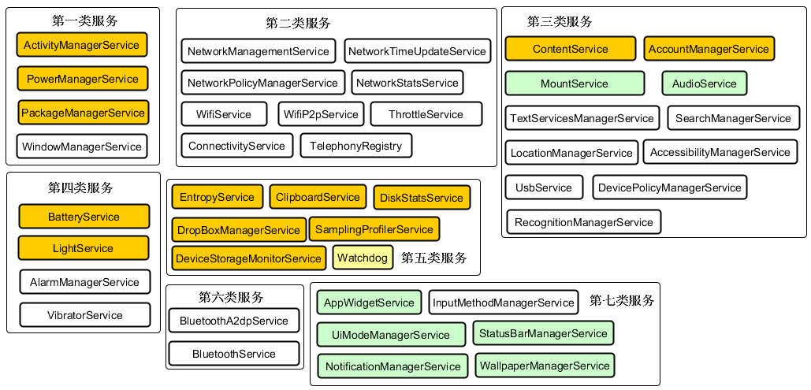
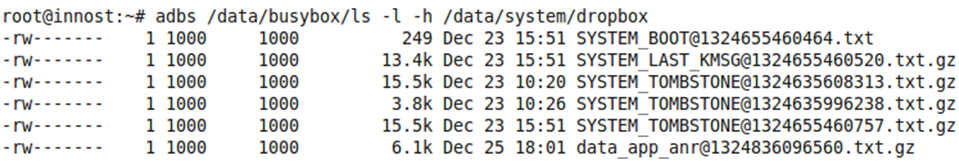
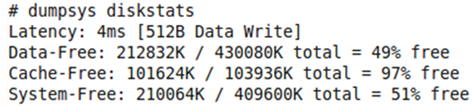
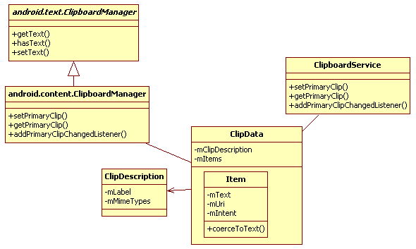

<h1>第3章  深入理解 SystemServer</h1>
<h2>本章主要内容：</h2>   

·  分析SystemServer

·  分析EntropyService、DropBoxManagerService、DiskStatsService

·  分析DeviceStorageMonitorService、SamplingProfilerService以及ClipboardService

<h2>本章所涉及的源代码文件名及位置：</h2>

·  SystemServer.java

frameworks/base/services/java/com/android/server/SystemServer.java

·  com_android_server_SystemServer.cpp

frameworks/base/services/jni/com_android_server_SystemServer.cpp

·  System_init.cpp

frameworks/base/cmds/system_server/library/System_init.cpp

·  EntropyService.java

frameworks/base/services/java/com/android/server/EntropyService.java

·  DropBoxManagerService.java

frameworks/base/services/java/com/android/server/DropBoxManagerService.java

·  ActivityManagerService.java

frameworks/base/services/java/com/android/server/am/ActivityManagerService.java

·  DiskStatsService.java

frameworks/base/services/java/com/android/server/DiskStatsService.java

·  dumpsys.cpp

frameworks/base/cmds/dumpsys/dumpsys.cpp

·  DeviceStorageMonitorService.java

frameworks/base/services/java/com/android/server/DeviceStorageMonitorService.java

·  SamplingProfilerService.java

frameworks/base/services/java/com/android/server/SamplingProfilerService.java

·  SamplingProfilerIntegration.java

frameworks/base/core/java/com/android/internal/os/SamplingProfilerIntegration.java

·  SamplingProfiler.java

libcore/dalvik/src/main/java/dalvik/system/profiler/SamplingProfiler.java

·  ClipboardService.java

frameworks/base/services/java/com/android/server/ClipboardService.java

·  ClipboardManager.java（android.content）

frameworks/base/core/java/android/content/ClipboardManager.java

·  ClipboardManager.java（android.text）

frameworks/base/core/java/android/text/ClipboardManager.java

·  ClipData.java

frameworks/base/core/java/android/content/ClipData.java

<h2>3.1  概述</h2>

SystemServer是什么？它可是Android Java世界的两大支柱之一。另外一个支柱是专门负责孵化Java进程的Zygote。这两大支柱倒了任何一根，都会导致Android Java世界的崩溃（所有由Zygote孵化的Java进程都会被销毁。SystemServer就是由Zygote孵化而来）。崩溃之后，幸好Linux系统中的天字号进程init会重新启动它们以重建Java世界。<a>[①]</a>

SystemServer正如其名，和系统服务有着重要关系。Android系统中几乎所有的核心Service都在这个进程中，如ActivityManagerService、PowerManagerService和WindowManagerService等。那么，作为这些服务的大本营，SystemServer会是什么样的呢？

<h2>3.2  SystemServer分析</h2>

SystemServer是由Zygote孵化而来的一个进程，通过ps命令，可知其进程名为system_server。

<h3>3.2.1  main函数分析</h3>

SystemServer核心逻辑的入口是main函数，其代码如下：

[--&gt;SystemServer.java]

    
public static void main(String[] args) {

    
     if(System.currentTimeMillis() &lt; EARLIEST_SUPPORTED_TIME) {

    
            //如果系统时钟早于1970，则设置系统时钟从1970开始

    
           Slog.w(TAG, "System clock is before 1970; setting to 1970.");

    
           SystemClock.setCurrentTimeMillis(EARLIEST_SUPPORTED_TIME);

    
        }

    
        //判断性能统计功能是否开启

    
        if(SamplingProfilerIntegration.isEnabled()) {

    
           SamplingProfilerIntegration.start();

    
           timer = new Timer();

    
           timer.schedule(new TimerTask() {

    
               @Override

    
               public void run() {

    
                   //SystemServer性能统计，每小时统计一次，统计结果输出为文件

    
                   SamplingProfilerIntegration.writeSnapshot("system_server",

    
                                                      null);

    
               }// SNAPSHOT_INTERVAL定义为1小时

    
           }, SNAPSHOT_INTERVAL, SNAPSHOT_INTERVAL);

    
        }

    
        //和Dalvik虚拟机相关的设置，主要是内存使用方面的控制

    
       dalvik.system.VMRuntime.getRuntime().clearGrowthLimit();

    
       VMRuntime.getRuntime().setTargetHeapUtilization(0.8f);

    
        //加载动态库libandroid_servers.so

    
       System.loadLibrary("android_servers");

    
       init1(args);//调用native的init1函数

    
  }

main函数首先做一些初始化工作，然后加载动态库libandroid_servers.so，最后再调用native的init1函数。该函数在libandroid_servers.so库中实现，其代码如下：

[--&gt;com_android_server_SystemServer.cpp]

    
extern "C" int system_init();

    
static voidandroid_server_SystemServer_init1(JNIEnv* env, jobject clazz)

    
{

    
   system_init(); //调用上面那个用extern 声明的system_init函数

    
}

 而system_init函数又在另外一个库libsystem_server.so中实现，代码如下：

[--&gt;System_init.cpp]

    
extern "C" status_t system_init()

    
{

    
     LOGI("Enteredsystem_init()");

    
     //初始化Binder系统

    
   sp&lt;ProcessState&gt; proc(ProcessState::self());

    
     //获取ServiceManager的客户端对象BpServiceManager

    
   sp&lt;IServiceManager&gt; sm = defaultServiceManager();

    
    

    
   //GrimReaper是一个很“血腥“的名字，俗称死神

    
    sp&lt;GrimReaper&gt;grim = new GrimReaper();

    
    /*

    
    下面这行代码的作用就是注册grim对象为ServiceManager死亡信息的接收者。一旦SM死亡，

    
    Binder系统就会发送讣告信息，这样grim对象的binderDied函数就会被调用。该函数内部

    
    将kill自己（即SystemServer）。

    
    笔者觉得，对于这种因挚爱离世而自杀的物体，叫死神好像不太合适

    
    */

    
   sm-&gt;asBinder()-&gt;linkToDeath(grim, grim.get(), 0);

    
 

    
    charpropBuf[PROPERTY_VALUE_MAX];

    
    //判断SystemServer是否启动SurfaceFlinger服务，该值由init.rc

    
    //脚本设置，默认为零，即不启动SF服务

    
    property_get("system_init.startsurfaceflinger",propBuf, "1");

    
    /*

    
    从4.0开始，和显示相关的核心服务surfaceflinger可独立到另外一个进程中。

    
    笔者认为，这可能和目前SystemServer的负担过重有关。另外，随着智能终端上HDMI的普及，

    
    未来和显示相关的工作将会越来越繁重。将SF放在单独进程中，不仅可加强集中管理，也可充分

    
    利用未来智能终端上多核CPU的资源

    
    */

    
    if(strcmp(propBuf, "1") == 0) {

    
       SurfaceFlinger::instantiate();

    
    }

    
    //判断SystemServer是否启动传感器服务，默认将启动传感器服务

    
   property_get("system_init.startsensorservice", propBuf,"1");

    
    if(strcmp(propBuf, "1") == 0) {

    
        //和SF相同，传感器服务也支持在独立进程中实现

    
       SensorService::instantiate();

    
    }

    
    //获得AndroidRuntime对象

    
   AndroidRuntime* runtime = AndroidRuntime::getRuntime();

    
    JNIEnv*env = runtime-&gt;getJNIEnv();

    
    ......//查找Java层的SystemServer类，获取init2函数的methodID

    
    jclassclazz = env-&gt;FindClass("com/android/server/SystemServer");

    
    ......

    
   jmethodID methodId = env-&gt;GetStaticMethodID(clazz, "init2","()V");

    
    ......//通过JNI调用Java层的init2函数

    
    env-&gt;CallStaticVoidMethod(clazz,methodId);

    
    //主线程加入Binder线程池

    
   ProcessState::self()-&gt;startThreadPool();

    
   IPCThreadState::self()-&gt;joinThreadPool();

    
    returnNO_ERROR;

    
}

那么，SystemServer的main函数究竟做了什么呢？

通过init1函数，辛辛苦苦从Java层穿越到Native层，做了一些初始化工作后，又通过JNI从Native层穿越到Java层去调用init2函数。

init2函数返回后，最终又回归到Native层。

是不是感觉init1和init2这两个函数的命名似曾相识，和我们初学编程时自定义的函数名非常像呢？其实代码中有一段“扭捏”的注释，解释了编写这种“初级”代码的原因。很简单，就是在对AndroidRuntime初始化前必须对一些核心服务初始化。

    
通过注释可看出，这段代码的作者也担心被人指责，但至少可以把函数名取得更形象一点吧？

<h3>3.2.2  Services群英会</h3>

init1函数看起来一点也不复杂，其实好戏都在init2中，其代码如下：

[--&gt;SystemServer.java]

    
public static final void init2() {

    
        Thread thr = new ServerThread();

    
       thr.setName("android.server.ServerThread");

    
       thr.start();//启动一个线程，这个线程就像英雄大会一样，聚集了各路英雄

    
}

上面的代码将创建一个新的线程ServerThread，该线程的run函数有600多行。如此之长的原因是，Android平台中众多Service都汇集于此。先看Services的集体亮相，如图3-1所示。

图3-1  Services群英会

图3-1中有7大类共43个Service（包括Watchdog）。实际上，还有一些Service并没有在ServerThread的run函数中露面，后面遇到时再做介绍。图3-1中的7大类服务主要包括：

·  位于第一大类的是Android的核心服务，如ActivityManagerService、WindowManagerService等。

·  位于第二大类的是和通信相关的服务，如Wifi相关服务、Telephone相关服务。

·  位于第三大类的是和系统功能相关的服务，如AudioService、MountService、UsbService等。

·  位于第四大类的是BatteryService、VibratorService等服务。

·  位于第五大类的是EntropyService，DiskStatsService、Watchdog等相对独立的服务。

·  位于第六大类的是蓝牙服务

·  位于第七大类的是UI方面的服务，如状态栏服务，通知管理服务等。

    
以上服务的分类并非官方标准，仅是笔者个人之见。

本章将分析其中的第五类服务。该类中的Service之间关系简单，而且功能相对独立。第五大类服务包括：

·  EntropyService，熵服务，它和随机数的生成有关。

·  ClipboardService，剪贴板服务。

·  DropBoxManagerService，该服务和系统运行时日志的存储与管理有关。

·  DiskStatsService以及DeviceStorageMonitorService，这两个服务用于查看和监测系统存储空间。

·  SamplingProfilerService，这个服务是4.0新增的，功能非常简单。

·  Watchdog，即看门狗，是Android的“老员工”了。我们在卷I第4章“深入理解Zygote”中曾分析过它。Android2.3以后其内存检测功能被去掉，所以与Android 2.2相比，更显简单了。这只小狗很可爱，就留给读者自己分析了。后面，将逐次分析这第五类服务的其他几项服务。

<h2>3.3  EntropyService分析</h2>

根据物理学基本原理，一个系统的熵越大，该系统就越不稳定。在Android中，目前也只有随机数喜欢处于这种不稳定的系统中了。

SystemServer中添加该服务的代码如下：

    
ServiceManager.addService("entropy", newEntropyService());

上边代码非常简单，从中可直接分析EntropyService的构造函数：

[--&gt;EntropyService.java]

    
public EntropyService() {

    
        //调用另外一个构造函数，getSystemDir函数返回的是/data/system目录

    
       this(getSystemDir() + "/entropy.dat","/dev/urandom");

    
}

    
public EntropyService(String entropyFile, StringrandomDevice) {

    
   this.randomDevice= randomDevice;//urandom是Linux系统中产生随机数的设备

    
   // /data/system/entropy.dat文件保存了系统此前的熵信息

    
  this.entropyFile = entropyFile; 

    
  //下面有4个关键函数

    
  loadInitialEntropy();//①

    
  addDeviceSpecificEntropy();//②

    
  writeEntropy();//③

    
  scheduleEntropyWriter();//④

    
}

从以上代码中可以看出，EntropyService构造函数中依次调用了4个关键函数，这4个函数比较简单，这里只介绍它们的作用。感兴趣的读者可自行分析其代码。

·  loadInitialEntropy函数：将entropy.dat文件的中内容写到urandom设备，这样可增加系统的随机性。根据代码中的注释，系统中有一个entropypool。在系统刚启动时，该pool中的内容为空，导致早期生成的随机数变得可预测。通过将entropy.dat数据写到该entropy pool（这样该pool中的内容就不为空）中，随机数的生成就无规律可言了。

·  addDeviceSpecificEntropy函数：将一些和设备相关的信息写入urandom设备。这些信息如下：

    
out.println("Copyright (C) 2009 The AndroidOpen Source Project");

    
out.println("All Your Randomness Are BelongTo Us");

    
out.println(START_TIME);

    
out.println(START_NANOTIME);

    
out.println(SystemProperties.get("ro.serialno"));

    
out.println(SystemProperties.get("ro.bootmode"));

    
out.println(SystemProperties.get("ro.baseband"));

    
out.println(SystemProperties.get("ro.carrier"));

    
out.println(SystemProperties.get("ro.bootloader"));

    
out.println(SystemProperties.get("ro.hardware"));

    
out.println(SystemProperties.get("ro.revision"));

    
out.println(new Object().hashCode());

    
out.println(System.currentTimeMillis());

    
out.println(System.nanoTime());

该函数的注释表明，即使向urandom的entropy pool中写入固定信息，也能增加随机数生成的随机性。从熵的角度考虑，系统的质量越大（即pool中的内容越多），该系统越不稳定。

·  writeEntropy函数：读取urandom设备的内容到entropy.dat文件。

·  scheduleEntropyWriter函数：向EntropyService内部的Handler发送一个ENTROPY_WHAT消息。该消息每3小时发送一次。收到该消息后，EntropyService会再次调用writeEntropy函数，将urandom设备的内容写到entropy.dat中。

通过上面的分析可知，entropy.dat文件保存了urandom设备内容的快照（每三小时更新一次）。当系统重新启动时，EntropyService又利用这个文件来增加系统的熵，通过这种方式使随机数的生成更加不可预测。

    
EntropyService本身的代码很简单，但是为了尽量保证随机数的随机性，Android还是下了一番苦功的。

 

<h2>3.4 DropBoxManagerService分析</h2>

DropBoxManagerService（简称DBMS，下同）用于生成和管理系统运行时的一些日志文件。这些日志文件大多记录的是系统或某个应用程序出错时的信息。

下面来分析这项服务。其中向SystemServer添加DBMS的代码：

    
ServiceManager.addService(Context.DROPBOX_SERVICE,//服务名为”dropbox”

    
                           new DropBoxManagerService(context, 

    
                           newFile("/data/system/dropbox")));

 

<h3>3.4.1  DBMS构造函数分析</h3>

DBMS构造函数如下：

[--&gt;DropBoxManagerService.java]

    
public DropBoxManagerService(final Contextcontext, File path) {

    
       mDropBoxDir = path;//path指定dropbox目录为/data/system/dropbox

    
       mContext = context;

    
       mContentResolver = context.getContentResolver();

    
 

    
       IntentFilter filter = new IntentFilter();

    
       filter.addAction(Intent.ACTION_DEVICE_STORAGE_LOW);

    
       filter.addAction(Intent.ACTION_BOOT_COMPLETED);

    
        //注册一个Broadcast监听对象，当系统启动完毕或者设备存储空间不足时，会收到广播

    
       context.registerReceiver(mReceiver, filter);

    
       //当Settings数据库相应项发生变化时候，也需要告知DBMS进行相应处理

    
       mContentResolver.registerContentObserver(

    
           Settings.Secure.CONTENT_URI, true,

    
           new ContentObserver(new Handler()) {

    
               public void onChange(boolean selfChange) {

    
             //当Settings数据库发生变化时候， BroadcastReceiver的onReceive函数

    
             //将被调用。注意第二个参数为null

    
                   mReceiver.onReceive(context,(Intent) null); 

    
               }

    
        });

    
}

根据上面代码可知：DBMS注册一个BroadcastReceiver对象，同时会监听Settings数据库的变动。其核心逻辑都在此BroadcastReceiver的onReceive函数中。该函数在以下三种情况发生时被调用：

·  当系统启动完毕时，由BOOT_COMPLETED广播触发。

·  当设备存储空间不足时，由DEVICE_STORAGE_LOW广播触发。

·  当Settings数据库相应项发生变化时候，该函数也会被触发。

这个函数内容较简单，主要功能是存储空间不足时需要删除一些老旧的日志文件以节省存储空间。读者可自行分析这个函数。

 

<h3>3.4.2  dropbox日志文件的添加</h3>

要想理清一个Service，最面好从它提供的服务开始进行分析。根据前面对DBMS的介绍可知，它提供了记录系统运行时日志信息的功能，所以这里先从dropbox日志文件的生成时说起。

当某个应用程序因为发生异常而崩溃（crash）时，ActivityManagerService（简称AMS，下同）的handleApplicationCrash函数被调用，其代码如下：

[--&gt;ActivityManagerService.java]

    
public void handleApplicationCrash(IBinder app,

    
                     ApplicationErrorReport.CrashInfocrashInfo) {

    
   ProcessRecordr = findAppProcess(app, "Crash");

    
   ......

    
   //调用addErrorToDropBox函数，第一个参数是一个字符串，为“crash”

    
   addErrorToDropBox("crash",r, null, null, null, null, null, crashInfo);

    
   ......

    
}

下面来看addErrorToDropBox函数：

[--&gt;ActivityManagerService.java]

    
public void addErrorToDropBox(String eventType,

    
           ProcessRecord process, ActivityRecord activity, 

    
            ActivityRecordparent, String subject,

    
           final String report, final File logFile,

    
           final ApplicationErrorReport.CrashInfo crashInfo) {

    
       

    
    /*

    
    dropbox日志文件的命名有一定的规则，其前缀都是一个特定的tag（标签），

    
    tag由两部分组成，合起来是”进程类型”_”事件类型”。

    
    下边代码中的processClass函数返回该进程的类型，包括“system_server”、“system_app”

    
    和“data_app”三种。eventType用于指定事件类型，目前也有三种类型：“crash“、”wtf“

    
    （what aterrible failure）和“anr”

    
    */

    
    finalString dropboxTag = processClass(process) + "_" + eventType;

    
    //获取DBMS Bn端的对象DropBoxManager 

    
       final DropBoxManager dbox = (DropBoxManager)

    
               mContext.getSystemService(Context.DROPBOX_SERVICE);

    
     /*

    
      对于DBMS，不仅通过tag于标示文件名，还可以根据配置的情况，允许或禁止特定tag日志

    
      文件的记录。isTagEnable将判断DBMS是否禁止该标签，如果该tag已被禁止，则不允许记

    
      录日志文件

    
      */

    
        if(dbox == null || !dbox.isTagEnabled(dropboxTag)) return;

    
        //创建一个StringBuilder，用于保存日志信息

    
       final StringBuilder sb = new StringBuilder(1024);

    
       appendDropBoxProcessHeaders(process, sb);

    
        ......//将信息保存到字符串sb中

    
         //单独启动一个线程用于向DBMS添加信息

    
       Thread worker = new Thread("Error dump: " + dropboxTag) {

    
           @Override

    
           public void run() {

    
               if (report != null) {

    
                   sb.append(report);

    
               }

    
               if (logFile != null) {

    
                   try {//如果有log文件，那么就把log文件内容读到sb中

    
                       sb.append(FileUtils.readTextFile(logFile, 

    
                                128 * 1024,"\n\n[[TRUNCATED]]"));

    
                   } ......

    
               }

    
               //读取crashInfo信息，一般记录的是调用堆栈信息

    
               if (crashInfo != null &amp;&amp; crashInfo.stackTrace != null) {

    
                   sb.append(crashInfo.stackTrace);

    
               }

    
               String setting = Settings.Secure.ERROR_LOGCAT_PREFIX + dropboxTag;

    
              //查询Settings数据库，判断该tag类型的日志是否对所记录的信息有行数限制，

    
             //例如某些tag的日志文件只准记录1000行的信息 

    
              int lines =Settings.Secure.getInt(mContext.getContentResolver(), 

    
                                                       setting, 0);

    
               if (lines &gt; 0) {

    
                   sb.append("\n");

    
                     InputStreamReader input =null;

    
                   try {

    
                        //创建一个新进程以运行logcat，后面的参数都是logcat常用的参数

    
                        java.lang.Processlogcat = new

    
                          ProcessBuilder("/system/bin/logcat",

    
                        "-v","time", "-b", "events", "-b","system", "-b",

    
                             "main", "-t", String.valueOf(lines))

    
                                .redirectErrorStream(true).start();

    
                     //由于新进程的输出已经重定向，因此这里可以获取最后lines行的信息，

    
                   //不熟悉ProcessBuidler的读者可以查看SDK中关于它的用法说明

    
                     ......

    
                  }

    
               }

    
              //调用DBMS的addText

    
               dbox.addText(dropboxTag, sb.toString());

    
           }

    
        };

    
        if(process == null || process.pid == MY_PID) {

    
           worker.run(); //如果是SystemServer进程crash了，则不能在别的线程执行

    
        }else {

    
           worker.start();

    
     }

    
}

由上面代码可知，addErrorToDropBox在生成日志的内容上花了不少工夫，因为这些是最重要的，最后仅调用addText函数便将内容传给DBMS的功能。

addText函数定义在DropBoxManager类中，代码如下：

[--&gt;DropBoxManager.java]

    
public void addText(String tag, String data) {

    
  /*

    
   mService和DBMS交互。DBMS对外只提供一个add函数用于日志添加，而DBM提供了3个函数，

    
   分别是addText、addData、addFile，以方便我们的使用

    
  */

    
   try ......

    
}

DBM向DBMS传递的数据被封装在一个Entry中。下面来看DBMS的add函数，其代码如下：

[--&gt;DropBoxManagerService.java]

    
public void add(DropBoxManager.Entry entry) {

    
        Filetemp = null;

    
       OutputStream output = null;

    
        finalString tag = entry.getTag();//先取出这个Entry的tag

    
        try{

    
           int flags = entry.getFlags();

    
            ......

    
            //做一些初始化工作，包括生成dropbox目录、统计当前已有的dropbox文件信息等

    
           init();

    
           if (!isTagEnabled(tag)) return;//如果该tag被禁止，则不能生成日志文件

    
           long max = trimToFit();

    
           long lastTrim = System.currentTimeMillis();

    
           //BlockSize一般是4KB

    
           byte[] buffer = new byte[mBlockSize];

    
           //从Entry中得到一个输入流。与Java I/O相关的类比较多，且用法非常灵活

    
           //建议读者阅读《Java编程思想》中“Java I/O系统”一章

    
            InputStreaminput = entry.getInputStream();

    
            ......

    
           int read = 0;

    
           while (read &lt; buffer.length) {

    
               int n = input.read(buffer, read, buffer.length - read);

    
                if (n &lt;= 0) break;

    
               read += n;

    
           }

    
           //先生成一个临时文件，命名方式为”drop线程id.tmp”

    
           temp = new File(mDropBoxDir, "drop" + 

    
                         Thread.currentThread().getId()+ ".tmp");

    
           int bufferSize = mBlockSize;

    
           if (bufferSize &gt; 4096) bufferSize = 4096;

    
           if (bufferSize &lt; 512) bufferSize = 512;

    
           FileOutputStream foutput = new FileOutputStream(temp);

    
           output = new BufferedOutputStream(foutput, bufferSize);

    
            //生成GZIP压缩文件

    
           if (read == buffer.length &amp;&amp; 

    
                 ((flags &amp;DropBoxManager.IS_GZIPPED) == 0)) {

    
               output = new GZIPOutputStream(output);

    
               flags = flags | DropBoxManager.IS_GZIPPED;

    
            }

    
            /*

    
                DBMS很珍惜/data分区，若所生成文件的size大于一个BlockSize，

    
                则一定要先压缩。

    
            */

    
            ......//写文件,这段代码非常繁琐，其主要目的是尽量节省存储空间

    
            /*

    
            生成一个EntryFile对象，并保存到DBMS内部的一个数据容器中。

    
            DBMS除了负责生成文件外，还提供查询的功能，这个功能由getNextEntry完成。

    
             另外，刚才生成的临时文件在createEntry函数中会重命为带标签的名字，

    
            读者可自行分析createEntry函数

    
            */

    
           long time = createEntry(temp, tag, flags);

    
           temp = null;

    
           Intent dropboxIntent = new

    
                         Intent(DropBoxManager.ACTION_DROPBOX_ENTRY_ADDED);

    
           dropboxIntent.putExtra(DropBoxManager.EXTRA_TAG, tag);

    
           dropboxIntent.putExtra(DropBoxManager.EXTRA_TIME, time);

    
           if (!mBooted) {

    
               dropboxIntent.addFlags(Intent.FLAG_RECEIVER_REGISTERED_ONLY);

    
           }

    
           //发送DROPBOX_ENTRY_ADDED广播。系统中目前还没有程序接收该广播

    
           mContext.sendBroadcast(dropboxIntent,

    
                            android.Manifest.permission.READ_LOGS);

    
        }......

    
}

上面代码中略去了DBMS写文件的部分，我们从代码注释中可获悉，DBMS非常珍惜/data分区的空间，每一个日志文件都需要考虑压缩以节省存储空间。如果说细节体现功力，那么这正是一个极好的例证。

一个真实设备上/data/system/dropbox目录的内容如图3-2所示。

图3-2  真实设备中dropbox目录的内容

图3-2中最后一项data_app_anr@1324836096560.txt.gz的大小是6.1KB，该文件解压后得到的文件大小是42kB。看来，压缩确实节省了不少存储空间。

另外，我们从图3-2中还发现了其他不同的tag，如SYSTEM_BOOT、SYSTEM_TOMBSTONE等，这些都是由BootReceiver在收到BOOT_COMPLETE广播后收集相关信息并传递给DBMS而生成的日志文件。

<h3>3.4.3  DBMS和settings数据库</h3>

DBMS的运行依赖一些配置项。其实除了DBMS，SystemServer中很多服务都依赖相关的配置选项。这些配置项都是通过SettingsProvider操作Settings数据库来设置和查询的。SettingsProvider是系统中很重要的一个APK，如果将其删除，系统就不能正常启动。

这里总结一下和DBMS相关的设置项，具体情况如下（注意，右边双引号的内容是该配置项在数据库中的名字。这些和系统相关的项都在Settings数据库中的Secure表内）：

    
//用来判断是否允许记录该tag类型的日志文件。默认是允许生成任何tag类型的文件

    
Secure.DROPBOX_TAG_PREFIX+tag: “dropbox:”+tag

    
//用于控制每个日志文件的存活时间，默认是三天。大于三天的日志文件就会被删除以节省空间

    
Secure.DROPBOX_AGE_SECONDS: ”dropbox_age_seconds”

    
//用于控制系统保存的日志文件个数，默认是1000个文件

    
Secure.DROPBOX_MAX_FILES：”dropbox_max_files”

    
//用于控制dropbox目录最多占存储空间容量的比例，默认是10%

    
Secure.DROPBOX_QUOTA_PERCENT:”dropbox_quota_percent”

    
//不允许dropbox使用的存储空间的比例，默认是10%，也就是dropbox最多只能使用90%的空间

    
Secure.DROPBOX_RESERVE_PERCENT:”dropbox_reserve_percent”

    
//dropbox最大能使用的空间大小，默认是5MB

    
Secure.DROPBOX_QUOTA_KB：”dropbox_quota_kb”

感兴趣的读者可以通过adb shell进入/data/data/com.android.providers.settings/databases/目录，然后利用sqlite3命令操作settings.db，其中有一个Secure表。不过系统中的很多选项在该表中都没有相关设置，因此实际运行时都会使用代码中设置的默认值。

<h2>3.5 DiskStatsService和DeviceStorageMonitorService分析</h2>

DiskStatsService和DeviceStroageMonitorService与系统内部存储管理和监控有关。

<h3>3.5.1 DiskStatsService分析</h3>

DiskStatsService代码非常简单，不过也有一个很有意思的地方，例如：

[--&gt;DiskStatsService.java]

    
public class DiskStatsService extends Binder

DiskStatsService从Binder派生，却没有实现任何接口，也就是说，DiskStatsService没有任何业务函数可供调用。为什么系统会存在这样的服务呢？

为了解释这个问题，有必要先把系统中一个很重要的命令dumpsys请出来。正如其名，这个命令用于打印系统中指定服务的信息，代码如下：

[--&gt;dumpsys.cpp]

    
int main(int argc, char* const argv[])

    
{

    
    //先获取与ServiceManager进程通信的BpServiceManager对象

    
   sp&lt;IServiceManager&gt; sm = defaultServiceManager();

    
   fflush(stdout);

    
    

    
    Vector&lt;String16&gt; services;

    
   Vector&lt;String16&gt; args;

    
    if (argc== 1) {//如果输入参数个数为1，则先查询在SM中注册的所有Service

    
       services = sm-&gt;listServices();

    
        //将service排序

    
       services.sort(sort_func);

    
        args.add(String16("-a"));

    
    } else {

    
        //指定查询某个service

    
       services.add(String16(argv[1]));

    
        //保存剩余参数，以后可以传给service的dump函数

    
        for(int i=2; i&lt;argc; i++) {

    
           args.add(String16(argv[i]));

    
        }

    
    }

    
 

    
    constsize_t N = services.size();

    
    ......

    
    for(size_t i=0; i&lt;N; i++) {

    
       sp&lt;IBinder&gt; service = sm-&gt;checkService(services[i]);

    
        ......

    
         //通过Binder调用该service的dump函数，将args也传给dump函数

    
         int err = service-&gt;dump(STDOUT_FILENO,args);

    
         ......

    
    }

    
    return0;

    
}

从上面代码可知，dumpsys通过Binder调用某个Service的dump函数。那么

“dumpsys diskstats”的输出会是什么呢？马上来试试，结果如图3-3所示。

图3-3  dumpsys diskstats的结果图示

图3-3说明了执行“dumpsysdiskstats”打印了系统中内部存储设备的使用情况。dumpsys是工作中常用的命令，建议读者掌握它的用法。

再来看DiskStatsService的dump函数，代码如下：

[--&gt;DiskStatsService.java]

    
protected void dump(FileDescriptor fd, PrintWriterpw, String[] args) {

    
       byte[] junk = new byte[512];

    
        for(int i = 0; i &lt; junk.length; i++) junk[i] = (byte) i;  

    
        //输出/data/system/perftest.tmp文件信息，输出后即删除该文件

    
        //目前还不清楚这个文件由谁生成。从名字上看应该和性能测试有关

    
        Filetmp = new File(Environment.getDataDirectory(),

    
                                "system/perftest.tmp");

    
       FileOutputStream fos = null;

    
       IOException error = null;

    
        longbefore = SystemClock.uptimeMillis();

    
        try{

    
           fos = new FileOutputStream(tmp);

    
           fos.write(junk);

    
        } ......

    
        longafter = SystemClock.uptimeMillis();

    
        if(tmp.exists()) tmp.delete();

    
 

    
        if(error != null) {

    
            ......

    
        }else {

    
           pw.print("Latency: ");

    
           pw.print(after - before);

    
           pw.println("ms [512B Data Write]");

    
        }

    
        //打印内部存储设备各个分区的信息

    
       reportFreeSpace(Environment.getDataDirectory(), "Data", pw);

    
       reportFreeSpace(Environment.getDownloadCacheDirectory(),"Cache", pw);

    
       reportFreeSpace(new File("/system"), "System", pw);

    
        //有些厂商还会将/proc/yaffs信息打印出来

    
}

从前述代码中可发现，DiskStatsService没有实现任何业务接口，似乎只是为了调试而存在。所以笔者认为，DiskStatsService的功能完全可以被整合到后面即将介绍的DeviceStorageManagerService类中。总之，本节最重要的就是dumpsys这个命令了，建议读者一定要掌握它的用法。

<h3>3.5.2 DeviceStorageManagerService分析</h3>

DeviceStorageManagerService（简称DSMS，下同）是用来监测系统内部存储空间的状态的，添加该服务的代码如下：

    
//DSMS的服务名为“devicestoragemonitor “

    
ServiceManager.addService(DeviceStorageMonitorService.SERVICE,

    
                        newDeviceStorageMonitorService(context));

DSMS的构造函数的代码如下：

[--&gt;DeviceStorageManagerService.java]

    
public DeviceStorageMonitorService(Contextcontext) {

    
       mLastReportedFreeMemTime = 0;

    
       mContext = context;

    
       mContentResolver = mContext.getContentResolver();

    
       mDataFileStats = new StatFs(DATA_PATH);//获取data分区的信息

    
       mSystemFileStats = new StatFs(SYSTEM_PATH);// 获取system分区的信息

    
       mCacheFileStats = new StatFs(CACHE_PATH);// 获取cache分区的信息

    
        //获得data分区的总大小

    
       mTotalMemory = ((long)mDataFileStats.getBlockCount() *

    
                       mDataFileStats.getBlockSize())/100L;

    
        /*

    
        创建三个Intent，分别用于通知存储空间不足、存储空间恢复正常和存储空间满。

    
        由于设置了REGISTERED_ONLY_BEFORE_BOOT标志，这3个Intent广播只能由

    
        系统服务接收

    
        */

    
       mStorageLowIntent = newIntent(Intent.ACTION_DEVICE_STORAGE_LOW);

    
       mStorageLowIntent.addFlags(

    
                        Intent.FLAG_RECEIVER_REGISTERED_ONLY_BEFORE_BOOT);

    
       mStorageOkIntent = new Intent(Intent.ACTION_DEVICE_STORAGE_OK);

    
       mStorageOkIntent.addFlags(

    
                   Intent.FLAG_RECEIVER_REGISTERED_ONLY_BEFORE_BOOT);

    
       mStorageFullIntent = new Intent(Intent.ACTION_DEVICE_STORAGE_FULL);

    
       mStorageFullIntent.addFlags(

    
                   Intent.FLAG_RECEIVER_REGISTERED_ONLY_BEFORE_BOOT);

    
       mStorageNotFullIntent = new

    
                    Intent(Intent.ACTION_DEVICE_STORAGE_NOT_FULL);

    
       mStorageNotFullIntent.addFlags(

    
                   Intent.FLAG_RECEIVER_REGISTERED_ONLY_BEFORE_BOOT);

    
        

    
        //查询Settings数据库中sys_storage_threshold_percentage的值，默认是10，

    
        //即当/data空间只剩下10%的时候，,认为空间不足

    
       mMemLowThreshold = getMemThreshold();

    
       //查询Settings数据库中的sys_storage_full_threshold_bytes的值，默认是1MB，

    
       //即当data分区只剩1MB时，就认为空间已满，剩下的这1MB空间保留给系统自用

    
       mMemFullThreshold = getMemFullThreshold();

    
        //检查内存

    
       checkMemory(true);

    
}

再来看checkMemory函数，代码如下：

 

    
private final void checkMemory(boolean checkCache){

    
  if(mClearingCache) {

    
      ......//如果正在清理空间，则不作处理

    
     } else{

    
           restatDataDir();//重新计算三个分区的剩余空间大小

    
            //如果剩余空间低于mMemLowThreshold，那么先清理一次空间

    
            clearCache();

    
            //如果空间仍不足，则发送广播，并在状态栏上设置一个警告通知

    
             sendNotification();

    
             ......

    
            //如果空间已满，则调用下面这个函数，以发送一次存储已满的广播

    
             sendFullNotification();

    
        } ......

    
      //DEFAULT_CHECK_INTERVAL为1分钟，即每一分钟会触发一次检查，似乎有点短

    
       postCheckMemoryMsg(true, DEFAULT_CHECK_INTERVAL);

    
}

当空间不足时，DSMS会先尝试clearCache函数，该函数内部会与PackageManagerService交互，其代码如下：

[--&gt;DeviceStorageManagerService.java]

    
private final void clearCache() {

    
 if(mClearCacheObserver == null) {

    
      //创建一个CachePackageDataObserver对象,当PKM清理完空间时会回调该对象的

    
      //onRemoveCompleted函数

    
      mClearCacheObserver = new CachePackageDataObserver();

    
   }

    
 mClearingCache= true;//设置mClearingCache的值为true，表示我们正在清理空间

    
 try {

    
     //调用PKM的freeStorageAndNotify函数以清理空间，这个函数在分析PKM时再介绍

    
    IPackageManager.Stub.asInterface(

    
            ServiceManager.getService("package")).

    
            freeStorageAndNotify(mMemLowThreshold,mClearCacheObserver);

    
   } ......

    
}

CachePackageDataObserver是DSMS定义的内部类，其onRemoveCompleted函数很简单，就是重新发送消息，让DSMS再检测一次内存空间。

DeviceStorageManagerService的功能单一，没有重载dump函数。而DiskStatsService唯一有用的就是dump功能了。不知Google的工程师为什么没有把DeviceStorageManagerService和DiskStatsService的功能整合到一起。

<h2>3.6  SamplingProfilerService分析</h2>

添加SamplingProfilerService服务的代码如下：

    
ServiceManager.addService("samplingprofiler",//服务名

    
                            newSamplingProfilerService(context));

<h3>3.6.1 SamplingProfilerService构造函数分析</h3>

下面给来分析SamplingProfilerService的构造函数，其代码如下：

[--&gt;SamplingProfilerService.java]

    
public SamplingProfilerService(Context context) {

    
       //注册一个CotentObserver，用于监测Settings数据库的变化

    
       registerSettingObserver(context);

    
       startWorking(context);//① startWorking函数，见下文的分析

    
}

先来分析上边的关键点startWorking函数，代码如下：

[--&gt;SamplingProfilerService.java]

    
private void startWorking(Context context) {

    
      finalDropBoxManager dropbox = //得到DropBoxManager对象

    
               (DropBoxManager) 

    
                   context.getSystemService(Context.DROPBOX_SERVICE);

    
        //枚举/data/snapshots目录下的文件

    
       File[] snapshotFiles = new File(SNAPSHOT_DIR).listFiles();

    
        for(int i = 0; snapshotFiles != null &amp;&amp; i &lt; snapshotFiles.length; 

    
             i++) {

    
            //将这些文件的内容转移到dropbox中，然后删除这个文件

    
           handleSnapshotFile(snapshotFiles[i], dropbox);

    
        }

    
        //创建一个FileObserver对象监控shots目录，如果目录中来了新的文件，那么把它们

    
        //转移到dropbox中

    
       snapshotObserver = new FileObserver(SNAPSHOT_DIR, FileObserver.ATTRIB) {

    
           @Override

    
           public void onEvent(int event, String path) {

    
               handleSnapshotFile(new File(SNAPSHOT_DIR, path), dropbox);

    
           }

    
        };

    
        //启动文件夹监控，采用了Linux平台的inotify机制，感兴趣的读者可以研究下inotify

    
       snapshotObserver.startWatching();

    
}

看完上边的代码，不知读者是否感到有些诧异。对此，笔者有两个疑惑：

其一，难道SamplingProfilerService的功能就是将/data/snapshots目录下的文件转移到dropbox中吗？该服务似乎与性能采样及统计没有任何关系！

其二，SamplingProfilerService本身并不提供性能统计的功能，那么性能采样与统计文件由谁生成呢？

第二个问题的答案是SamplingProfilerIntegration，这个类封装了一个SamplingProfiler（由dalvik虚拟机提供）对象，并提供了方便利用的函数进行性能统计。（可惜这个类并不是由SDK输出的，要使用该类，就只能利用源码进行编译。）

<h3>3.6.2  SamplingProfilerIntegration介绍</h3>

先来看如何使用SamplingProfilerIntegration进行性能统计。系统中有很多重要进程都需要对性能进行分析，比如Zygote，其相关代码如下：

 [--&gt;zygoteInit.java]

    
public static void main(String argv[]) {

    
try {

    
            //启动性能统计

    
           SamplingProfilerIntegration.start();

    
           ......//Zygote做自己的工作

    
            //结束统计并生成结果文件

    
           SamplingProfilerIntegration.writeZygoteSnapshot();

    
           ......

    
}

先看start函数，代码如下：

[--&gt;SamplingProfilerIntegration.java]

    
public static void start() {

    
        if(!enabled) {//判断是否开启性能统计。enable由谁控制？

    
           return;

    
        }

    
        ......

    
       ThreadGroup group = Thread.currentThread().getThreadGroup();

    
       SamplingProfiler.ThreadSet threadSet =

    
                             SamplingProfiler.newThreadGroupTheadSet(group);

    
        //创建一个dalvik的SamplingProfiler，我们暂时不会对它进行分析

    
        samplingProfiler= new SamplingProfiler(samplingProfilerDepth,

    
                                                        threadSet);

    
        //启动统计

    
       samplingProfiler.start(samplingProfilerMilliseconds);

    
       startMillis = System.currentTimeMillis();

    
    }

上边代码中提出了一个问题，即用于判断是否启动性能统计的enable变量由谁控制，答案在该类的static语句中，其代码如下：

[--&gt;SamplingProfilerIntegration.java]

    
static {

    
       samplingProfilerMilliseconds = //取系统属性，默认值为0，即禁止性能统计

    
                   SystemProperties.getInt("persist.sys.profiler_ms", 0);

    
       samplingProfilerDepth = 

    
                   SystemProperties.getInt("persist.sys.profiler_depth", 4);

    
         //如果samplingProfilerMilliseconds的值大于零，则允许性能统计

    
        if(samplingProfilerMilliseconds &gt; 0) {

    
           File dir = new File(SNAPSHOT_DIR);

    
            ......//创建/data/snapshots目录，并使其可写

    
           if (dir.isDirectory()) {

    
               snapshotWriter = Executors.newSingleThreadExecutor(

    
                                                   new ThreadFactory() {

    
                        public ThreadnewThread(Runnable r) {

    
                            return newThread(r, TAG);//创建用于输出统计文件的工作线程

    
                        }

    
                   });

    
               enabled = true;

    
            } ......

    
        }else {

    
           snapshotWriter = null;

    
           enabled = false;

    
           Log.i(TAG, "Profiling disabled.");

    
        }

    
 }

enable的控制竟然放在static语句中，这表明要使用性能统计，就必须重新启动要统计的进程。

启动性能统计后，需要输出统计文件，这项工作由writeZygoteSnapshot函数完成，其代码如下：

[--&gt;SamplingProfilerIntegration.java]

    
public static void writeZygoteSnapshot() {

    
        ......

    
        //调用writeSnapshotFile函数，注意第一个参数为“zygote”，用于表示进程名

    
       writeSnapshotFile("zygote", null);

    
       samplingProfiler.shutdown();//关闭统计

    
       samplingProfiler = null;

    
       startMillis = 0;

    
}

writeSnapshotFile函数比较简单，功能就是在shots目录下生成一个统计文件，统计文件的名称由两部分组成，合起来就是“进程名_开始性能统计的时刻.snapshot”。另外，writeSnapshotfile内部会调用generateSnapshotHeader函数在该统计文件文件头部写一些特定的信息，例如版本号、编译信息等。

    
SamplingProfilerIntegration的核心是SamplingProfiler，这个类定义在libcore/dalvik/src/main/java/dalvik/system/profiler/SamplingProfiler.java文件中。感兴趣的读者可以研究一下该类的用法。在实际开发中，我一般使用Debug类提供的方法进行性能统计。

 

<h2>3.7 ClipboardService分析</h2>

ClipboardService（简称CBS，下同）是Android系统中的元老级服务了，自Android 1.0起就支持剪贴功能。在Android 4.0中再遇见它时，此功能已有了长足改进。先来看和剪贴功能有关的类的家族图谱，如图3-4所示。

图3-4  和剪贴服务有关的类

由图3-4可知：

·  在Android 4.0中，源码中的content.ClipboardManager类继承了text.ClipboardManager类。从text.ClipboardManager类的命名中也可看出，早期的剪贴功能只支持文本。ClipboardManager由剪贴板服务的客户端使用，在SDK中有相应文档说明。

·  新增一个ClipData类，它就像一个容器，管理存储在其中的数据信息。具体的数据信息存储在ClipData的成员变量mItems中。该变量是一个Item类型的数组，每一个Item代表一项数据。

·  ClipDescription类用来描述一个ClipData中的数据类型。目前，Android系统中的剪贴板支持3种类型的数据（Text、Intent、以及URL列表）。

·  剪贴板的服务端由ClipboardService实现。

下边我们通过一个例子来分析CBS。该例子来源于AndroidSDK提供的一段示例代码（取自SDK安装目录/sample/android-14/NotePad）。

<h3>3.7.1  Copy数据到剪贴板 </h3>

我们截取与Copy操作相关的代码：

[--&gt;sample]

    
//首先获取能与CBS交互的ClipboardManager对象

    
ClipboardManager clipboard = (ClipboardManager)

    
                          getSystemService(Context.CLIPBOARD_SERVICE);

    
//调用setPrimaryClip函数，参数是ClipData.newUri函数的返回值

    
clipboard.setPrimaryClip(ClipData.newUri(  

    
                                   getContentResolver(),"Note",noteUri));

ClipData的newUri是一个static函数，用于返回一个存储URI数据类型的ClipData，代码如下。根据前文所述可知，ClipData对象装载的就是可保存在剪贴板中的数据。

[--&gt;ClipData.java]

    
static public ClipData newUri(ContentResolverresolver, CharSequence label,

    
                                      Uri uri) {

    
     Itemitem = new Item(uri); //创建一个Item，将Uri直接传给它的构造函数

    
    String[] mimeTypes = null;

    
      /*

    
        下边代码的功能是获取这个Uri代表的数据的MIME类型。先尝试利用ContentResolver

    
        从ContentProvider那查询，如果查询不到，则设置mimeTypes为

    
        MIMETYPES_TEXT_URILIST，它的定义是new String[“text/uri-list”]

    
      */

    
      if("content".equals(uri.getScheme())) {

    
           String realType = resolver.getType(uri);

    
           //查询该uri所指向的数据的mimeTypes

    
           mimeTypes = resolver.getStreamTypes(uri, "*/*");

    
           if (mimeTypes == null) {

    
               if (realType != null) {

    
                   mimeTypes = new String[] { 

    
                            realType,ClipDescription.MIMETYPE_TEXT_URILIST };

    
               }

    
           } else {

    
               ......

    
        }

    
        if(mimeTypes == null) {

    
           mimeTypes = MIMETYPES_TEXT_URILIST;

    
        }

    
        //创建一个ClipData对象

    
       return new ClipData(label, mimeTypes, item);

    
}

    
//ClipData的构造函数

    
public ClipData(CharSequence label, String[]mimeTypes, Item item) {

    
       mClipDescription = new ClipDescription(label, mimeTypes);

    
        ......

    
       mIcon = null;

    
       mItems.add(item);//将item对象添加到mItems数组中

    
    }

newUri函数的主要功能在于，获得URI所指向的数据的数据类型。对于使用剪切板服务的程序来说，了解剪切板中数据的数据类型相当重要，因为这样可以判断自己能否处理这种类型的数据。

    
URI和MIME的关系： URI指向数据的位置，这和PC机上文件的存储位置类似，例如c:/dfp。MIME则表示该数据的数据类型。在Windows平台上是采用后缀名来表示文件类型的，前面提到的c盘下的dfp文件，后缀是wav，表示该文件是一个wav音频。

    
对于剪切板来说，数据源由URI指定，数据类型由MIME表示，两者缺一不可。

获得一个ClipData后，将调用setPrimaryClip函数，将数据传递到CBS。setPrimaryClip的代码如下：

    
public void setPrimaryClip(ClipData clip) {

    
   try {

    
             //跨Binder调用，先要把参数打包。有兴趣的读者可以看看writToParcel函数

    
            getService().setPrimaryClip(clip);

    
        }catch (RemoteException e) {

    
   }

    
}

通过Binder发送setPrimaryClip请求后，由CBS完成实际功能，代码如下：

[--&gt;ClipboardService.java]

    
public void setPrimaryClip(ClipData clip) {

    
       synchronized (this) {

    
        ......

    
         //权限检查，后面会在3.7.3中单独分析

    
          checkDataOwnerLocked(clip,Binder.getCallingUid());

    
         */

    
        //和权限相关，后续会分析

    
       clearActiveOwnersLocked();

    
        //保存新的clipData到mPrimaryClip中

    
       mPrimaryClip = clip;

    
        / *

    
           mPrimaryClipListeners是一个RemoteCallbackList数组，

    
           当CBS中的ClipData发生变化时，CBS需要向那些监控剪切板的

    
           客户端发送通知。客户端通过addPrimaryClipChangedListener函数

    
           注册回调

    
        */

    
       final int n = mPrimaryClipListeners.beginBroadcast();

    
        for (int i = 0; i &lt; n; i++) {

    
        try{

    
               //通知客户端，剪切板的内容发生变化

    
                mPrimaryClipListeners.getBroadcastItem(i).

    
                                        dispatchPrimaryClipChanged();

    
               }......

    
           }

    
           mPrimaryClipListeners.finishBroadcast();

    
        }

    
    }

setPrimaryClip比较简单。但是由于新增支持Uri和Intent这两种数据类型，因此在安全性方面还有一些需要考虑的地方。这部分内容我们放到3.7.3小节去分析。

    
RemoteCallbackList是一个比较重要的常用类，很有必要掌握它的用法。

 

<h3>3.7.2  从剪切板Paste数据</h3>

我们来看一个示例，代码如下所示：

[--&gt;Sample]

    
final void performPaste() {

    
    //获取ClipboardManager对象

    
   ClipboardManager clipboard = (ClipboardManager)

    
           getSystemService(Context.CLIPBOARD_SERVICE);

    
 

    
    //获取ContentResolver对象

    
   ContentResolver cr = getContentResolver();

    
    //从剪贴板中取出ClipData    

    
    ClipDataclip = clipboard.getPrimaryClip();

    
    if (clip!= null) {

    
       String text=null;

    
       String title=null;

    
        //取剪切板ClipData中的第一项Item

    
       ClipData.Item item = clip.getItemAt(0);

    
        /*

    
            下面这行代码取出Item中所包含的Uri。看起来顺理成章，其实不然。

    
            应思考这样一个问题，为什么这里一定是取Uri呢？原因是在本例中，

    
            copy方和paste方都事先了解ClipData中的数据类型。

    
            如果paste方不了解ClipData中的数据类型，该如何处理？

    
            一种简单的方法就是采用if/else的判断语句。另外还有别的方法，

    
            下文将做分析。

    
         */ 

    
        Uriuri = item.getUri();

    
       Cursor orig = cr.query(uri,PROJECTION, null, null,null);

    
           ......//查询数据库并获取信息

    
          orig.close();

    
           }

    
        }

    
        if(text == null) {

    
           //如果paste方不了解ClipData中的数据类型，可调用coerceToText

    
          //函数，强制得到文本类型的数据

    
           text = item.coerceToText(this).toString();//强制为文本

    
        }

    
      ......

    
}

下面来分析getPrimaryClip函数。

[--&gt;ClipboardManager.java]

    
public ClipData getPrimaryClip() {

    
   try {

    
           //调用CBS的getPrimaryClip，并传递自己的package名

    
           return getService().getPrimaryClip(mContext.getPackageName());

    
        }......

    
}

[--&gt;ClipboardManagerService.java]

    
public ClipData getPrimaryClip(String pkg) {

    
       synchronized (this) {

    
           //赋予该pkg相应的权限，后文再作分析

    
           addActiveOwnerLocked(Binder.getCallingUid(), pkg);

    
           return mPrimaryClip;//返回ClipData给客户端

    
        }

    
}

在上边的代码注释中，曾提到coerceToText函数。该函数在paste方不了解ClipData中数据类型的情况下，可以强制得到文本类型的数据。对于URI和Intent，这个功能又是如何实现的呢？来看下面的代码：

[--&gt;ClipData.java]

    
public CharSequence coerceToText(Context context){

    
   //如果该Item已经有mText，则直接返回文本

    
   if (mText!= null) {

    
       return mText;

    
   }

    
   //如果该Item中的数据是URI类型

    
   if (mUri!= null) {

    
       FileInputStream stream = null;

    
        try{

    
              /*

    
                ContentProvider需要实现openTypedAssetFileDescriptor函数，

    
                以返回指定MIME（这里是text/*）类型的数据源（AssetFileDescriptor）

    
              */

    
              AssetFileDescriptor descr = context.getContentResolver()

    
                           .openTypedAssetFileDescriptor(mUri, "text/*", null);

    
              //创建一个输入流

    
              stream = descr.createInputStream();

    
              //创建一个InputStreamReader，读出来的数据将转换成UTF-8的文本

    
              InputStreamReader reader = new InputStreamReader(stream,

    
                                                      "UTF-8");

    
              StringBuilder builder = new StringBuilder(128);

    
              char[] buffer = new char[8192];

    
              int len;

    
              //从ContentProvider那读取数据，然后转换成UTF-8的字符串

    
              while ((len=reader.read(buffer)) &gt; 0) {

    
                   builder.append(buffer, 0, len);

    
              }

    
              //返回String

    
              return builder.toString();

    
         } ......

    
   }

    
    //如果是Intent，则调用toUri返回一个字符串

    
   if (mIntent != null) {

    
      returnmIntent.toUri(Intent.URI_INTENT_SCHEME);

    
     }

    
   return"";

    
  }

    
}

分析上边代码可知，针对URI类型的数据，coerceToText函数还是做了不少工作的。当然，还需要提供该URI的ContentProvider实现相应的函数。

<h3>3.7.3  CBS中的权限管理</h3>

在前文的分析中，我们略去了CBS中与权限管理相关的部分，本节将集中讨论这个问题。先来回顾一下CBS中和权限管理相关的函数调用。

    
//copy方设置ClipData在CBS的setPrimaryClip函数中进行：

    
checkDataOwnerLocked(clip,Binder.getCallingUid());

    
clearActiveOwnersLocked();

    
//paste方获取ClipData在CBS的getPrimaryClip函数中进行：

    
addActiveOwnerLocked(Binder.getCallingUid(), pkg);

在分析这3个函数之前，不妨先介绍一下Android系统中的URI权限管理。

<h4>1.  URI权限管理介绍</h4>

Android系统的权限管理中有一类是专门针对URI的，先来看一个示例，该例来自package/providers/ContactsProvider，在它的AndroidManifest.xml中有如下声明：

[--&gt;AndroidManifest.xml]

    
&lt;providerandroid:name="ContactsProvider2"

    
           ......

    
           android:readPermission="android.permission.READ_CONTACTS"

    
           android:writePermission="android.permission.WRITE_CONTACTS"&gt;

    
            ......

    
           &lt;grant-uri-permission android:pathPattern=".*" /&gt;

    
&lt;/provider&gt;

这里声明了一个名为“ContactsProvider2“的ContentProvider，并定义了几个权限声明，下面对其进行解释。

·  readPermission：要求调用query函数的客户端必须声明use-permission为READ_CONTACTS。

·  writePermission：要求调用update或insert函数的客户端必须声明use-permission为WRITE_CONTACTS。

·  grant-uri-permission：和授权有关。

初识grant-uri-permission时，会觉得比较难以理解，现在通过举例分析帮助读者加深认识。

·  Contacts和ContactProvider这两个APP都是由系统提供的程序，而且二者关系紧密，所以Contacts一定会声明READ_CONTACTS和WRITE_CONTACT的权限。如此，Contacts就可以毫无阻碍地通过ContactsProvider来查询或更新数据库了。

·  假设Contacts新增一个功能，将ContactsProvider中的某条数据copy到剪切板。根据前面已介绍过的知识可以知道，Contacts会向剪切板中复制一个URI类型的数据。

·  另外一个程序从剪切板中paste这条数据，由于是URI类型的，所以此程序会通过ContentResolver来query该URI所指向的数据。但是这个程序却并未声明READ_CONTACTS的权限，所以它query数据时必然会失败。

或许有人会问，为什么第三个程序不声明相应权限呢？原因很简单，第三个程序不知道自己该申明怎样的权限（除非这两个程序的开发者能互通信息）。本例ContactsProvider设置的读权限是READ_CONTACTS，以后可能换成READ_CONTACTS_EXTEND。为了解决类似问题，Android提供了一套专门针对URI的权限管理机制。以这套机制解决示例中权限声明问题的方法是这样的：当第三个程序从剪切板中paste数据时，系统会判断是否需要为这个程序授权。当然，系统不会随意授权，而是需要考虑ContactsProvider的情况。因为ContactsProvider声明了grant-uri-permission，并且所paste的URI匹配其中的pathPattern，所以授权就能成功。倘若ContactsProvider没有声明grant-uri-permission，或者URI不匹配指定的pathPattern，则授权失败。

有了前面介绍的权限管理机制，相信下面CBS中的权限管理理解起来就比较简单了。

    
感兴趣的读者可阅读SDK安装目录下/docs/guide/topics/security/security.html中关于URI Permission的说明部分。

<h4>2. checkDataOwnerLocked函数分析</h4>

checkDataOwnerLocked函数的代码如下：

[--&gt;ClipboardService.java]

    
private final void checkDataOwnerLocked(ClipDatadata, int uid) {

    
        //第二个参数uid为copy方进程的uid

    
       final int N = data.getItemCount();

    
        for(int i=0; i&lt;N; i++) {

    
           //为每一个item调用checkItemOwnerLocked

    
           checkItemOwnerLocked(data.getItemAt(i), uid);

    
        }

    
}

    
// checkItemOwnerLocked函数分析

    
private final voidcheckItemOwnerLocked(ClipData.Item item, int uid) {

    
        if(item.getUri() != null) {//检查Uri

    
           checkUriOwnerLocked(item.getUri(), uid);

    
        }

    
       Intent intent = item.getIntent();

    
       //getData函数返回的也是一个URI，因此这里实际上检查的也是URI

    
        if(intent != null &amp;&amp; intent.getData() != null) {

    
           checkUriOwnerLocked(intent.getData(), uid);

    
        }

    
}

权限检查就是针对URI的，因为URI所指向的数据可能是系统内部使用或私密的。例如Setting数据中的Secure表，这里的数据不能随意访问。虽然直接使用ContentResolver访问这些数据时系统会进行权限检查，但是由于目前的剪切板服务也支持URI数据类型，所以这里也需要做检查，否则恶意程序就能轻松读取私密信息。

下边来分析checkUriOwnerLocked函数，其代码如下：

[--&gt;ClipboardService.java]

    
private final void checkUriOwnerLocked(Uri uri,int uid) {

    
        ......

    
        longident = Binder.clearCallingIdentity();

    
       boolean allowed = false;

    
        try{

    
           /*

    
             调用ActivityManagerService的checkGrantUriPermission函数，

    
              该函数内部将检查copy方是否能被赋予URI_READ权限。如果不允许，

    
              该函数会抛SecurityException异常

    
           */

    
           mAm.checkGrantUriPermission(uid, null, uri, 

    
                                           Intent.FLAG_GRANT_READ_URI_PERMISSION);

    
        }catch (RemoteException e) {

    
        }finally {

    
           Binder.restoreCallingIdentity(ident);

    
        }

    
    }

根据前面的知识，这里先要检查copy方是否有读取URI的权限。下面来分析paste方的权限管理

<h4>3.  clearActiveOwnersLocked函数分析</h4>

clearActiveOwnersLocked函数的代码如下：

[--&gt;ClipboardService.java]

    
private final void addActiveOwnerLocked(int uid,String pkg) {

    
       PackageInfo pi;

    
        try{

    
          /*

    
           调用PackageManagerService的getPackageInfo函数得到相关信息

    
            然后做一次安全检查，如果PacakgeInfo的uid信息和当前调用的uid不一致，

    
            则抛SecurityException。这个很好理解，因为paste方可以传递虚假的

    
           packagename，但uid是没法造假的

    
           */

    
           pi = mPm.getPackageInfo(pkg, 0); 

    
           if (pi.applicationInfo.uid != uid) {

    
               throw new SecurityException("Calling uid " + uid

    
                        + " does not ownpackage " + pkg);

    
           }

    
         } ......

    
        }

    
        //mActivePermissionOwners用来保存已经通过安全检查的package

    
        if(mPrimaryClip != null &amp;&amp; !mActivePermissionOwners.contains(pkg)) {

    
           //针对ClipData中的每一个Item，都需要调用grantItemLocked来检查权限

    
           final int N = mPrimaryClip.getItemCount();

    
           for (int i=0; i&lt;N; i++) {

    
               grantItemLocked(mPrimaryClip.getItemAt(i), pkg);

    
           }//保存package信息到mActivePermissionOwners

    
           mActivePermissionOwners.add(pkg);

    
        }

    
}

    
//grantItemLocked分析

    
private final void grantItemLocked(ClipData.Itemitem, String pkg) {

    
        if(item.getUri() != null) {

    
           grantUriLocked(item.getUri(), pkg);

    
        } //和copy方一样，这里仅检查URI的情况

    
       Intent intent = item.getIntent();

    
        if(intent != null &amp;&amp; intent.getData() != null) {

    
           grantUriLocked(intent.getData(), pkg);

    
        }

    
}

再来看grantUriLocked的代码：

[--&gt;ClipboardService.java]

    
private final void grantUriLocked(Uri uri, Stringpkg) {

    
        longident = Binder.clearCallingIdentity();

    
        try{

    
          /*

    
              调用ActivityManagerService的grantUriPermissionFromOwner函数，

    
              注意第二个参数传递的是CBS所在进程的uid。该函数内部也会检查权限。

    
               该函数调用成功后，paste方就被授予了对应URI的读权限

    
            */

    
           mAm.grantUriPermissionFromOwner(mPermissionOwner, 

    
                                    Process.myUid(),pkg, uri,

    
                                   Intent.FLAG_GRANT_READ_URI_PERMISSION);

    
        }catch (RemoteException e) {

    
        } finally {

    
           Binder.restoreCallingIdentity(ident);

    
        }

    
}

既然有授权，那么客户端使用完毕后就需要撤销授权，这个工作是在setPrimaryClip函数的clearActiveOwnersLocked中完成的。当为剪切板设置新的ClipData时，自然需要将与旧ClipData相关的权限撤销。读者可自行分析clearActiveOwnersLocked函数。

 

<h2>3.8  本章小结</h2>

本章首先分析了SystemServer进程的启动过程，然后向读者展示了该进程中所容纳的系统核心服务。从总体上来说，这些服务可分为七大类，本章介绍了其中的第五大类服务，这是因为此类服务功能相对单一，依赖关系较为简单。这几个服务包括EntropyService、

DropBoxManagerService、DiskStatsService、DeviceStorageMonitorService、ClipboardService和SamplingProfilerService。其中ClipboardService涉及URI权限管理方面的知识，相对较难，建议读者仔细阅读并深入体会。

     
    

    

        
<a>[①]</a> 关于zygote及它和systemserver之间的关系，建议读者阅读本书卷I第4章“深入理解Zygote”。

    

    
版权声明：本文为博主原创文章，未经博主允许不得转载。

